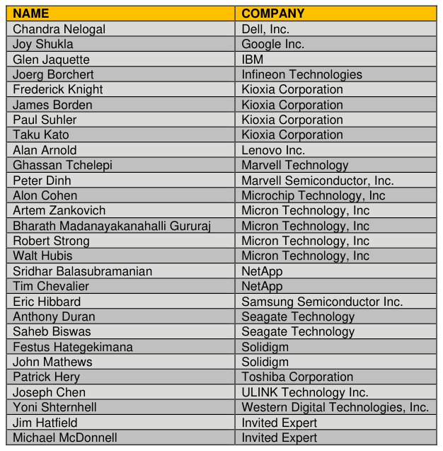

## ACKNOWLEDGEMENT

> **Section ID**:  | **Page**: 3-8

ACKNOWLEDGEMENT 
The TCG wishes to thank all those who contributed to this specification.  This document builds on work done in various 
working groups in the TCG and the industry at large. 
CONTENTS 
DISCLAIMERS, NOTICES, AND LICENSE TERMS ................................................................................................... 1 
ACKNOWLEDGEMENT .............................................................................................................................................. 2 
LIST OF TABLES ........................................................................................................................................................ 8 
LIST OF FIGURES ...................................................................................................................................................... 9 
1 
INTRODUCTION ............................................................................................................................................... 10 
1.1 Document Purpose .................................................................................................................................... 10 
1.2 Scope and Intended Audience ................................................................................................................... 10 
1.3 Conventions ............................................................................................................................................... 10 
1.3.1 Key Words ........................................................................................................................................ 10 
1.3.2 Font Conventions .............................................................................................................................. 10 
1.3.3 Statement Types ............................................................................................................................... 10 
1.3.4 Cell Shading and Font Legend for Preconfiguration Tables .............................................................. 11 
1.3.5 List Conventions ............................................................................................................................... 12 
1.3.5.1 Lists Overview .................................................................................................................... 12 
1.3.5.2 Unordered Lists .................................................................................................................. 12 
1.3.5.3 Ordered Lists ...................................................................................................................... 12 
1.3.6 Numbering Conventions ................................................................................................................... 12 
1.3.7 Bit Conventions ................................................................................................................................. 13 
1.3.8 Number Range Conventions ............................................................................................................. 13 
1.3.9 Specify and Indicate Conventions ..................................................................................................... 13 
1.4 Document References ............................................................................................................................... 13 
1.4.1 Document Precedence ..................................................................................................................... 13 
1.4.2 Approved References ....................................................................................................................... 13 
1.4.3 References Under Development ....................................................................................................... 14 
1.5 Dependencies on Other Feature Sets ........................................................................................................ 14 
1.6 Interactions with Other Feature Sets .......................................................................................................... 14 
1.7 Definition of Terms ..................................................................................................................................... 14 
2 
OPAL SSC OVERVIEW..................................................................................................................................... 16 
2.1 Opal SSC Use Cases and Threats ............................................................................................................. 16 
2.2 Security Providers (SPs) ............................................................................................................................ 16 
2.3 Interface Communication Protocol ............................................................................................................. 16 
2.4 Cryptographic Features .............................................................................................................................. 16 
2.5 Authentication ............................................................................................................................................ 16 
2.6 Table Management .................................................................................................................................... 17 
2.7 Access Control & Personalization .............................................................................................................. 17 
2.8 Issuance ..................................................................................................................................................... 17 
2.9 SSC Discovery ........................................................................................................................................... 17 
2.10 
Mandatory Feature Sets ................................................................................................................... 17 
3 
OPAL SSC FEATURES ..................................................................................................................................... 18 
3.1 Security Protocol 1 Support ....................................................................................................................... 18 
3.1.1 Level 0 Discovery (M) ....................................................................................................................... 18 
3.1.1.1 Level 0 Discovery Header .................................................................................................. 18 
3.1.1.2 TPer Feature (Feature Code = 0x0001) ............................................................................. 19 
3.1.1.3 Locking Feature (Feature Code = 0x0002) ......................................................................... 19 
3.1.1.3.1 
LockingEnabled Definition ........................................................................................ 20 
3.1.1.4 Geometry Reporting Feature (Feature Code = 0x0003) ..................................................... 20 
3.1.1.4.1 
Overview ................................................................................................................... 20 
3.1.1.4.2 
ALIGN ....................................................................................................................... 21 
3.1.1.4.3 
LogicalBlockSize ....................................................................................................... 21 
3.1.1.4.4 
AlignmentGranularity ................................................................................................ 21 
3.1.1.4.5 
LowestAlignedLBA .................................................................................................... 21 
3.1.1.5 Opal SSC V2 Feature (Feature Code = 0x0203) ................................................................ 22 
3.1.1.5.1 
Base ComID ............................................................................................................. 23 
3.1.1.5.2 
Number of ComIDs ................................................................................................... 23 
3.1.1.6 Supported Data Removal Mechanism Feature (Feature Code = 0x0404) .......................... 23 
3.1.1.6.1 
Data Removal Operation Processing Definition ........................................................ 25 
3.1.1.6.2 
Data Removal Operation Interrupted ........................................................................ 25 
3.1.1.6.3 
Supported Data Removal Mechanism Definition ...................................................... 26 
3.1.1.6.4 
Data Removal Time Format and Data Removal Time Definition .............................. 26 
3.2 Security Protocol 2 Support ....................................................................................................................... 27 
3.2.1 ComID Management ......................................................................................................................... 27 
3.2.2 Stack Protocol Reset (M) .................................................................................................................. 27 
3.2.3 TPER_RESET command (M) ........................................................................................................... 27 
3.3 Communications ........................................................................................................................................ 28 
3.3.1 Communication Properties ................................................................................................................ 28 
3.3.2 Supported Security Protocols ............................................................................................................ 28 
3.3.3 ComIDs ............................................................................................................................................. 29 
3.3.4 Synchronous Protocol ....................................................................................................................... 29 
3.3.4.1 Payload Encoding .............................................................................................................. 29 
3.3.4.1.1 
Stream Encoding Modifications ................................................................................ 29 
3.3.4.1.2 
TCG Packets............................................................................................................. 30 
3.3.4.1.3 
Payload Error Response ........................................................................................... 30 
3.3.5 Storage Device Resets ..................................................................................................................... 30 
3.3.5.1 Interface Resets ................................................................................................................. 30 
3.3.5.2 TCG Reset Events.............................................................................................................. 31 
3.3.6 Protocol Stack Reset Commands (M) ............................................................................................... 31 
4 
OPAL SSC-COMPLIANT FUNCTIONS AND SPS ............................................................................................ 32 
4.1 Session Manager ....................................................................................................................................... 32 
4.1.1 Methods ............................................................................................................................................ 32 
4.1.1.1 Properties (M) ..................................................................................................................... 32 
4.1.1.2 StartSession (M) ................................................................................................................. 33 
4.1.1.3 SyncSession (M) ................................................................................................................ 34 
4.1.1.4 CloseSession (O) ............................................................................................................... 34 
4.2 Admin SP ................................................................................................................................................... 34 
4.2.1 Base Template Tables ...................................................................................................................... 34 
4.2.1.1 SPInfo (M) .......................................................................................................................... 34 
4.2.1.2 SPTemplates (M)................................................................................................................ 34 
4.2.1.3 Table (M) ............................................................................................................................ 35 
4.2.1.4 MethodID (M) ..................................................................................................................... 37 
4.2.1.5 AccessControl (M) .............................................................................................................. 37 
4.2.1.6 ACE (M) .............................................................................................................................. 45 
4.2.1.7 Authority (M) ....................................................................................................................... 46 
4.2.1.8 C_PIN (M) .......................................................................................................................... 47 
4.2.2 Base Template Methods ................................................................................................................... 48 
4.2.3 Admin Template Tables .................................................................................................................... 48 
4.2.3.1 TPerInfo (M) ....................................................................................................................... 48 
4.2.3.2 Template (M) ...................................................................................................................... 49 
4.2.3.3 SP (M) ................................................................................................................................ 49 
4.2.4 Admin Template Methods ................................................................................................................. 50 
4.2.5 Opal Additional Column Types .......................................................................................................... 50 
4.2.5.1 Data_removal_mechanism ................................................................................................. 50 
4.2.6 Opal Additional Data Structures ........................................................................................................ 50 
4.2.6.1 DataRemovalMechanism (ObjectTable) ............................................................................. 50 
4.2.6.1.1 
UID ............................................................................................................................ 50 
4.2.6.1.2 
ActiveDataRemovalMechanism ................................................................................ 50 
4.2.7 Opal Additional Tables ...................................................................................................................... 51 
4.2.7.1 DataRemovalMechansim (M) ............................................................................................. 51 
4.2.8 Crypto Template Tables .................................................................................................................... 51 
4.2.9 Crypto Template Methods ................................................................................................................. 51 
4.2.9.1 Random .............................................................................................................................. 51 
4.3 Locking SP ................................................................................................................................................. 51 
4.3.1 Base Template Tables ...................................................................................................................... 51 
4.3.1.1 SPInfo (M) .......................................................................................................................... 51 
4.3.1.2 SPTemplates (M)................................................................................................................ 51 
4.3.1.3 Table (M) ............................................................................................................................ 52 
4.3.1.4 Type (N) ............................................................................................................................. 53 
4.3.1.5 MethodID (M) ..................................................................................................................... 53 
4.3.1.6 AccessControl (M) .............................................................................................................. 54 
4.3.1.7 ACE (M) .............................................................................................................................. 77 
4.3.1.8 Authority (M) ....................................................................................................................... 81 
4.3.1.9 C_PIN (M) .......................................................................................................................... 82 
4.3.1.10 SecretProtect (M) ............................................................................................................... 83 
4.3.2 Base Template Methods ................................................................................................................... 83 
4.3.3 Crypto Template Tables .................................................................................................................... 84 
4.3.4 Crypto Template Methods ................................................................................................................. 84 
4.3.4.1 Random .............................................................................................................................. 84 
4.3.5 Locking Template Tables .................................................................................................................. 84 
4.3.5.1 LockingInfo (M) ................................................................................................................... 84 
4.3.5.2 Locking (M) ......................................................................................................................... 85 
4.3.5.2.1 
Geometry Reporting Feature Behavior ..................................................................... 86 
4.3.5.2.2 
LockOnReset Restrictions ........................................................................................ 87 
4.3.5.3 MBRControl (M) ................................................................................................................. 87 
4.3.5.3.1 
DoneOnReset Restrictions ....................................................................................... 87 
4.3.5.4 MBR (M) ............................................................................................................................. 88 
4.3.5.5 K_AES_128 or K_AES_256 (M) ......................................................................................... 88 
4.3.6 Locking Template Methods ............................................................................................................... 89 
4.3.7 Storage Device Read/Write Data Command Locking Behavior Interactions with Range Crossing ... 89 
4.3.8 Non Template Tables ........................................................................................................................ 89 
4.3.8.1 DataStore (M) ..................................................................................................................... 89 
5 
APPENDIX – SSC SPECIFIC FEATURES ........................................................................................................ 90 
5.1 Opal SSC-Specific Methods ....................................................................................................................... 90 
5.1.1 Activate – Admin Template SP Object Method ................................................................................. 90 
5.1.1.1 Activate Support ................................................................................................................. 90 
5.1.1.2 Side effects of Activate ....................................................................................................... 90 
5.1.2 Revert – Admin Template SP Object Method ................................................................................... 90 
5.1.2.1 Revert Support ................................................................................................................... 91 
5.1.2.2 Effects of Revert ................................................................................................................. 91 
5.1.2.2.1 
Effects of Revert on the PIN Column Value of C_PIN_SID ....................................... 92 
5.1.2.3 Interrupted Revert............................................................................................................... 92 
5.1.3 RevertSP – Base Template SP Method ............................................................................................ 93 
5.1.3.1 RevertSP Support .............................................................................................................. 93 
5.1.3.2 KeepGlobalRangeKey parameter (Locking Template-specific) .......................................... 93 
5.1.3.3 Effects of RevertSP ............................................................................................................ 93 
5.1.3.4 Interrupted RevertSP .......................................................................................................... 94 
5.2 Life Cycle ................................................................................................................................................... 94 
5.2.1 Issued vs. Manufactured SPs ........................................................................................................... 94 
5.2.1.1 Issued SPs ......................................................................................................................... 94 
5.2.1.2 Manufactured SPs .............................................................................................................. 94 
5.2.2 Manufactured SP Life Cycle States .................................................................................................. 95 
5.2.2.1 State definitions for Manufactured SPs .............................................................................. 95 
5.2.2.2 State transitions for Manufactured SPs .............................................................................. 96 
5.2.2.2.1 
Manufactured-Inactive to Manufactured .................................................................... 96 
5.2.2.2.2 
ANY STATE to ORIGINAL FACTORY STATE ......................................................... 96 
5.2.2.3 State behaviors for Manufactured SPs ............................................................................... 96 
5.2.2.3.1 
Manufactured-Inactive .............................................................................................. 96 
5.2.2.3.2 
Manufactured ............................................................................................................ 97 
5.2.3 Type Table Modification .................................................................................................................... 97 
5.3 Byte Table Access Granularity ................................................................................................................... 97 
5.3.1 Table Table Modification ................................................................................................................... 97 
5.3.1.1 MandatoryWriteGranularity ................................................................................................. 98 
5.3.1.1.1 
Object Tables ............................................................................................................ 98 
5.3.1.1.2 
Byte Tables ............................................................................................................... 98 
5.3.1.2 RecommendedAccessGranularity ...................................................................................... 98 
5.3.1.2.1 
Object Tables ............................................................................................................ 98 
5.3.1.2.2 
Byte Tables ............................................................................................................... 99 
5.4 Examples of Alignment Geometry Reporting ............................................................................................. 99 

---
### 📊 Tables (1)

#### Table 1: Untitled Table

*(No markdown content)*

