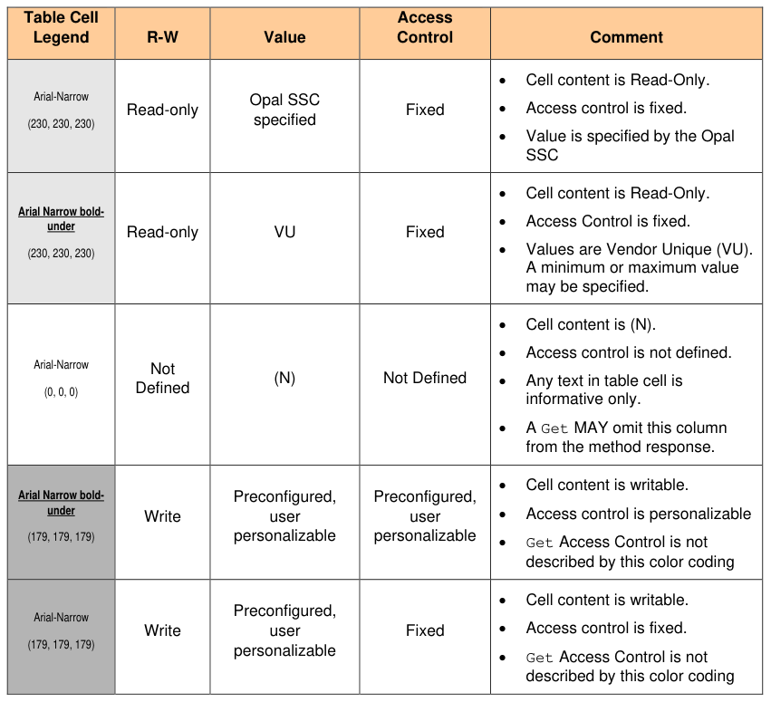

#### 1.3.4 Cell Shading and Font Legend for Preconfiguration Tables

> **Section ID**: 1.3.4 | **Page**: 12-12

1.3.4 Cell Shading and Font Legend for Preconfiguration Tables 
The legend in Table 1 defines the Preconfiguration tables cell color coding, with the RGB values for the shading of 
each cell indicated in parentheses. This color coding is informative only. A Preconfiguration table cell content is 
normative. If a Preconfiguration table cell is empty or blank (regardless of shading), then the contents of that cell are 
not specified in this specification. The contents may be specified in another specification. 
Table 1 - Preconfiguration Tables Legend 

---
### 📊 Tables (1)

#### Table 1: Table 1 - Preconfiguration Tables Legend

| Table Cell Legend | R-W | Value | Access Control | Comment |
| :--- | :--- | :--- | :--- | :--- |
| Arial-Narrow   (230, 230, 230) | Read-only | Opal SSC specified | Fixed | • Cell content is Read-Only. • Access control is fixed. • Value is specified by the Opal SSC |
| Arial Narrow bold-under   (230, 230, 230) | Read-only | VU | Fixed | • Cell content is Read-Only. • Access Control is fixed. • Values are Vendor Unique (VU). A minimum or maximum value may be specified. |
| Arial-Narrow   (0, 0, 0) | Not Defined | (N) | Not Defined | • Cell content is (N). • Access control is not defined. • Any text in table cell is informative only. • A Get MAY omit this column from the method response. |
| Arial Narrow bold-under   (179, 179, 179) | Write | Preconfigured, user personalizable | Preconfigured, user personalizable | • Cell content is writable. • Access control is personalizable • Get Access Control is not described by this color coding |
| Arial-Narrow   (179, 179, 179) | Write | Preconfigured, user personalizable | Fixed | • Cell content is writable. • Access control is fixed. • Get Access Control is not described by this color coding |

