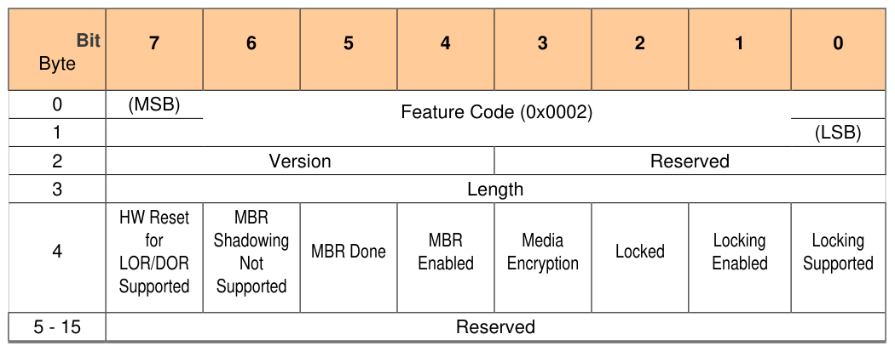

##### 3.1.1.3 Locking Feature (Feature Code = 0x0002)

> **Section ID**: 3.1.1.3 | **Page**: 20-20

3.1.1.3 Locking Feature (Feature Code = 0x0002) 
** means the present current state of the respective feature 
Table 4 - Level 0 Discovery - Locking Feature Descriptor 
An Opal SSC compliant Storage Device SHALL return the following: 
• 
Feature Code 
= 0x0002 
• 
Version 
= 0x3 or any version that supports the defined features in this SSC 
• 
Length 
= 0x0C 
• 
HW Reset for LOR/DOR Supported     = VU 
• 
MBR Shadowing Not Supported 
= 0 
o 
MBR Shadowing feature SHALL be supported. See section 4.3.5.4. 
• 
MBR Done 
= **  
• 
MBR Enabled 
= ** 
• 
Media Encryption 
= 1 
• 
Locked 
= ** 
• 
Locking Enabled 

---
### 📊 Tables (1)

#### Table 1: Table 4 - Level 0 Discovery - Locking Feature Descriptor

| Bit | 7 | 6 | 5 | 4 | 3 | 2 | 1 | 0 |
| :--- | :--- | :--- | :--- | :--- | :--- | :--- | :--- | :--- |
| Byte | | | | | | | | |
| 0 | (MSB) | | | | | | | |
| | | | | | | | | |
| | | | | | | | | |
| | |

