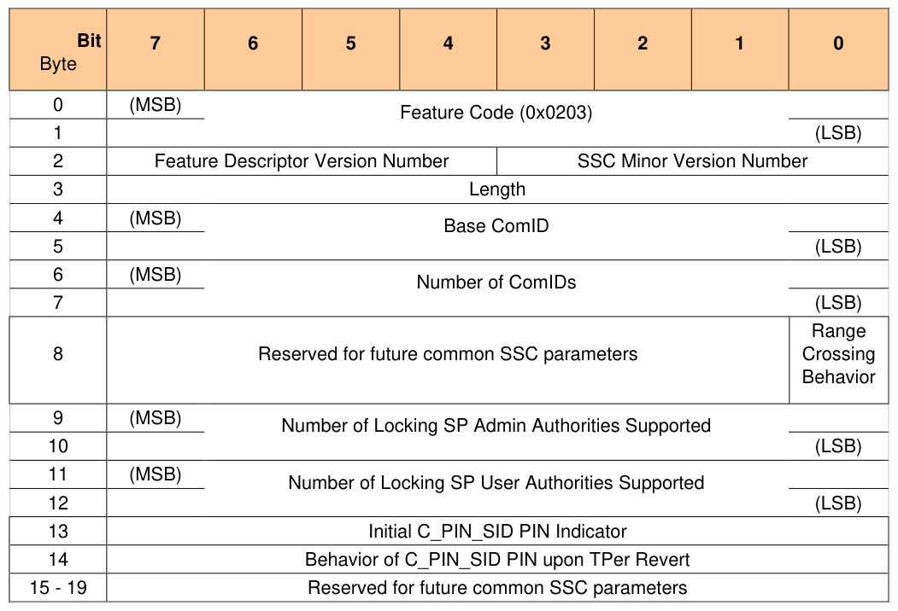
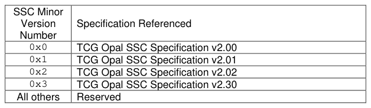

##### 3.1.1.5 Opal SSC V2 Feature (Feature Code = 0x0203)

> **Section ID**: 3.1.1.5 | **Page**: 23-23

3.1.1.5 Opal SSC V2 Feature (Feature Code = 0x0203) 
Table 6 - Level 0 Discovery - Opal SSC V2 Feature Descriptor 
An Opal SSC compliant Storage Device SHALL return the following: 
• 
Feature Code 
= 0x0203 
• 
Feature Descriptor Version Number 
= 0x2 or any version that supports the defined features in this SSC 
• 
SSC Minor Version Number 
= As specified in Table 7 
• 
Length 
= 0x10 
• 
Base ComID 
= VU 
• 
Number of ComIDs 
= 0x0001 or larger 
• 
Range Crossing Behavior 
= VU 
o 
0 = The Storage Device supports commands addressing consecutive LBAs in more than one LBA 
range if all the LBA ranges addressed are unlocked. See section 4.3.7. 
o 
1 = The Storage Device terminates commands addressing consecutive LBAs in more than one LBA 
range. See 4.3.7 
• 
Number of Locking SP Admin Authorities 
= 4 or larger 
• 
Number of Locking SP User Authorities  
= 8 or larger 
• 
Initial C_PIN_SID PIN Indicator = VU 
o 
0x00 = The initial C_PIN_SID PIN value is equal to the C_PIN_MSID PIN value 
o 
0xFF = The initial C_PIN_SID PIN value is VU, and MAY not be equal to the C_PIN_MSID PIN value 
o 
0x01 – 0xFE = Reserved 
• 
Behavior of C_PIN_SID PIN upon TPer Revert = VU 
o 
0x00 = The C_PIN_SID PIN value becomes the value of the C_PIN_MSID PIN column after 
successful invocation of Revert on the Admin SP’s object in the SP table 
o 
0xFF = The C_PIN_SID PIN value changes to a VU value after successful invocation of Revert on the 
Admin SP’s object in the SP table, and MAY not be equal to the C_PIN_MSID PIN value 
o 
0x01 – 0xFE = Reserved 
Table 7 - SSC Minor Versions 
If an Opal v2.00 SSC implementation is backward compatible with Opal v1.00, then the Storage Device SHALL also 
report the Opal SSC feature descriptor as defined in [5]. 
Start of Informative Comment 
An Opal v2.00 implementation is backward compatible to Opal v1.00 only if the geometry reported by the Geometry 
Reporting feature does not specify any alignment restrictions (i.e. ALIGN = FALSE, see section 3.1.1.4.2) , and if the 
TPer does not specify any granularity restrictions for byte tables (i.e. MandatoryWriteGranularity = 1 for all byte tables, 
see section 5.3.1.1), and if the “Initial C_PIN_SID PIN Indicator” and “Behavior of C_PIN_SID PIN upon TPer Revert” 
fields are both 0x00. 
End of Informative Comment 

---
### 📊 Tables (2)

#### Table 1: Table 6 - Level 0 Discovery - Opal SSC V2 Feature Descriptor

*(No markdown content)*

#### Table 2: Table 7 - SSC Minor Versions

*(No markdown content)*

