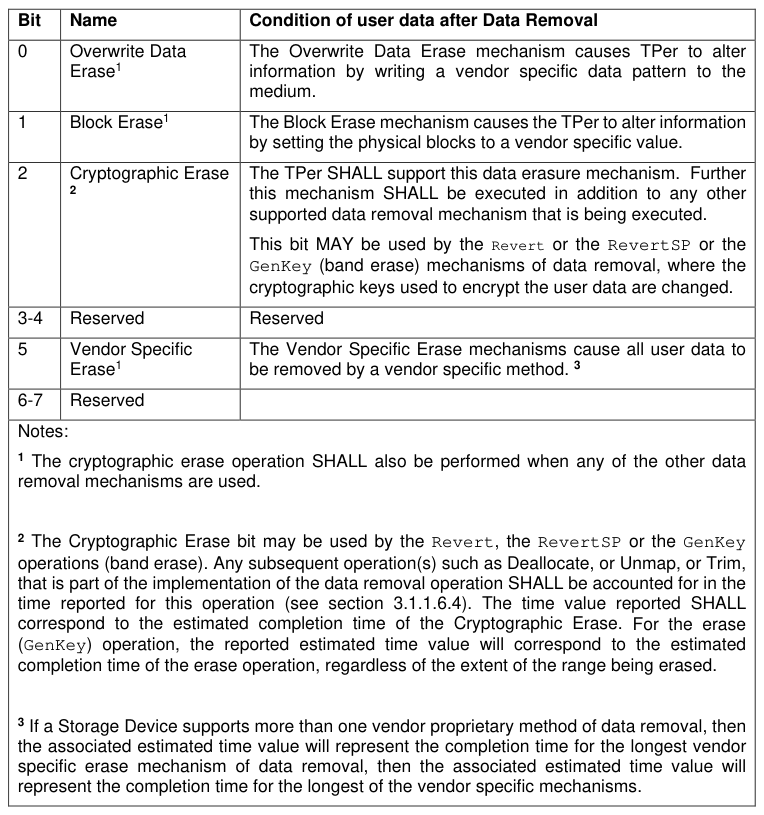

###### 3.1.1.6.3 Supported Data Removal Mechanism Definition

> **Section ID**: 3.1.1.6.3 | **Page**: 27-27

3.1.1.6.3 Supported Data Removal Mechanism Definition 
Each bit of the Supported Data Removal Mechanism (see Table 10) SHALL be set to one if the TPer supports the 
corresponding Data Removal Mechanism; otherwise, each bit SHALL be set to zero. The TPer SHALL support the 
Crypto Erase mechanism and MAY support the Overwrite Data Erase or Block Erase or other mechanisms. The 
TPer MAY support multiple Data Removal Mechanisms described in Table 10. After a RevertSP method has 
completed without an error, the condition of user data SHALL be indicated as specified in Table 10. 
Table 10 - Supported Data Removal Mechanism 

---
### 📊 Tables (1)

#### Table 1: Table 10 - Supported Data Removal Mechanism

| Bit | Name | Condition of user data after Data Removal |
|---|---|---|
| 0 | Overwrite Data Erase¹ | The Overwrite Data Erase mechanism causes TPer to alter information by writing a vendor specific data pattern to the medium. |
| 1 | Block Erase¹ | The Block Erase mechanism causes the TPer to alter information by setting the physical blocks to a vendor specific value. |
| 2 | Cryptographic Erase² | The TPer SHALL support this data erasure mechanism. Further this mechanism SHALL be executed in addition to any other supported data removal mechanism that is being executed.  This bit MAY be used by the Revert or the RevertSP or the GenKey (band erase) mechanisms of data removal, where the cryptographic keys used to encrypt the user data are changed. |
| 3-4 | Reserved | Reserved |
| 5 | Vendor Specific Erase¹ | The Vendor Specific Erase mechanisms cause all user data to be removed by a vendor specific method. ³ |
| 6-7 | Reserved | |
| | | |
| | Notes: | |
| | ¹ The cryptographic erase operation SHALL also be performed when any of the other data removal mechanisms are used. | |
| | ² The Cryptographic Erase bit may be used by the Revert, the RevertSP or the GenKey operations (band erase). Any subsequent operation(s) such as Deallocate, or Unmap, or Trim, that is part of the implementation of the data removal operation SHALL be accounted for in the time reported for this operation (see section 3.1.1.6.4). The time value reported SHALL correspond to the estimated completion time of the Cryptographic Erase. For the erase (GenKey) operation, the reported estimated time value will correspond to the estimated completion time of the erase operation, regardless of the extent of the range being erased. | |
| | ³ If a Storage Device supports more than one vendor proprietary method of data removal, then the associated estimated time value will represent the completion time for the longest vendor specific erase mechanism of data removal, then the associated estimated time value will represent the completion time for the longest of the vendor specific mechanisms. | |

