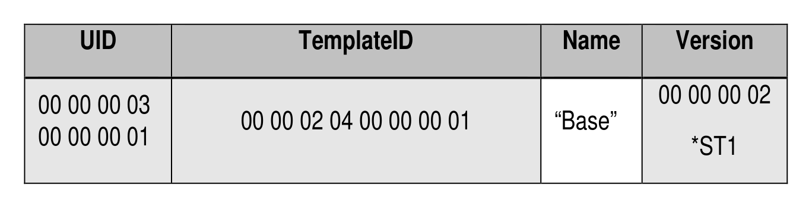
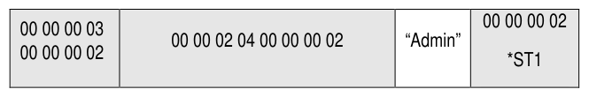

##### 4.2.1.2 SPTemplates (M)

> **Section ID**: 4.2.1.2 | **Page**: 35-35

4.2.1.2 SPTemplates (M) 
The SPTemplates table is defined in [2], and Table 19 defines the Preconfiguration Data for the SPTemplates table. 
*ST1 means this version number or any version number that complies with this SSC. 
Table 19 - Admin SP - SPTemplates Table Preconfiguration 

---
### 📊 Tables (2)

#### Table 1: Table 19 - Admin SP - SPTemplates Table Preconfiguration

*(No markdown content)*

#### Table 2: Untitled Table

*(No markdown content)*

