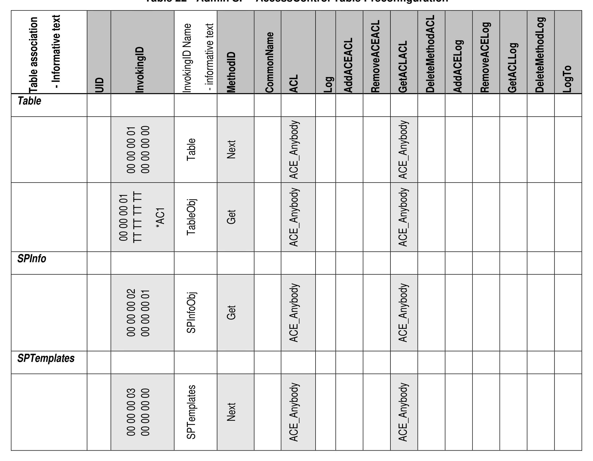
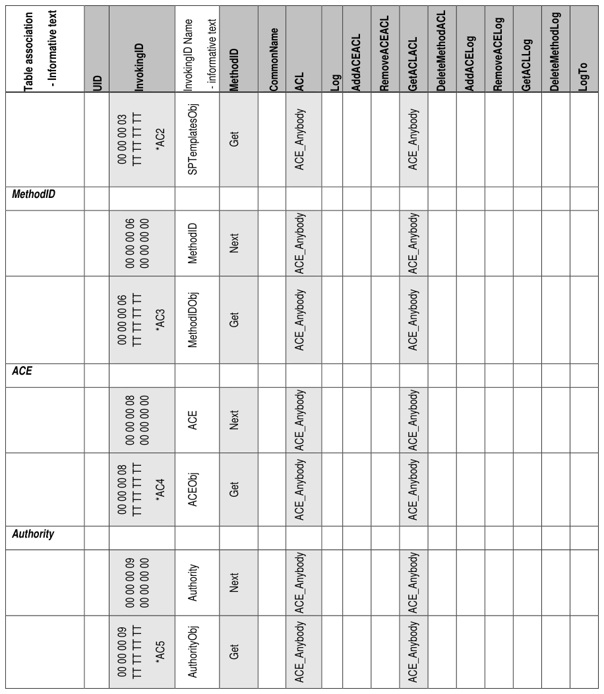
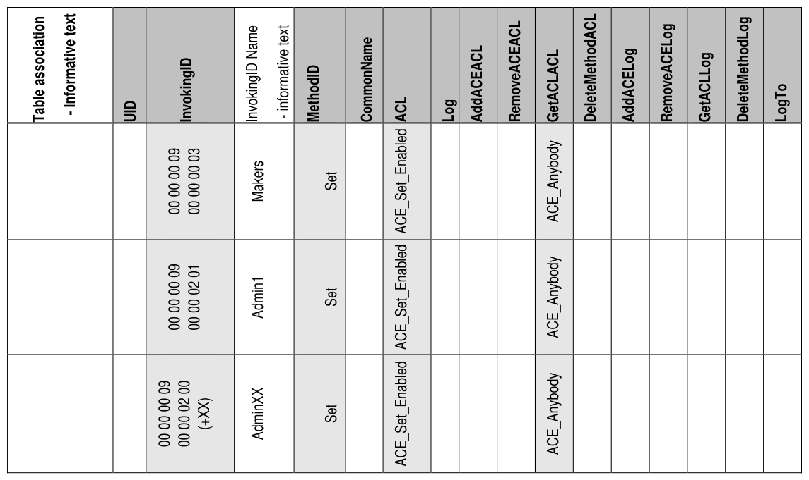
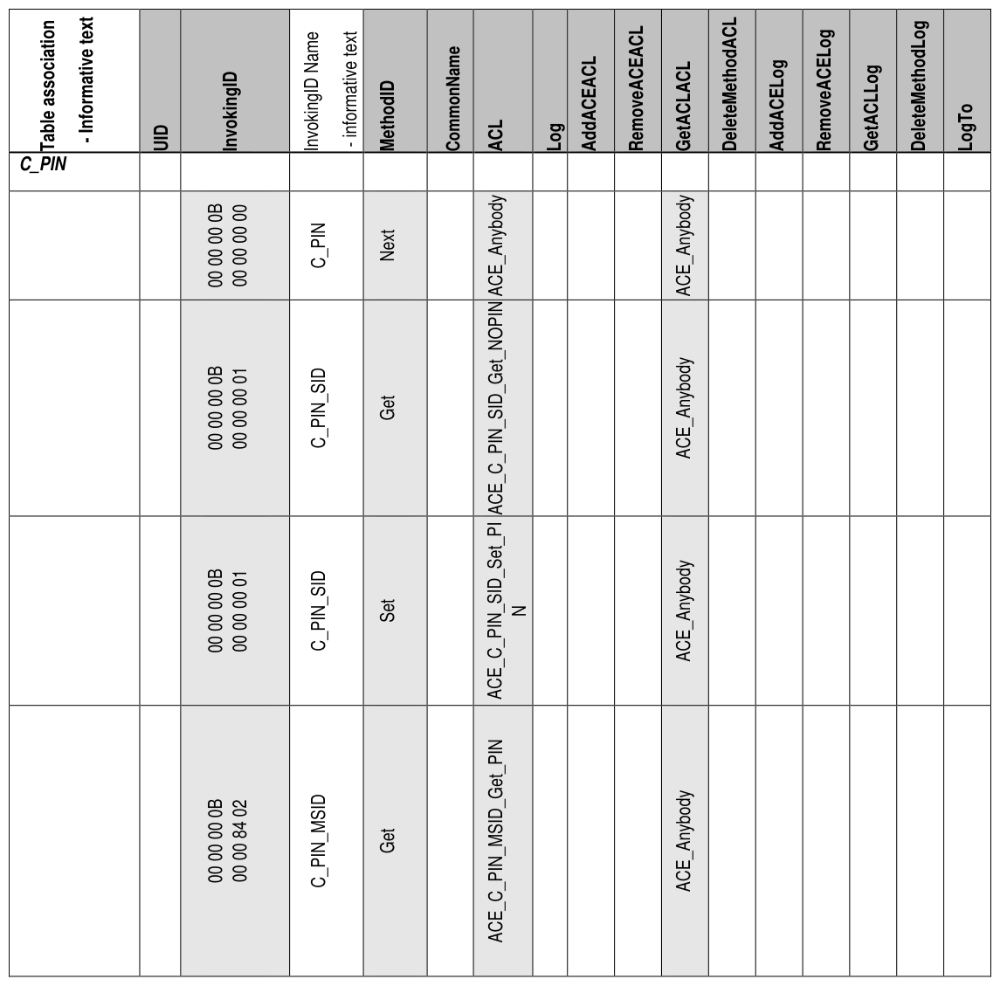
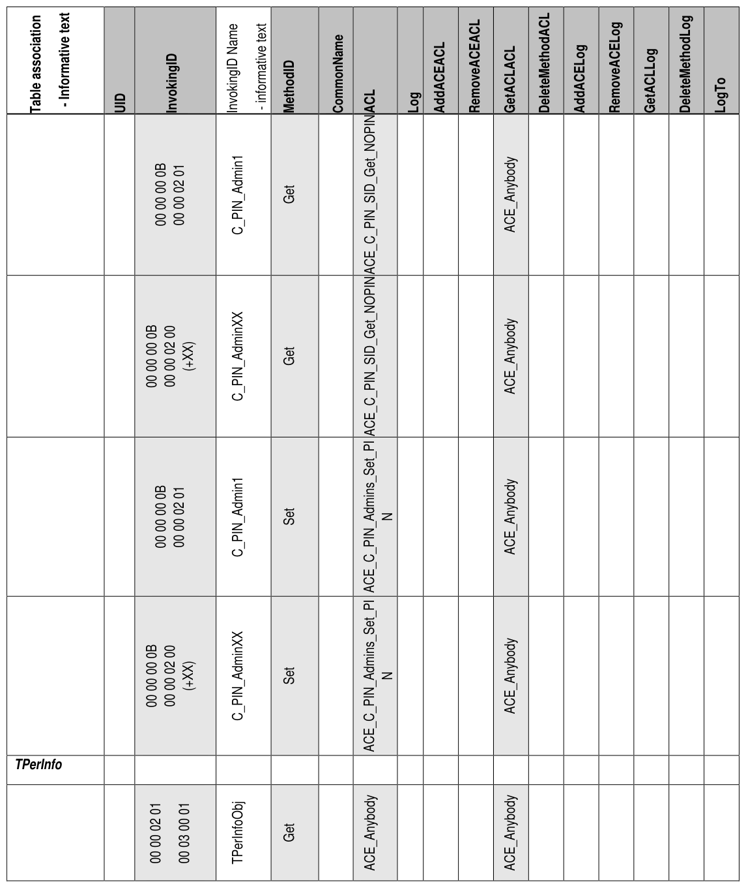
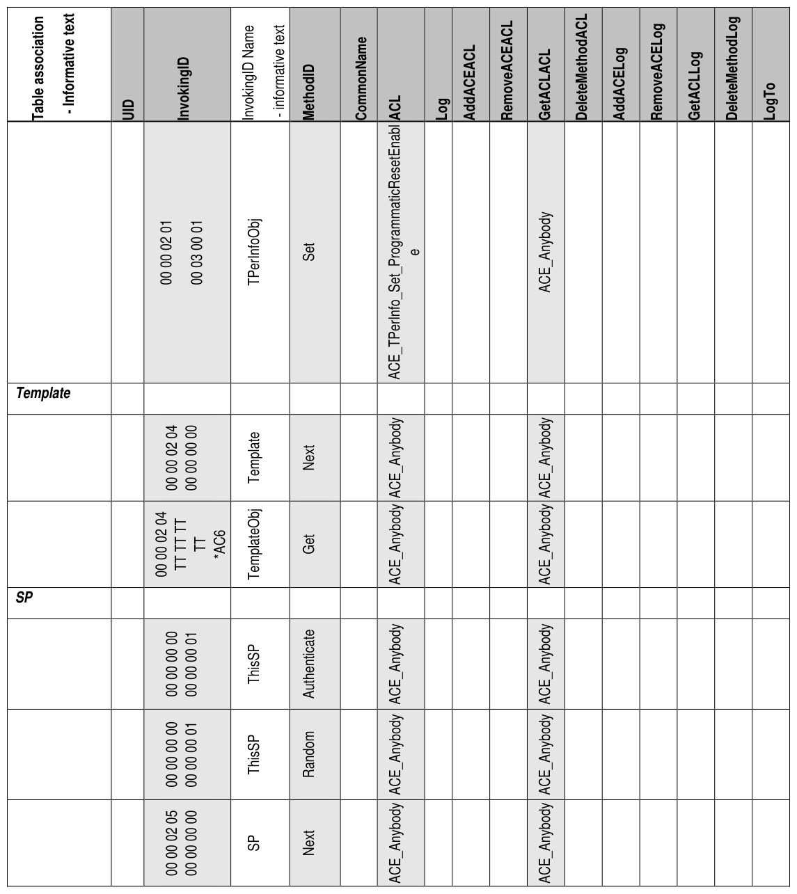
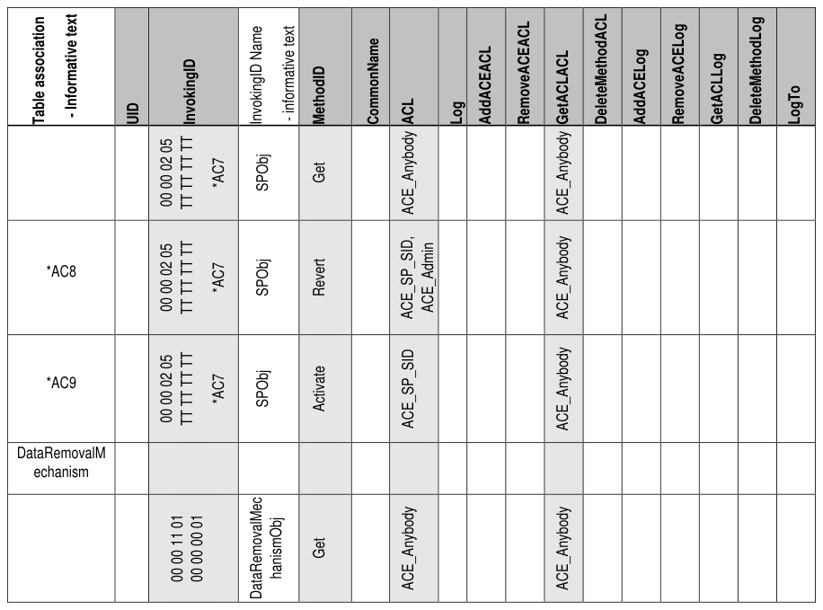
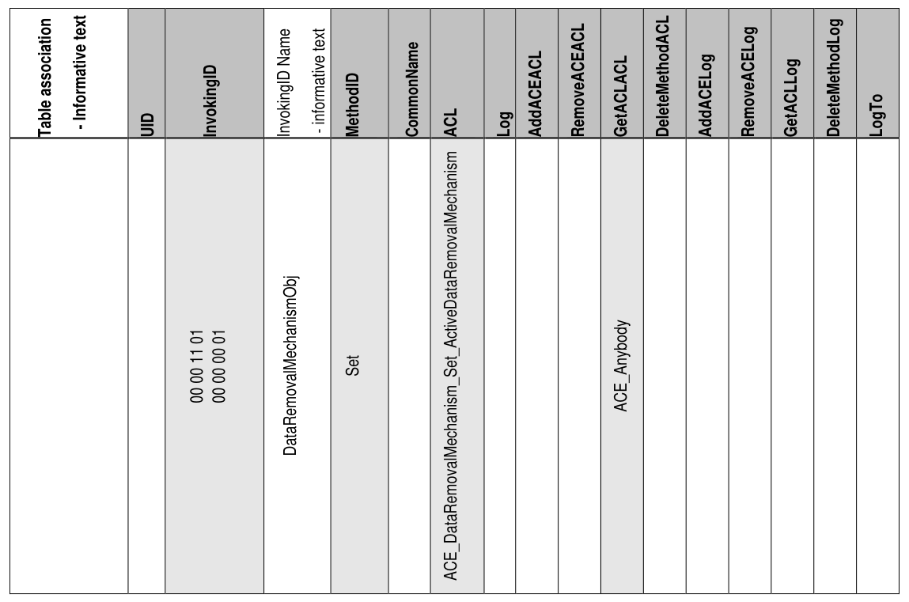

##### 4.2.1.5 AccessControl (M)

> **Section ID**: 4.2.1.5 | **Page**: 38-45

4.2.1.5 AccessControl (M) 
Table 22 contains Optional rows identified by (O). 
Notation: 
*AC1:  the notation of “TT TT TT TT” represents a shorthand for the LSBs of the Table object UIDs 
*AC2:  the notation of “TT TT TT TT” represents a shorthand for the LSBs of the SPTemplates object UIDs 
*AC3:  the notation of “TT TT TT TT” represents a shorthand for the LSBs of the MethodID object UIDs 
*AC4:  the notation of “TT TT TT TT” represents a shorthand for the LSBs of the ACE object UIDs 
*AC5:  the notation of “TT TT TT TT” represents a shorthand for the LSBs of the Authority object UIDs 
*AC6:  the notation of “TT TT TT TT” represents a shorthand for the LSBs of the Template object UIDs 
*AC7:  the notation of “TT TT TT TT” represents a shorthand for the LSBs of the SP object UIDs 
Start of Informative Comment 
*AC8:  refer to section 5.1.2 for details on the requirements for supporting Revert 
*AC9:  refer to section 5.1.1 for details on the requirements for supporting Activate 
End of Informative Comment 
The InvokingID, MethodID and GetACLACL columns are a special case. Although they are marked as Read-Only 
with fixed access control, the access control for invocation of the Get method is (N).  
The ACL column is readable only via the GetACL method. 
Table 22 - Admin SP - AccessControl Table Preconfiguration 

---
### 📊 Tables (8)

#### Table 1: Table 22 - Admin SP - AccessControl Table Preconfiguration

*(No markdown content)*

#### Table 2: Untitled Table

*(No markdown content)*

#### Table 3: Untitled Table

*(No markdown content)*

#### Table 4: Untitled Table

*(No markdown content)*

#### Table 5: Untitled Table

*(No markdown content)*

#### Table 6: Untitled Table

*(No markdown content)*

#### Table 7: Untitled Table

*(No markdown content)*

#### Table 8: Untitled Table

*(No markdown content)*

