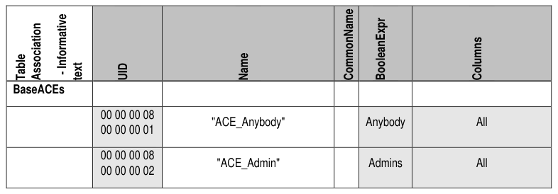
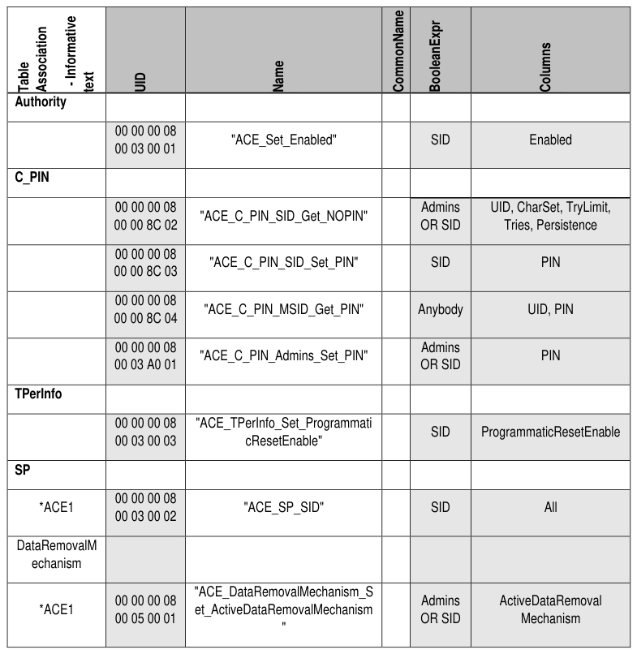

##### 4.2.1.6 ACE (M)

> **Section ID**: 4.2.1.6 | **Page**: 46-46

4.2.1.6 ACE (M)  
Table 23 contains Optional rows designated with (O). 
Start of Informative Comment 
*ACE1 means that row is (M) if the TPer supports either Activate or Revert, and (N) otherwise. 
End of Informative Comment 
Table 23 - Admin SP - ACE Table Preconfiguration 

---
### 📊 Tables (2)

#### Table 1: Untitled Table

*(No markdown content)*

#### Table 2: Untitled Table

*(No markdown content)*

