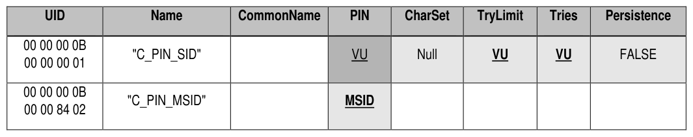
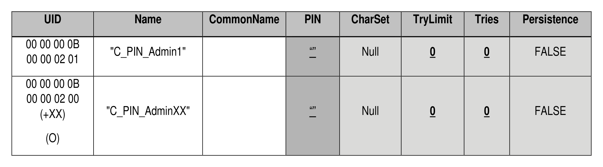

##### 4.2.1.8 C_PIN (M)

> **Section ID**: 4.2.1.8 | **Page**: 48-48

4.2.1.8 C_PIN (M) 
The C_PIN table is defined in [2], and Table 25 defines the Preconfiguration Data for the C_PIN table. 
Table 25 - Admin SP - C_PIN Table Preconfiguration 
For Storage Devices that will be used in environments where an automated take ownership process is required, the 
initial PIN column value of C_PIN_SID SHALL be set to the PIN column value of C_PIN_MSID.  In order to allow for 
alternative take ownership processes, the initial PIN column value of C_PIN_SID MAY be Vendor Unique (VU). 
Start of Informative Comment 
Several activation / take ownership models are possible.  The simplest model, which is the only model supported by 
Opal v1.00, is a process whereby the host discovers the initial C_PIN_SID PIN value by performing a Get operation 
on the C_PIN_MSID object.  This model requires that the initial C_PIN_SID PIN be the value of the C_PIN_MSID PIN. 
Opal v2.00 allows the initial C_PIN_SID PIN value to be vendor unique in order to allow for alternative activation / 
take ownership models. Such models require that the C_PIN_SID PIN be retrieved in a way that is beyond the scope 
of this specification. 
Before a device vendor chooses to implement an activation / take ownership model based on a vendor unique SID 
PIN, the Storage Device vendor must undertake due diligence to ensure that the ecosystem exists to support such an 
activation / take ownership model. Having a C_PIN_SID PIN value that is different from the C_PIN_MSID PIN value 
may have serious ramifications, such as the inability to take ownership of the Storage Device. 
See section 5.1.2.2.1 for an explanation of how the Revert method affects the value of the C_PIN_SID PIN column. 
End of Informative Comment 

---
### 📊 Tables (2)

#### Table 1: Table 25 - Admin SP - C_PIN Table Preconfiguration

*(No markdown content)*

#### Table 2: Untitled Table

*(No markdown content)*

