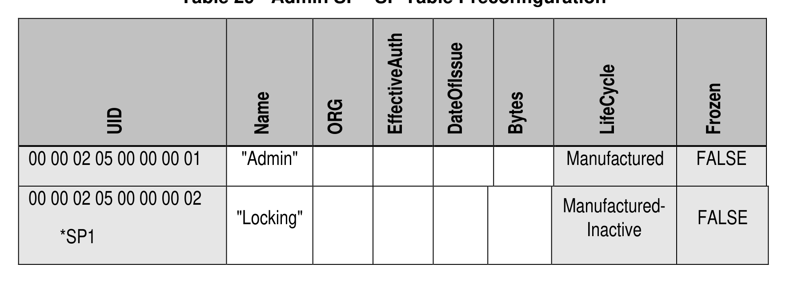

##### 4.2.3.3 SP (M)

> **Section ID**: 4.2.3.3 | **Page**: 50-50

4.2.3.3 SP (M) 
The SP table is defined in [2], and Table 29 defines the Preconfiguration Data for the SP table. 
*SP1 means that this row only exists in the Admin SP's OFS when the Locking SP is created by the manufacturer. 
Table 29 - Admin SP - SP Table Preconfiguration 

---
### 📊 Tables (1)

#### Table 1: Table 29 - Admin SP - SP Table Preconfiguration

| UID | Name | ORG | EffectiveAuth | DateOfIssue | Bytes | LifeCycle | Frozen |
| :--- | :--- | :--- | :--- | :--- | :--- | :--- | :--- |
| 00 00 02 05 00 00 00 01 | "Admin" | | | | | Manufactured | FALSE |
| 00 00 02 05 00 00 00 02 | "Locking" | | | | | Manufactured-Inactive | FALSE |
| *SP1 | | | | | | | |

