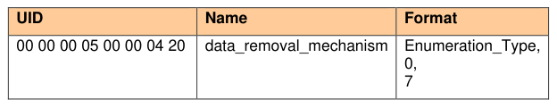
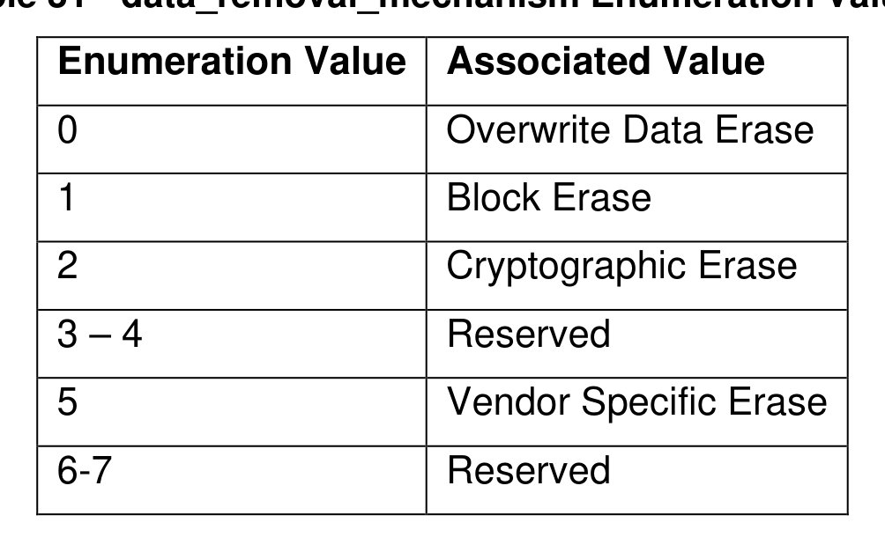

##### 4.2.5.1 Data_removal_mechanism

> **Section ID**: 4.2.5.1 | **Page**: 51-51

4.2.5.1 Data_removal_mechanism 
The data_removal_mechanism type is defined in Table 30 for Opal:  
Table 30 - data_removal_mechanism Type Table Addition 
Table 31 defines the enumeration values. The mechanisms associated with each Enumeration Value are defined in 
Table 10. 
Table 31 - data_removal_mechanism Enumeration Values 

---
### 📊 Tables (2)

#### Table 1: Table 30 - data_removal_mechanism Type Table Addition

| UID | Name | Format |
|:---|:---|:---|
| 00 00 00 05 00 00 04 20 | data_removal_mechanism | Enumeration_Type, 0, 7 |

#### Table 2: Table 31 - data_removal_mechanism Enumeration Values

Table 31 - data_removal_mechanism Enumeration Values

| Enumeration Value | Associated Value |
|---|---|
| 0 | Overwrite Data Erase |
| 1 | Block Erase |
| 2 | Cryptographic Erase |
| 3 – 4 | Reserved |
| 5 | Vendor Specific Erase |
| 6-7 | Reserved |

