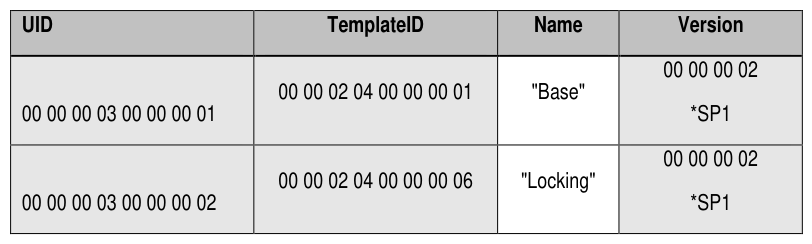

##### 4.3.1.2 SPTemplates (M)

> **Section ID**: 4.3.1.2 | **Page**: 52-52

4.3.1.2 SPTemplates (M) 
The SPTemplates table is defined in [2], and Table 35 defines the Preconfiguration Data for the SPTemplates table. 
*SP1 means that this version number or any number that supports the defined features in this SSC 
Table 35 - Locking SP - SPTemplates Table Preconfiguration 

---
### 📊 Tables (1)

#### Table 1: Table 35 - Locking SP - SPTemplates Table Preconfiguration

| UID | TemplateID | Name | Version |
|:---|:---|:---|:---|
| 00 00 00 03 00 00 00 01 | 00 00 02 04 00 00 00 01 | "Base" | 00 00 00 02 |
| | | | *SP1 |
| 00 00 00 03 00 00 00 02 | 00 00 02 04 00 00 00 06 | "Locking" | 00 00 00 02 |
| | | | *SP1 |

