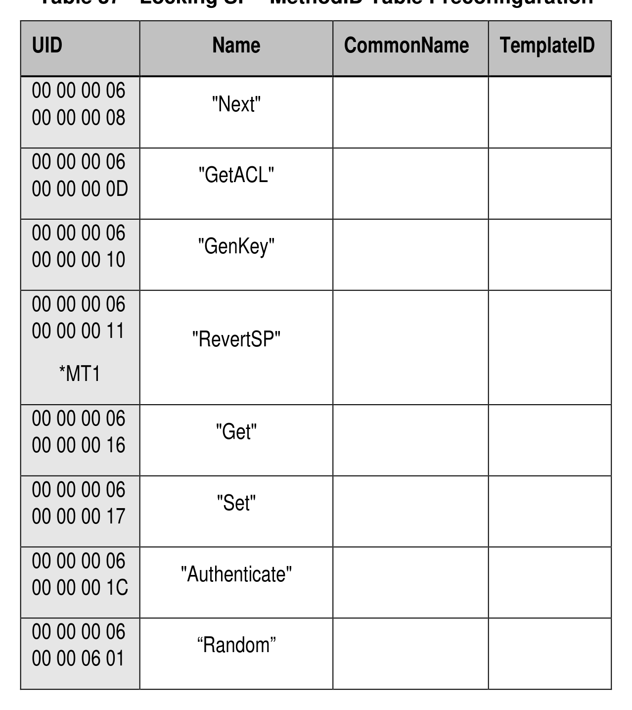

##### 4.3.1.5 MethodID (M)

> **Section ID**: 4.3.1.5 | **Page**: 54-54

4.3.1.5 MethodID (M) 
The MethodID table is defined in [2], and Table 37 defines the Preconfiguration Data for the MethodID table. 
*MT1 means refer to section 5.1.2.3 for details on the requirements for supporting RevertSP. 
Table 37 - Locking SP - MethodID Table Preconfiguration 

---
### 📊 Tables (1)

#### Table 1: Table 37 - Locking SP - MethodID Table Preconfiguration

*(No markdown content)*

