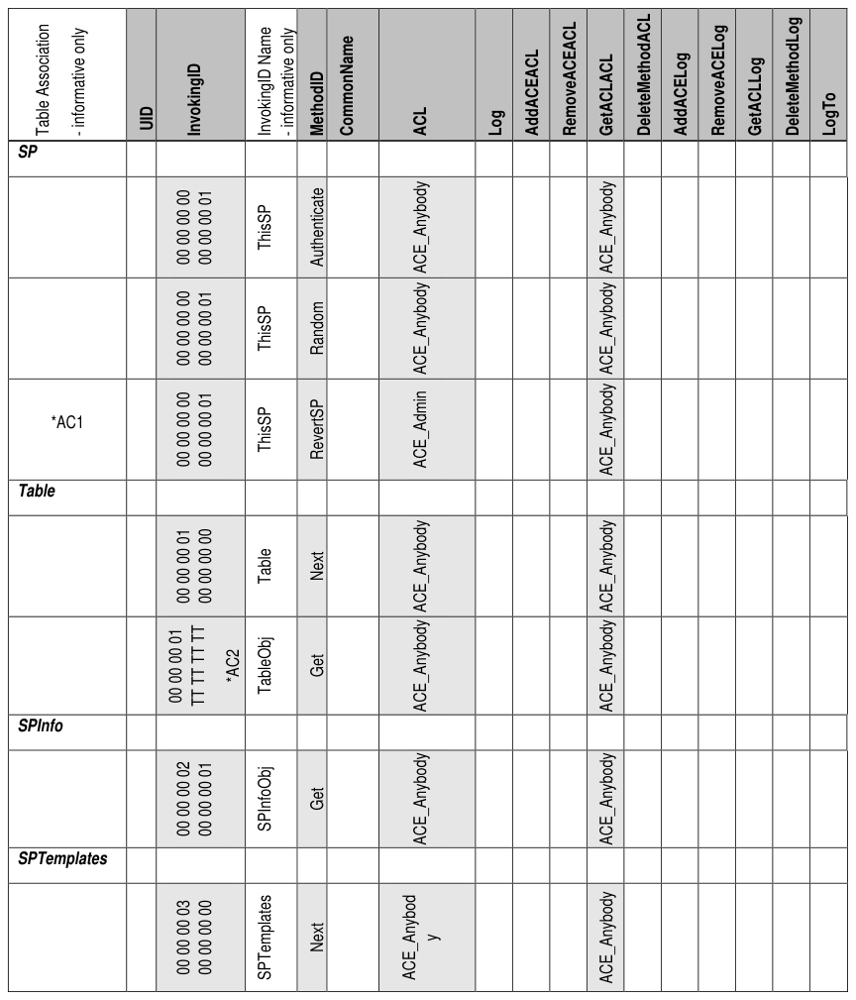
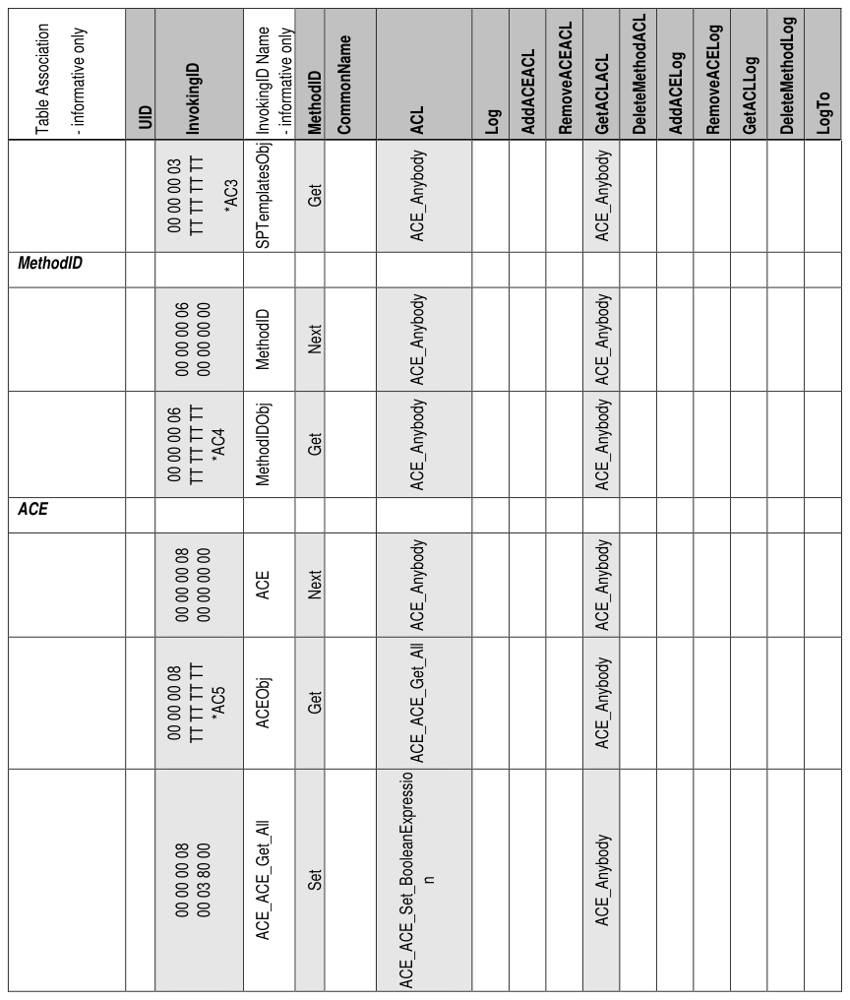
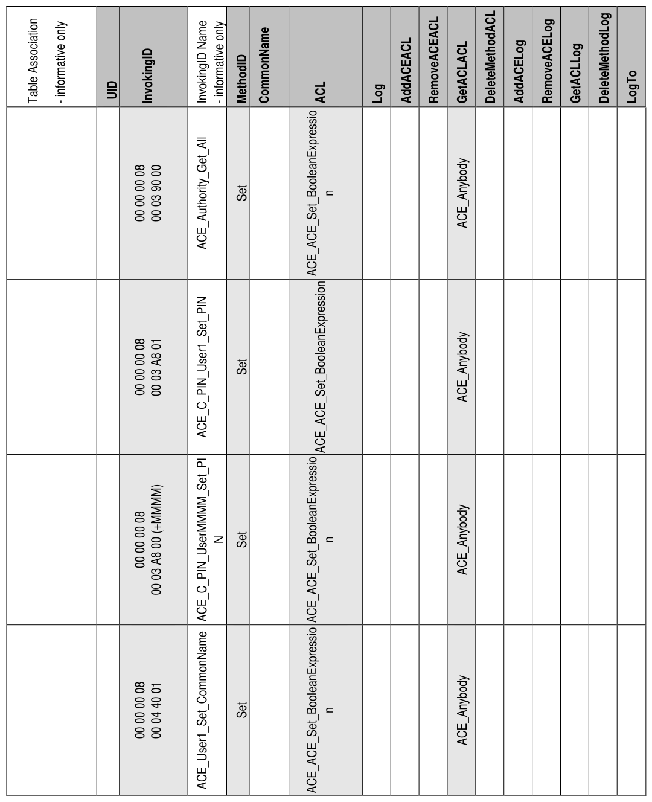
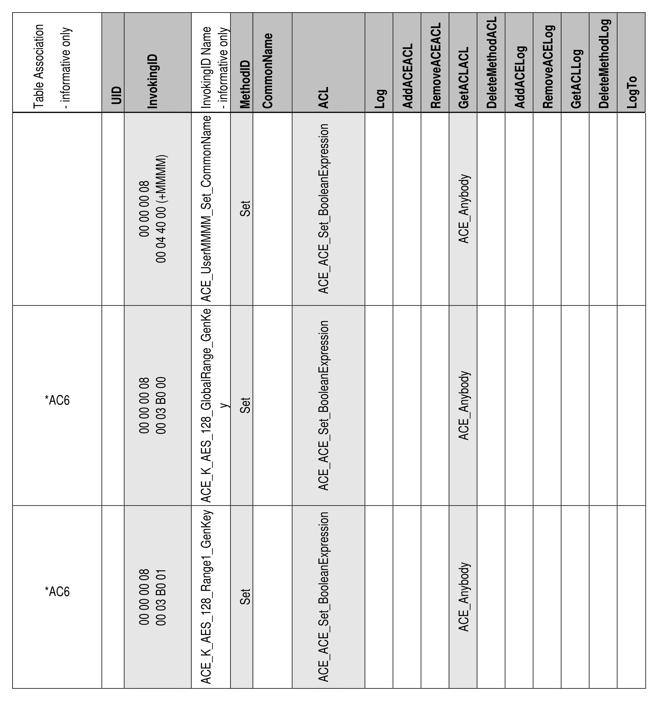
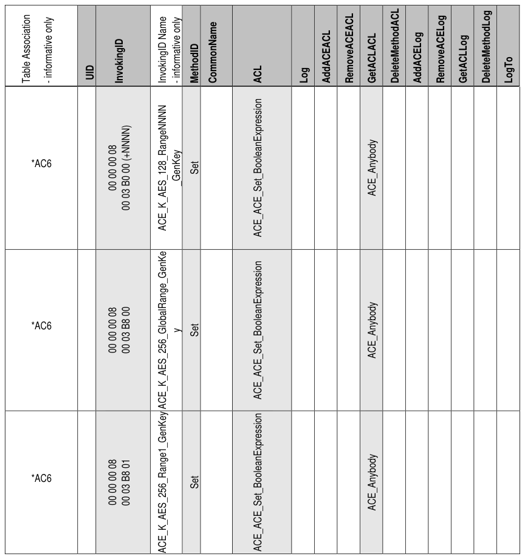
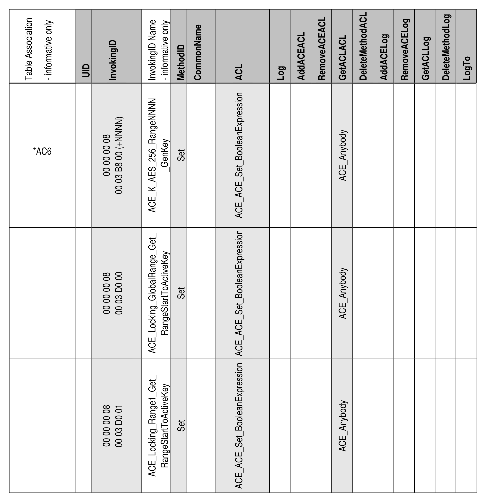
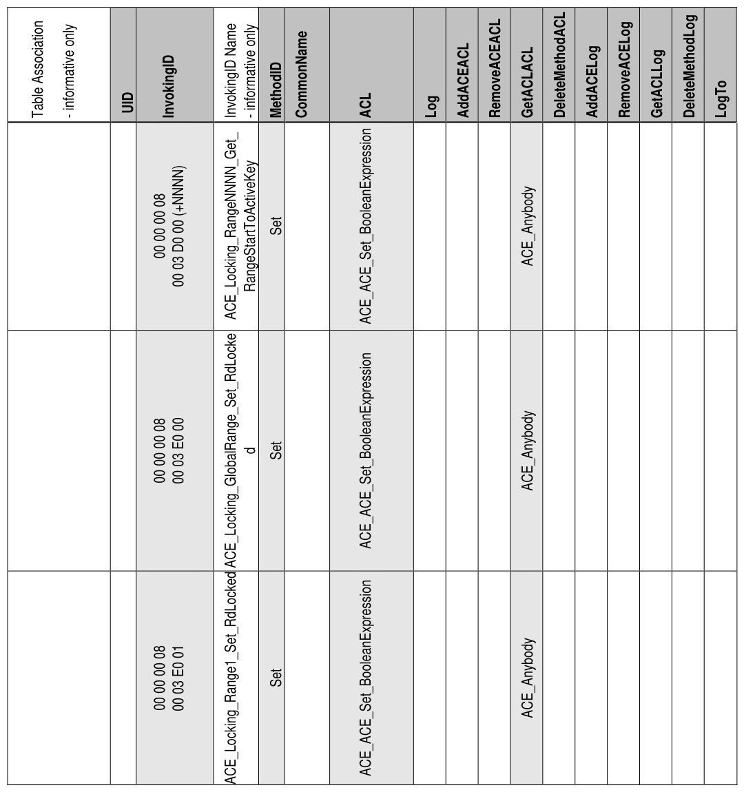
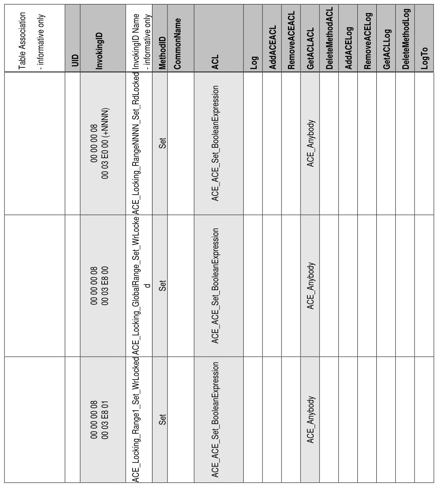
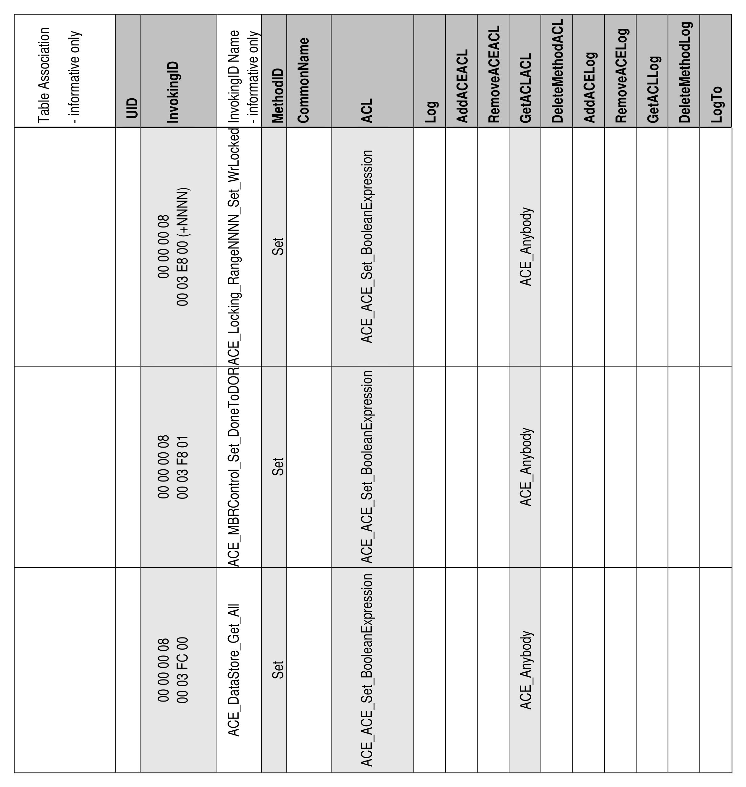

##### 4.3.1.6 AccessControl (M)

> **Section ID**: 4.3.1.6 | **Page**: 55-77

4.3.1.6 AccessControl (M)  
Table 38 contains Optional rows designated with (O).  
Start of Informative Comment 
*AC1:  refer to section 5.1.2.3 for details on the requirements for supporting RevertSP 
*AC8:  the notation of “TT TT TT TT” represents a shorthand for the LSBs of the SecretProtect object UIDs 
End of Informative Comment 
*AC2:  the notation of “TT TT TT TT” represents a shorthand for the LSBs of the Table object UIDs 
*AC3:  the notation of “TT TT TT TT” represents a shorthand for the LSBs of the SPTemplates object UIDs 
*AC4:  the notation of “TT TT TT TT” represents a shorthand for the LSBs of the MethodID object UIDs 
*AC5:  the notation of “TT TT TT TT” represents a shorthand for the LSBs of the ACE object UIDs 
*AC6:  only K_AES_128 or K_AES_256 related rows are Mandatory 
*AC7:  the notation of “TT TT TT TT” represents a shorthand for the LSB of the Authority object UIDs 
Notes: 
• 
The AccessControl table is different from any other table defined in this specification. Although cells in 
this table are marked as Read-Only with fixed access control, the access control for invocation of the Get 
method is (N).  
• 
The ACL column is readable only via the GetACL method. 
Table 38 - Locking SP - AccessControl Table Preconfiguration 

---
### 📊 Tables (9)

#### Table 1: Table 38 - Locking SP - AccessControl Table Preconfiguration

| Table Association - informative only | UID | InvokingID | InvokingID Name - informative only | MethodID | CommonName | ACL | Log | AddACEACL | RemoveACEACL | GetACLACL | DeleteMethodACL | AddACELog | RemoveACELog | GetACLLog | DeleteMethodLog | LogTo |
| :--- | :--- | :--- | :--- | :--- | :--- | :--- | :--- | :--- | :--- | :--- | :--- | :--- | :--- | :--- | :--- | :--- |
| SP | | | | | | | | | | | | | | | | |
| | | | | | | | | | | | | |

#### Table 2: Untitled Table

(Continuation of Table 38 - Locking SP - AccessControl Table Preconfiguration - see first part)

#### Table 3: Untitled Table

(Continuation of Table 38 - Locking SP - AccessControl Table Preconfiguration - see first part)

#### Table 4: Untitled Table

(Continuation of Table 38 - Locking SP - AccessControl Table Preconfiguration - see first part)

#### Table 5: Untitled Table

(Continuation of Table 38 - Locking SP - AccessControl Table Preconfiguration - see first part)

#### Table 6: Untitled Table

(Continuation of Table 38 - Locking SP - AccessControl Table Preconfiguration - see first part)

#### Table 7: Untitled Table

(Continuation of Table 38 - Locking SP - AccessControl Table Preconfiguration - see first part)

#### Table 8: Untitled Table

(Continuation of Table 38 - Locking SP - AccessControl Table Preconfiguration - see first part)

#### Table 9: Untitled Table

(Continuation of Table 38 - Locking SP - AccessControl Table Preconfiguration - see first part)

