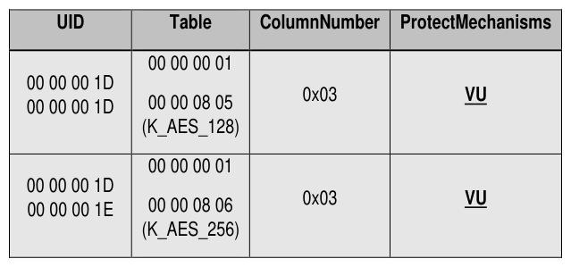

##### 4.3.1.10 SecretProtect (M)

> **Section ID**: 4.3.1.10 | **Page**: 84-84

4.3.1.10 SecretProtect (M) 
At least one of the objects shown in Table 42 SHALL be supported 
Table 42 - Locking SP - SecretProtect Table Preconfiguration 
Note: The “VU” entries in Table 42 indicate that this specification does not require a specific value to be reported in 
the ProtectMechanisms cell.  It is NOT a requirement to report the “Vendor Unique” protect_types value (Refer to [2] 
for details). 

---
### 📊 Tables (1)

#### Table 1: Table 42 - Locking SP - SecretProtect Table Preconfiguration

*(No markdown content)*

