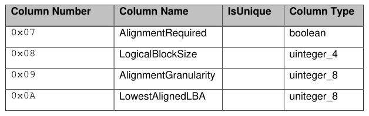
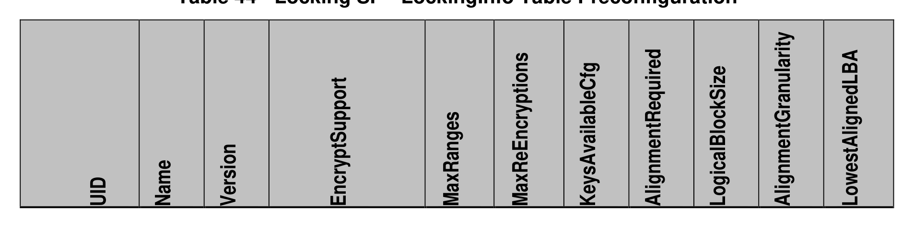
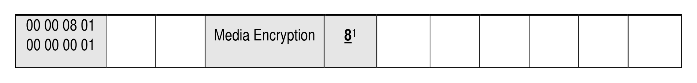

##### 4.3.5.1 LockingInfo (M)

> **Section ID**: 4.3.5.1 | **Page**: 85-85

4.3.5.1 LockingInfo (M) 
The LockingInfo table has the columns defined in Table 43, in addition to those defined in [2]: 
Table 43 - Locking SP – LockingInfo Columns 
• 
AlignmentRequired 
This column indicates whether the TPer requires ranges in the Locking table to be aligned (see section 

---
### 📊 Tables (3)

#### Table 1: Table 43 - Locking SP – LockingInfo Columns

| Column Number | Column Name | IsUnique | Column Type |
|:---|:---|:---|:---|
| 0x07 | AlignmentRequired | | boolean |
| 0x08 | LogicalBlockSize | | uinteger_4 |
| 0x09 | AlignmentGranularity | | uinteger_8 |
| 0x0A | LowestAlignedLBA | | uinteger_8 |

#### Table 2: Table 44 - Locking SP - LockingInfo Table Preconfiguration

| UID | Name | Version | EncryptSupport | MaxRngs | MaxReEncryptions | KeysAvailableCfg | AlignmentRequired | LogicalBlockSize | AlignmentGranularity | LowestAlignedLBA |
|:---|:---|:---|:---|:---|:---|:---|:---|:---|:---|:---|
| 00 00 08 01 | | | Media Encryption | 8¹ | | | | | | |
| 00 00 00 01 | | | | | | | | | | |

#### Table 3: Untitled Table

(Continuation of Table 44 - Locking SP - LockingInfo Table Preconfiguration - see first part)

