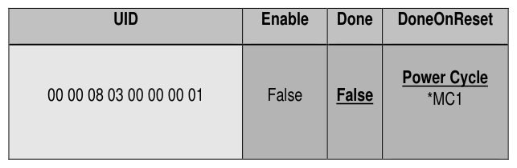

###### 4.3.5.3.1 DoneOnReset Restrictions

> **Section ID**: 4.3.5.3.1 | **Page**: 88-88

Storage Devices. Refer to section 4.3.5.3.1 for details. 
Table 46 - Locking SP - MBRControl Table Preconfiguration 
4.3.5.3.1 DoneOnReset Restrictions 
The TPer SHALL support the following DoneOnReset column values: 
a) 
{ 0 } (i.e. Power Cycle); and 
b) 
{ 0, 3 } (i.e. Power Cycle and Programmatic). 
Additionally, the TPer MAY support the following DoneOnReset column values: 
a) 
{ 0, 1 } (i.e. Power Cycle and Hardware Reset); and 
b) 
{ 0,1, 3 } (i.e. Power Cycle, Hardware Reset and Programmatic). 

---
### 📊 Tables (1)

#### Table 1: Table 46 - Locking SP - MBRControl Table Preconfiguration

*(No markdown content)*

