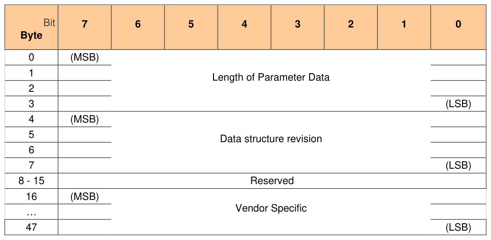

### 2.10 Mandatory Feature Sets

> **Section ID**: 2.10 | **Page**: 18-18

2.10 Mandatory Feature Sets 
An Opal SSC compliant Storage Device SHALL support the following TCG Storage Feature Sets: 
1) Additional DataStore Tables, Opal Family Feature Set (refer to [6]); 
2) PSID, Opal SSC Feature Set (refer to [6]). 

---
### 📊 Tables (1)

#### Table 1: Table 2 - Level 0 Discovery Header

| Bit | 7 | 6 | 5 | 4 | 3 | 2 | 1 | 0 |
|:---|:---|:---|:---|:---|:---|:---|:---|:---|
| Byte | | | | | | | | |
| 0 | (MSB) | | | | | | | |
| 1 | | | | | | | | |
| 2 | | | | | | | | |
| 3 | | | | | | | | (LSB) |
| 4 | (MSB) | | | | | | | |
| 5 | | | | | | | | |
| 6 | | | | | | | | |
| 7 | | | | | | | | (LSB) |
| 8 - 15 | | | | | | | | |
| 16 | (MSB) | | | | | | | |
| ... | | | | | | | | |
| 47 | | | | | | | | (LSB) |

