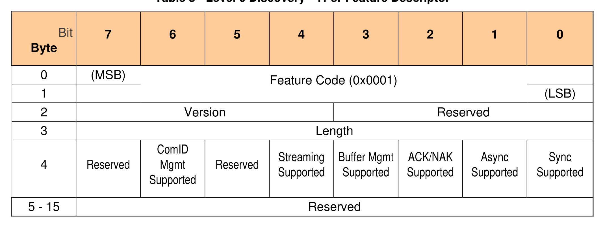

##### 3.1.1.2 TPer Feature (Feature Code = 0x0001)

> **Section ID**: 3.1.1.2 | **Page**: 20-20

3.1.1.2 TPer Feature (Feature Code = 0x0001) 
Table 3 - Level 0 Discovery - TPer Feature Descriptor 
An Opal SSC compliant Storage Device SHALL return the following: 
• 
Feature Code 
= 0x0001 
• 
Version 
= 0x1 or any version that supports the defined features in this SSC 
• 
Length 
= 0x0C 
• 
ComID Mgmt Supported 
= VU 
• 
Streaming Supported 
= 1 
• 
Buffer Mgmt Supported 
= VU  
• 
ACK/NACK Supported 
= VU  
• 
Async Supported 
= VU  
• 
Sync Supported  
= 1 

---
### 📊 Tables (1)

#### Table 1: Table 3 - Level 0 Discovery - TPer Feature Descriptor

| Byte | Bit | 7 | 6 | 5 | 4 | 3 | 2 | 1 | 0 |
| :--- | :--- | :--- | :--- | :--- | :--- | :--- | :--- | :--- | :--- |
| | | | | | | | | | |
| 0 | (MSB) | | | | | | | | |
| | | | | | | | | | |
| | | | | | | | | | |

