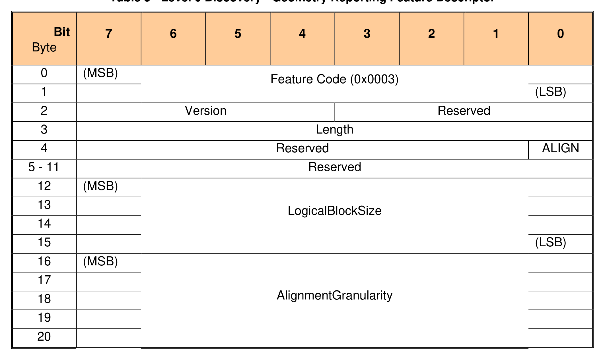
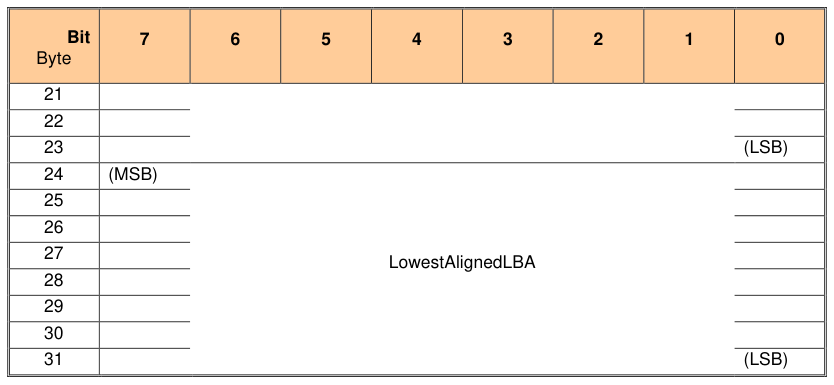

###### 3.1.1.4.1 Overview

> **Section ID**: 3.1.1.4.1 | **Page**: 21-21

3.1.1.4.1 Overview 
This information indicates support for logical block and physical block geometry. This feature MAY be returned in the 
Level 0 Discovery response. See [2] for additional information. 
Table 5 - Level 0 Discovery - Geometry Reporting Feature Descriptor 
TCG Storage Security Subsystem Class (SSC): Opal 
TCG Storage Security Subsystem Class (SSC): Opal  |  Version 2.30  |  1/30/2025  |  PUBLISHED 
Page 21 
© TCG 2025 
An Opal SSC compliant Storage Device SHALL return the following: 
• 
Feature Code = 0x0003 
• 
Version  
= 0x01 
• 
Length  
= 0x1C 

---
### 📊 Tables (2)

#### Table 1: Table 5 - Level 0 Discovery - Geometry Reporting Feature Descriptor

| Bit | 7 | 6 | 5 | 4 | 3 | 2 | 1 | 0 |
| :--- | :--- | :--- | :--- | :--- | :--- | :--- | :--- | :--- |
| Byte | | | | | | | | |
| 0 | (MSB) | | | | | | | |
| | | | | | | | | Feature Code (0x0003) |
| | | | | | | | | (LSB) |
| 1 | | | | | | | | |
| 2 | | | | Version | | | | Reserved |
| 3 | | | | | | | | Length |
| 4 | | | | | | | | Reserved |
| | | | | | | | | ALIGN |
| 5 - 11 | | | | | | | | Reserved |
| 12 | (MSB) | | | | | | | |
| 13 | | | | | | | | LogicalBlockSize |
| 14 | | | | | | | | |
| 15 | | | | | | | | (LSB) |
| 16 | (MSB) | | | | | | | |
| 17 | | | | | | | | AlignmentGranularity |
| 18 | | | | | | | | |
| 19 | | | | | | | | |
| 20 | | | | | | | | |
| | | | | | | | | |
| Bit | 7 | 6 | 5 | 4 | 3 | 2 | 1 | 0 |
| Byte | | | | | | | | |
| 21 | | | | | | | | |
| 22 | | | | | | | | |
| 23 | | | | | | | | |
| 24 | (MSB) | | | | | | | |
| 25 | | | | | | | | LowestAlignedLBA |
| 26 | | | | | | | | |
| 27 | | | | | | | | |
| 28 | | | | | | | | |
| 29 | | | | | | | | |
| 30 | | | | | | | | |
| 31 | | | | | | | | (LSB) |

#### Table 2: Untitled Table

(Continuation of Table 5 - Level 0 Discovery - Geometry Reporting Feature Descriptor - see first part)

