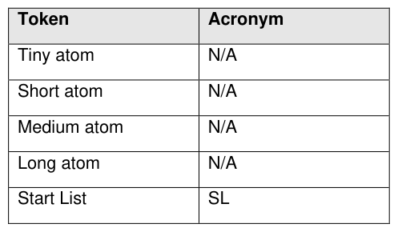
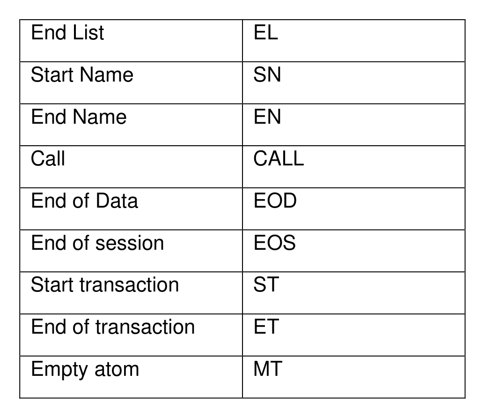

###### 3.3.4.1.1 Stream Encoding Modifications

> **Section ID**: 3.3.4.1.1 | **Page**: 30-30

3.3.4.1.1 Stream Encoding Modifications 
The TPer SHALL support tokens listed in Table 15. If an unsupported token is encountered, the TPer SHALL treat the 
token as a streaming protocol violation and return an error per the definition in section 3.3.4.1.3. 
Table 15 - Supported Tokens 
TCG Storage Security Subsystem Class (SSC): Opal 
TCG Storage Security Subsystem Class (SSC): Opal  |  Version 2.30  |  1/30/2025  |  PUBLISHED 
Page 30 
© TCG 2025 

---
### 📊 Tables (2)

#### Table 1: Table 15 - Supported Tokens

| Token | Acronym |
| :--- | :--- |
| Tiny atom | N/A |
| Short atom | N/A |
| Medium atom | N/A |
| Long atom | N/A |
| Start List | SL |
| End List | EL |
| Start Name | SN |
| End Name | EN |
| Call | CALL |
| End of Data | EOD |
| End of session | EOS |
| Start transaction | ST |
| End of transaction | ET |
| Empty atom | MT |

#### Table 2: Untitled Table

(Continuation of Table 15 - Supported Tokens - see first part)

