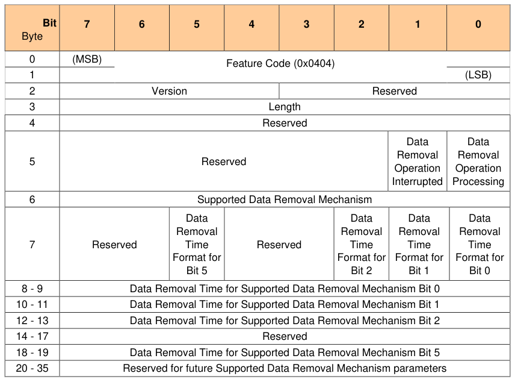
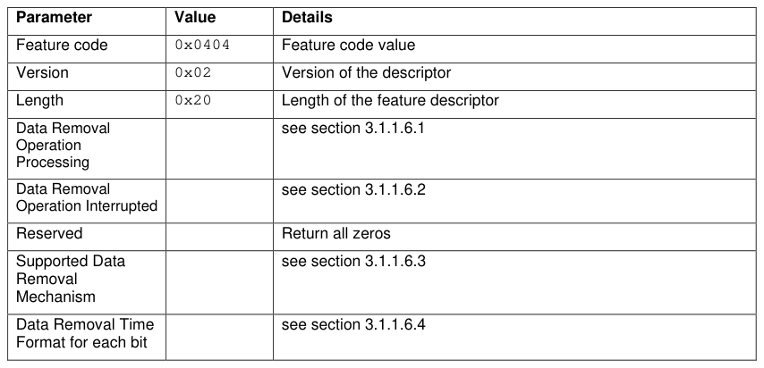
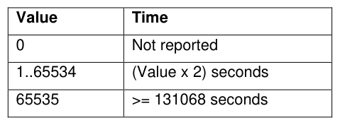
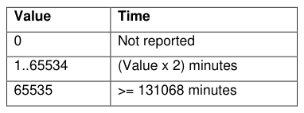
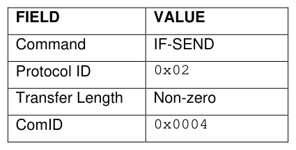

## Bit

> **Section ID**:  | **Page**: 20-32

---
### 📊 Tables (12)

#### Table 1: Table 3 - Level 0 Discovery - TPer Feature Descriptor

| Byte | Bit | 7 | 6 | 5 | 4 | 3 | 2 | 1 | 0 |
| :--- | :--- | :--- | :--- | :--- | :--- | :--- | :--- | :--- | :--- |
| | | | | | | | | | |
| 0 | (MSB) | | | | | | | | |
| | | | | | | | | | |
| | | | | | | | | | |

#### Table 2: Table 4 - Level 0 Discovery - Locking Feature Descriptor

| Bit Byte | 7 | 6 | 5 | 4 | 3 | 2 | 1 | 0 |
| :--- | :--- | :--- | :--- | :--- | :--- | :--- | :--- | :--- |
| | (MSB) | | | | | | | |
| 0 | | | | | | | | |
| | | | | | | | | Feature Code (0x0002) |
| | | | | | | | | |
| 1 | | | | | | | | |
| | | | | | | | | (LSB) |
| 2 | | | | | | | | |
| | | | | | | | | Version |
| | | | | | | | | Reserved |
| 3 | | | | | | | | |
| | | | | | | | | Length |
| 4 | HW Reset for LOR/DOR Supported | MBR Shadowing Not Supported | MBR Done | MBR Enabled | Media Encryption | Locked | Locking Enabled | Locking Supported |
| 5 - 15 | | | | | | | | |
| | | | | | | | | Reserved |

#### Table 3: Table 5 - Level 0 Discovery - Geometry Reporting Feature Descriptor

| Bit | 7 | 6 | 5 | 4 | 3 | 2 | 1 | 0 |
| :--- | :--- | :--- | :--- | :--- | :--- | :--- | :--- | :--- |
| Byte | | | | | | | | |
| 0 | (MSB) | | | | | | | |
| | | | | | | | | Feature Code (0x0003) |
| | | | | | | | | (LSB) |
| 1 | | | | | | | | |
| 2 | | | | Version | | | | Reserved |
| 3 | | | | | | | | Length |
| 4 | | | | | | | | Reserved |
| | | | | | | | | ALIGN |
| 5 - 11 | | | | | | | | Reserved |
| 12 | (MSB) | | | | | | | |
| 13 | | | | | | | | LogicalBlockSize |
| 14 | | | | | | | | |
| 15 | | | | | | | | (LSB) |
| 16 | (MSB) | | | | | | | |
| 17 | | | | | | | | AlignmentGranularity |
| 18 | | | | | | | | |
| 19 | | | | | | | | |
| 20 | | | | | | | | |
| | | | | | | | | |
| Bit | 7 | 6 | 5 | 4 | 3 | 2 | 1 | 0 |
| Byte | | | | | | | | |
| 21 | | | | | | | | |
| 22 | | | | | | | | |
| 23 | | | | | | | | |
| 24 | (MSB) | | | | | | | |
| 25 | | | | | | | | LowestAlignedLBA |
| 26 | | | | | | | | |
| 27 | | | | | | | | |
| 28 | | | | | | | | |
| 29 | | | | | | | | |
| 30 | | | | | | | | |
| 31 | | | | | | | | (LSB) |

#### Table 4: Untitled Table

(Continuation of Table 5 - Level 0 Discovery - Geometry Reporting Feature Descriptor - see first part)

#### Table 5: Table 6 - Level 0 Discovery - Opal SSC V2 Feature Descriptor

| Bit Byte | 7 | 6 | 5 | 4 | 3 | 2 | 1 | 0 |
| :--- | :--- | :--- | :--- | :--- | :--- | :--- | :--- | :--- |
| 0 | (MSB) | | | | | | | |
| | | | | | | | | Feature Code (0x0203) |
| | | | | | | | | (LSB) |
| 1 | | | | | | | | |
| 2 | | | | | | | | Feature Descriptor Version Number |
| | | | | | | | | SSC Minor Version Number |
| 3 | | | | | | | | Length |
| 4 | (MSB) | | | | | | | Base ComID |
| | | | | | | | | (LSB) |
| 5 | | | | | | | | |
| 6 | (MSB) | | | | | | | Number of ComIDs |
| | | | | | | | | (LSB) |
| 7 | | | | | | | | |
| 8 | | | | | | | | Reserved for future common SSC parameters |
| | | | | | | | | Range Crossing Behavior |
| 9 | (MSB) | | | | | | | Number of Locking SP Admin Authorities Supported |
| | | | | | | | | (LSB) |
| 10 | | | | | | | | |
| 11 | (MSB) | | | | | | | Number of Locking SP User Authorities Supported |
| | | | | | | | | (LSB) |
| 12 | | | | | | | | |
| 13 | | | | | | | | Initial C_PIN_SID PIN Indicator |
| 14 | | | | | | | | Behavior of C_PIN_SID PIN upon TPer Revert |
| 15 - 19 | | | | | | | | Reserved for future common SSC parameters |

#### Table 6: Table 7 - SSC Minor Versions

| SSC Minor Version Number | Specification Referenced |
| :--- | :--- |
| 0x0 | TCG Opal SSC Specification v2.00 |
| 0x1 | TCG Opal SSC Specification v2.01 |
| 0x2 | TCG Opal SSC Specification v2.02 |
| 0x3 | TCG Opal SSC Specification v2.30 |
| All others | Reserved |

#### Table 7: Table 8 - Level 0 Discovery – Supported Data Removal Mechanism Feature Descriptor

| Bit Byte | 7 | 6 | 5 | 4 | 3 | 2 | 1 | 0 |
| :--- | :--- | :--- | :--- | :--- | :--- | :--- | :--- | :--- |
| 0 | (MSB) | | | | | | | |
| | | | | | | | | Feature Code (0x0404) |
| | | | | | | | | |
| | | | | | | | | (LSB) |
| 1 | | | | | | | | |
| 2 | | Version | | | | | Reserved | |
| 3 | | | | | | | | Length |
| 4 | | | | | | | | Reserved |
| 5 | | | | | | | Data Removal Operation Interrupted | Data Removal Operation Processing |
| 6 | | | | | | | | Supported Data Removal Mechanism |
| 7 | Reserved | Data Removal Time Format for Bit 5 | Reserved | Data Removal Time Format for Bit 2 | Data Removal Time Format for Bit 1 | Data Removal Time Format for Bit 0 | | |
| 8 - 9 | | | | | | | | Data Removal Time for Supported Data Removal Mechanism Bit 0 |
| 10 - 11 | | | | | | | | Data Removal Time for Supported Data Removal Mechanism Bit 1 |
| 12 - 13 | | | | | | | | Data Removal Time for Supported Data Removal Mechanism Bit 2 |
| 14 - 17 | | | | | | | | Reserved |
| 18 - 19 | | | | | | | | Data Removal Time for Supported Data Removal Mechanism Bit 5 |
| 20 - 35 | | | | | | | | Reserved for future Supported Data Removal Mechanism parameters |

#### Table 8: Table 9 - Parameter explanation

| Parameter | Value | Details |
| :--- | :--- | :--- |
| Feature code | 0x0404 | Feature code value |
| Version | 0x02 | Version of the descriptor |
| Length | 0x20 | Length of the feature descriptor |
| Data Removal Operation Processing | | see section 3.1.1.6.1 |
| Data Removal Operation Interrupted | | see section 3.1.1.6.2 |
| Reserved | | Return all zeros |
| Supported Data Removal Mechanism | | see section 3.1.1.6.3 |
| Data Removal Time Format for each bit | | see section 3.1.1.6.4 |

#### Table 9: Table 10 - Supported Data Removal Mechanism

| Bit | Name | Condition of user data after Data Removal |
|---|---|---|
| 0 | Overwrite Data Erase¹ | The Overwrite Data Erase mechanism causes TPer to alter information by writing a vendor specific data pattern to the medium. |
| 1 | Block Erase¹ | The Block Erase mechanism causes the TPer to alter information by setting the physical blocks to a vendor specific value. |
| 2 | Cryptographic Erase² | The TPer SHALL support this data erase mechanism. Further this mechanism SHALL be executed in addition to any other supported data removal mechanism that is being executed.     This bit MAY be used by the Revert or the RevertSP or the GenKey (band erase) mechanisms of data removal, where the cryptographic keys used to encrypt the user data are changed. |
| 3-4 | Reserved | Reserved |
| 5 | Vendor Specific Erase¹ | The Vendor Specific Erase mechanisms cause all user data to be removed by a vendor specific method. ³ |
| 6-7 | Reserved | |
| | | |
| Notes: | | |
| | | ¹ The cryptographic erase operation SHALL also be performed when any of the other data removal mechanisms are used. |
| | | ² The Cryptographic Erase bit may be used by the Revert, the RevertSP or the GenKey operations (band erase). Any subsequent operation(s) such as Deallocate, or Unmap, or Trim, that is part of the implementation of the data removal operation SHALL be accounted for in the time reported for this operation (see section 3.1.1.6.4). The time value reported SHALL correspond to the estimated completion time of the Cryptographic Erase. For the erase (GenKey) operation, the reported estimated time value will correspond to the estimated completion time of the erase operation, regardless of the extent of the range being erased. |
| | | ³ If a Storage Device supports more than one vendor proprietary method of data removal, then the associated estimated time value will represent the completion time for the longest vendor specific erase mechanism of data removal, then the associated estimated time value will represent the completion time for the longest of the vendor specific mechanisms. |

#### Table 10: Table 11 - Data Removal Time (Data Removal Time Format bit= 0)

| Value | Time |
|---|---|
| 0 | Not reported |
| 1..65534 | (Value x 2) seconds |
| 65535 | >= 131068 seconds |

#### Table 11: Table 12 - Data Removal Time (Data Removal Time Format bit= 1)

| Value | Time |
|---|---|
| 0 | Not reported |
| 1..65534 | (Value x 2) minutes |
| 65535 | >= 131068 minutes |

#### Table 12: Table 13 - TPER_RESET Command

| FIELD | VALUE |
|---|---|
| Command | IF-SEND |
| Protocol ID | 0x02 |
| Transfer Length | Non-zero |
| ComID | 0x0004 |

