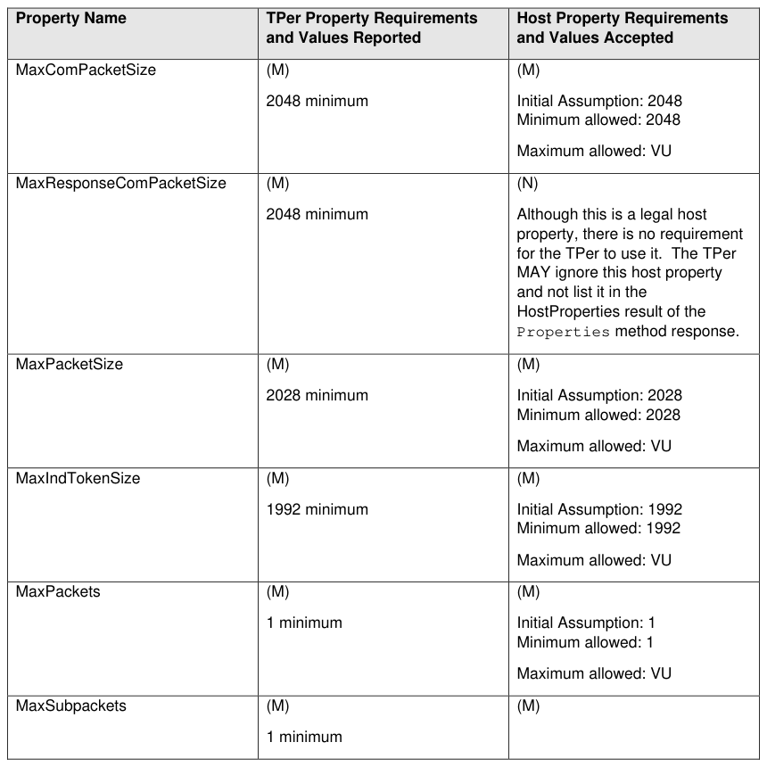
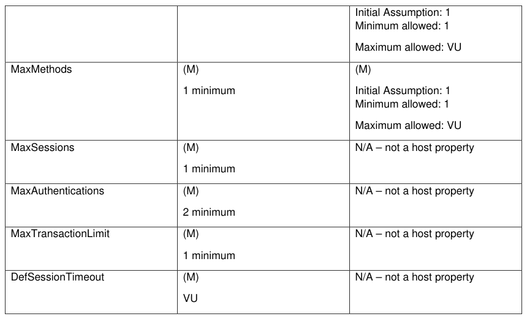

##### 4.1.1.1 Properties (M)

> **Section ID**: 4.1.1.1 | **Page**: 33-33

4.1.1.1 Properties (M) 
An Opal SSC compliant Storage Device SHALL support the Properties method.  The requirements for support of 
the various TPer and Host properties, and the requirements for their values, are shown in Table 17. 
Table 17 - Properties Requirements 
TCG Storage Security Subsystem Class (SSC): Opal 
TCG Storage Security Subsystem Class (SSC): Opal  |  Version 2.30  |  1/30/2025  |  PUBLISHED 
Page 33 
© TCG 2025 

---
### 📊 Tables (2)

#### Table 1: Table 17 - Properties Requirements

| Property Name | TPer Property Requirements and Values Reported | Host Property Requirements and Values Accepted |
| :--- | :--- | :--- |
| MaxComPacketSize | (M) 2048 minimum | (M) Initial Assumption: 2048 Minimum allowed: 2048 Maximum allowed: VU |
| MaxResponseComPacketSize | (M) 2048 minimum | (N) Although this is a legal host property, there is no requirement for the TPer to use it. The TPer MAY ignore this host property and not list it in the HostProperties result of the Properties method response. |
| MaxPacketSize | (M) 2028 minimum | (M) Initial Assumption: 2028 Minimum allowed: 2028 Maximum allowed: VU |
| MaxIndTokenSize | (M) 1992 minimum | (M) Initial Assumption: 1992 Minimum allowed: 1992 Maximum allowed: VU |
| MaxPackets | (M) 1 minimum | (M) Initial Assumption: 1 Minimum allowed: 1 Maximum allowed: VU |
| MaxSubpackets | (M) 1 minimum | (M) |
| | | Initial Assumption: 1 Minimum allowed: 1 Maximum allowed: VU |
| MaxMethods | (M) 1 minimum | (M) Initial Assumption: 1 Minimum allowed: 1 Maximum allowed: VU |
| MaxSessions | (M) 1 minimum | N/A – not a host property |
| MaxAuthentications | (M) 2 minimum | N/A – not a host property |
| MaxTransactionLimit | (M) 1 minimum | N/A – not a host property |
| DefSessionTimeout | (M) VU | N/A – not a host property |

#### Table 2: Untitled Table

(Continuation of Table 17 - Properties Requirements - see first part)

