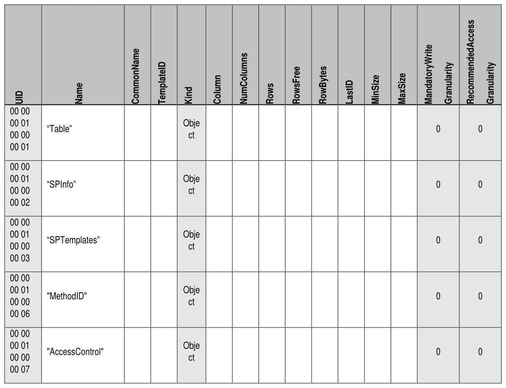
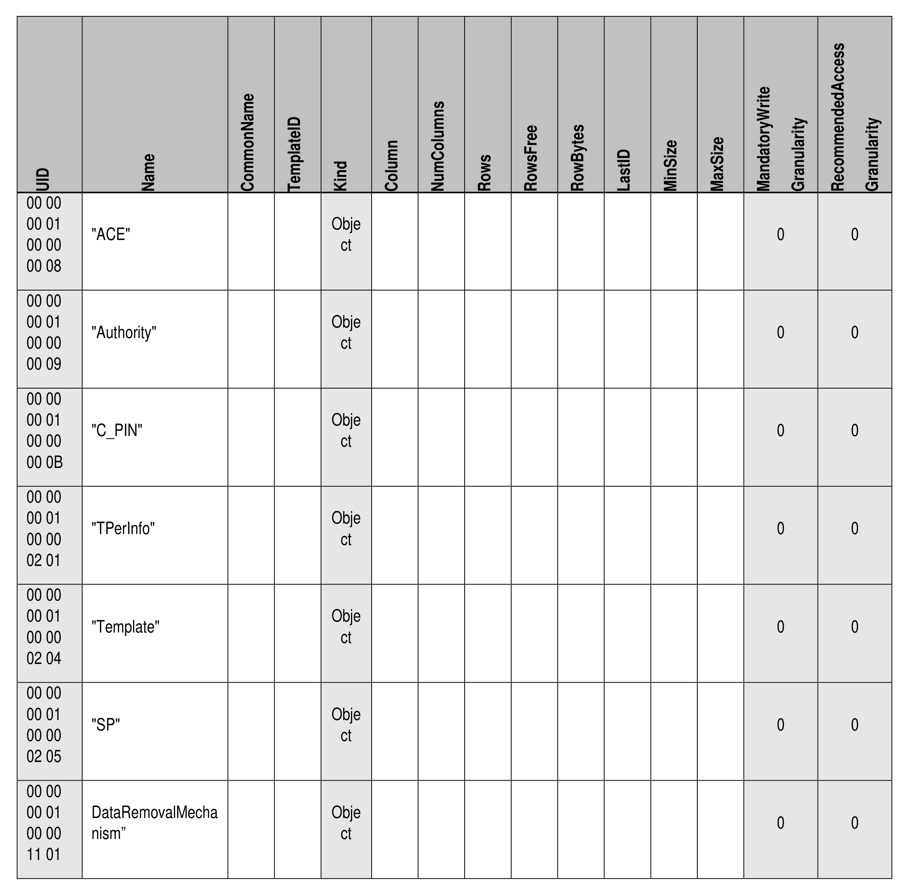

##### 4.2.1.3 Table (M)

> **Section ID**: 4.2.1.3 | **Page**: 36-37

4.2.1.3 Table (M) 
The Table table is defined in [2], and Table 20 defines the Preconfiguration Data for the Table table. 
Refer 
to 
section 
5.3 
for 
a 
description 
and 
requirements 
of 
the 
MandatoryWriteGranularity 
and 
RecommendedAccessGranularity columns. 
If the Data Removal Mechanism feature descriptor is not supported, then the DataRemovalMechanism row SHALL 
NOT exist. 
Table 20 - Admin SP - Table Table Preconfiguration 
TCG Storage Security Subsystem Class (SSC): Opal 
TCG Storage Security Subsystem Class (SSC): Opal  |  Version 2.30  |  1/30/2025  |  PUBLISHED 
Page 36 
© TCG 2025 
Start of Informative Comment 
[2] states, “The Table table in the Admin SP includes a row for each table that the TPer supports, in addition to a row 
for each table that exists in the Admin SP.”  However, the Opal SSC requires only the tables from the Admin SP to be 
included in the Admin SP’s Table table, as indicated in Table 20. 
End of Informative Comment 
TCG Storage Security Subsystem Class (SSC): Opal 
TCG Storage Security Subsystem Class (SSC): Opal  |  Version 2.30  |  1/30/2025  |  PUBLISHED 
Page 37 
© TCG 2025 

---
### 📊 Tables (2)

#### Table 1: Untitled Table

| UID | Name | CommonName | TemplateID | Kind | Column | NumColumns | Rows | RowsFree | RowBytes | LastID | MinSize | MaxSize | MandatoryWrite | Granularity | RecommendedAccess | Granularity |
|:---|:---|:---|:---|:---|:---|:---|:---|:---|:---|:---|:---|:---|:---|:---|:---|:---|
| 00 00 | | | | | | | | | | | | | | | | |
| 00 01 | "Table" | | | Object | | | | | | | | | 0 | 0 | | |
| 00 00 | | | | | | | | | | | | | | | | |
| 00 01 | | | | | | | | | | | | | | | | |
| 00 00 | | | | | | | | | | | | | | | | |
| 00 01 | | | | | | | | | | | | | | | | |
| 00 00 | | | | | | | | | | | | | | | | |
| 00 01 | "SPInfo" | | | Object | | | | | | | | | 0 | 0 | | |
| 00 00 | | | | | | | | | | | | | | | | |
| 00 02 | | | | | | | | | | | | | | | | |
| 00 00 | | | | | | | | | | | | | | | | |
| 00 01 | "SPTemplates" | | | Object | | | | | | | | | 0 | 0 | | |
| 00 00 | | | | | | | | | | | | | | | | |
| 00 03 | | | | | | | | | | | | | | | | |
| 00 00 | | | | | | | | | | | | | | | | |
| 00 01 | "MethodID" | | | Object | | | | | | | | | 0 | 0 | | |
| 00 00 | | | | | | | | | | | | | | | | |
| 00 00 | | | | | | | | | | | | | | | | |
| 00 06 | | | | | | | | | | | | | | | | |
| 00 00 | | | | | | | | | | | | | | | | |
| 00 01 | "AccessControl" | | | Object | | | | | | | | | 0 | 0 | | |
| 00 00 | | | | | | | | | | | | | | | | |
| 00 07 | | | | | | | | | | | | | | | | |
| 00 00 | | | | | | | | | | | | | | | | |
| 00 01 | | | | | | | | | | | | | | | | |
| 00 00 | | | | | | | | | | | | | | | | |
| 00 08 | | | | | | | | | | | | | | | | |
| 00 00 | | | | | | | | | | | | | | | | |
| 00 01 | "ACE" | | | Object | | | | | | | | | 0 | 0 | | |
| 00 00 | | | | | | | | | | | | | | | | |
| 00 08 | | | | | | | | | | | | | | | | |
| 00 00 | | | | | | | | | | | | | | | | |
| 00 01 | "Authority" | | | Object | | | | | | | | | 0 | 0 | | |
| 00 00 | | | | | | | | | | | | | | | | |
| 00 09 | | | | | | | | | | | | | | | | |
| 00 00 | | | | | | | | | | | | | | | | |
| 00 01 | "C_PIN" | | | Object | | | | | | | | | 0 | 0 | | |
| 00 00 | | | | | | | | | | | | | | | | |
| 00 0B | | | | | | | | | | | | | | | | |
| 00 00 | | | | | | | | | | | | | | | | |
| 00 01 | "TPerInfo" | | | Object | | | | | | | | | 0 | 0 | | |
| 00 00 | | | | | | | | | | | | | | | | |
| 02 01 | | | | | | | | | | | | | | | | |
| 00 00 | | | | | | | | | | | | | | | | |
| 00 01 | "Template" | | | Object | | | | | | | | | 0 | 0 | | |
| 00 00 | | | | | | | | | | | | | | | | |
| 02 04 | | | | | | | | | | | | | | | | |
| 00 00 | | | | | | | | | | | | | | | | |
| 00 01 | "SP" | | | Object | | | | | | | | | 0 | 0 | | |
| 00 00 | | | | | | | | | | | | | | | | |
| 02 05 | | | | | | | | | | | | | | | | |
| 00 00 | | | | | | | | | | | | | | | | |
| 00 01 | DataRemovalMechanism | | | Object | | | | | | | | | 0 | 0 | | |
| 00 00 | | | | | | | | | | | | | | | | |
| 11 01 | | | | | | | | | | | | | | | | |

#### Table 2: Untitled Table

(Continuation of Untitled Table - see first part)

