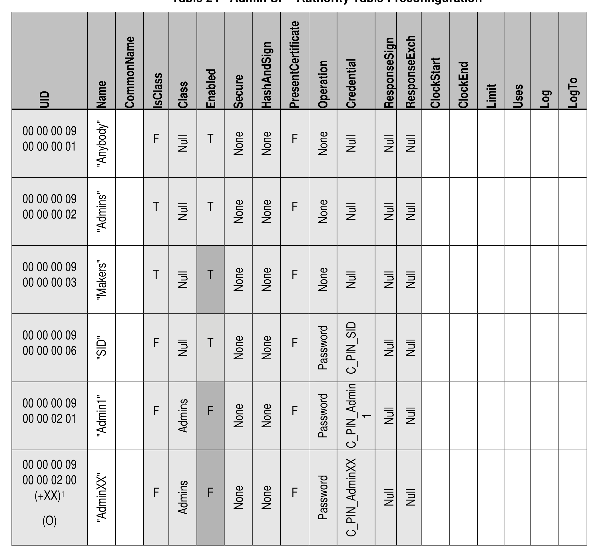

##### 4.2.1.7 Authority (M)

> **Section ID**: 4.2.1.7 | **Page**: 47-47

4.2.1.7 Authority (M) 
The Authority table is defined in [2], and Table 24 defines the Preconfiguration Data for the Authority table. 
Note: 
• 
Admin1 (M) is required; any additional Admin authorities are (O) 
TCG Storage Security Subsystem Class (SSC): Opal 
TCG Storage Security Subsystem Class (SSC): Opal  |  Version 2.30  |  1/30/2025  |  PUBLISHED 
Page 47 
© TCG 2025 
Table 24 - Admin SP - Authority Table Preconfiguration 

---
### 📊 Tables (1)

#### Table 1: Table 24 - Admin SP - Authority Table Preconfiguration

| UID | Name | CommonName | IsClass | Class | Enabled | Secure | HashAndSign | PresentCertificate | Operation | Credential | ResponseSign | ResponseExch | ClockStart | ClockEnd | Limit | Uses | Log | LogTo |
| :--- | :--- | :--- | :--- | :--- | :--- | :--- | :--- | :--- | :--- | :--- | :--- | :--- | :--- | :--- | :--- | :--- | :--- | :--- |
| 00 00 00 09 00 00 00 01 | "Anybody" | | F | Null | T | None | None | F | None | Null | Null | Null | | | | | | |
| 00 00 00 09 00 00 00 02 | "Admins" | | T | Null | T | None | None | F | None | Null | Null | Null | | | | | | |
| 00 00 00 09 00 00 00 03 | "Makers" | | T | Null | T | None | None | F | None | Null | Null | Null | | | | | | |
| 00 00 00 09 00 00 00 06 | "SID" | | F | Null | T | None | None | F | Password | C_PIN_SID | Null | Null | | | | | | |
| 00 00 00 09 00 00 02 01 | "Admin1" | | F | Admins | F | None | None | F | Password | C_PIN_Admin_1 | Null | Null | | | | | | |
| 00 00 00 09 00 00 02 00 (+XX)¹ (O) | "AdminXX" | | F | Admins | F | None | None | F | Password | C_PIN_AdminXX | Null | Null | | | | | | |

