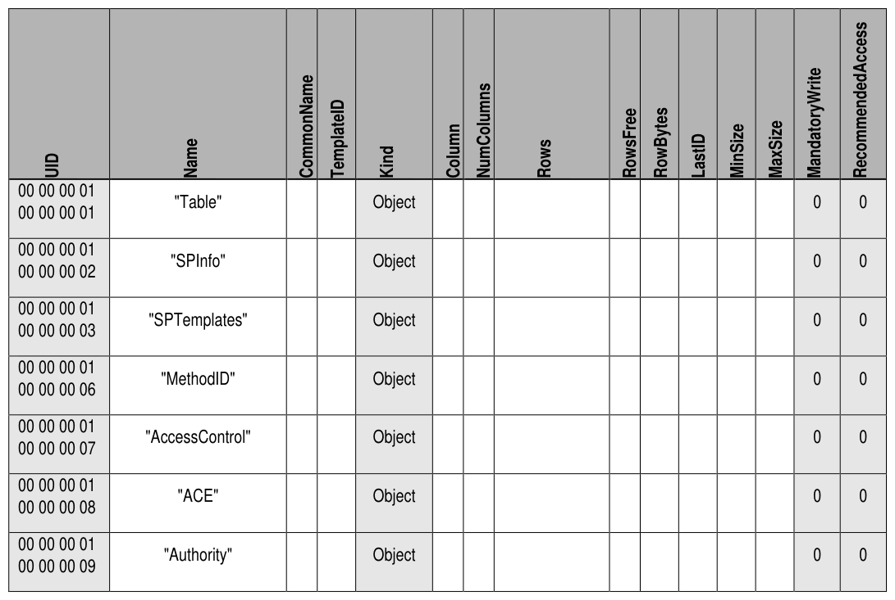
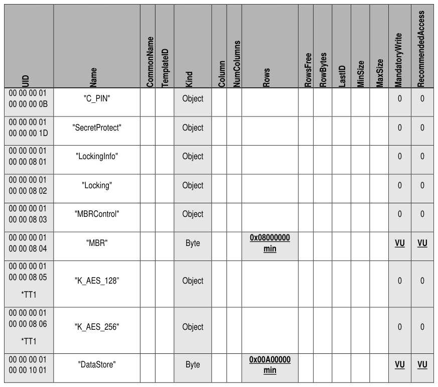

##### 4.3.1.3 Table (M)

> **Section ID**: 4.3.1.3 | **Page**: 53-53

4.3.1.3 Table (M) 
The Table table is defined in [2], and Table 36 defines the Preconfiguration Data for the Table table. 
Table 36 contains Optional rows designated with (O). 
*TT1 means that only one of the two K_AES* tables is required 
Refer 
to 
section 
5.3 
for 
a 
description 
and 
requirements 
of 
the 
MandatoryWriteGranularity 
and 
RecommendedAccessGranularity columns. 
Table 36 - Locking SP - Table Table Preconfiguration 
TCG Storage Security Subsystem Class (SSC): Opal 
TCG Storage Security Subsystem Class (SSC): Opal  |  Version 2.30  |  1/30/2025  |  PUBLISHED 
Page 53 
© TCG 2025 

---
### 📊 Tables (2)

#### Table 1: Table 36 - Locking SP - Table Table Preconfiguration

| UID | Name | CommonName | TemplateID | Kind | Column | NumColumns | Rows | RowsFree | RowBytes | LastID | MinSize | MaxSize | MandatoryWrite | RecommendedAccess |
|:---|:---|:---|:---|:---|:---|:---|:---|:---|:---|:---|:---|:---|:---|:---|
| 00 00 00 01 00 00 00 01 | "Table" | | | Object | | | | | | | | | 0 | 0 |
| 00 00 00 01 00 00 00 02 | "SPInfo" | | | Object | | | | | | | | | 0 | 0 |
| 00 00 00 01 00 00 00 03 | "SPTemplates" | | | Object | | | | | | | | | 0 | 0 |
| 00 00 00 01 00 00 00 06 | "MethodID" | | | Object | | | | | | | | | 0 | 0 |
| 00 00 00 01 00 00 00 07 | "AccessControl" | | | Object | | | | | | | | | 0 | 0 |
| 00 00 00 01 00 00 00 08 | "ACE" | | | Object | | | | | | | | | 0 | 0 |
| 00 00 00 01 00 00 00 09 | "Authority" | | | Object | | | | | | | | | 0 | 0 |
| | | | | | | | | | | | | | | |
| | | | | | | | | | | | | |

#### Table 2: Untitled Table

(Continuation of Table 36 - Locking SP - Table Table Preconfiguration - see first part)

