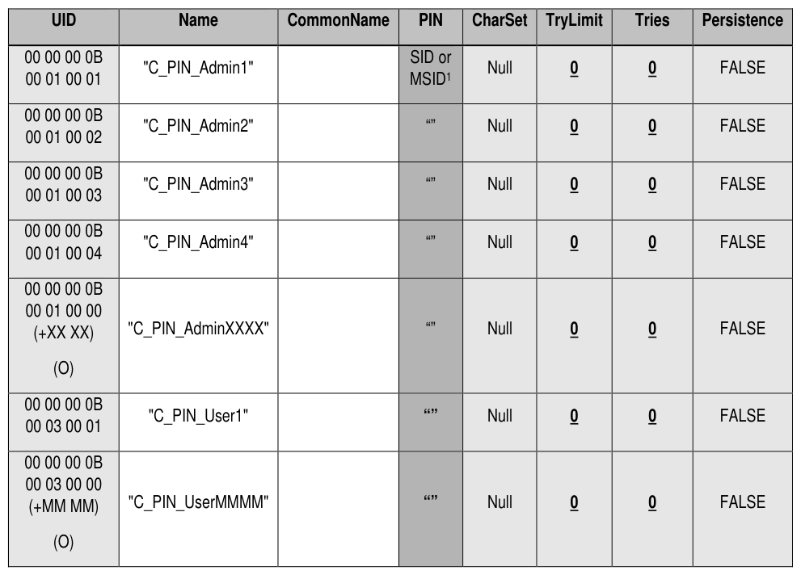

##### 4.3.1.9 C_PIN (M)

> **Section ID**: 4.3.1.9 | **Page**: 83-83

4.3.1.9 C_PIN (M) 
Table 41 includes Optional rows designated with (O) 
Notes: 
1. If the Locking SP's original life cycle state is Manufactured-Inactive, see 5.1.1.2 for the initial value of 
C_PIN_Admin1.PIN. If the Locking SP's original life cycle state is Manufactured, then the initial value of 
C_PIN_Admin1.PIN is the same as the Admin SP's C_PIN_MSID.PIN value. 
TCG Storage Security Subsystem Class (SSC): Opal 
TCG Storage Security Subsystem Class (SSC): Opal  |  Version 2.30  |  1/30/2025  |  PUBLISHED 
Page 83 
© TCG 2025 
Table 41 - Locking SP - C_PIN Table Preconfiguration 

---
### 📊 Tables (1)

#### Table 1: Table 41 - Locking SP - C_PIN Table Preconfiguration

| UID | Name | CommonName | PIN | CharSet | TryLimit | Tries | Persistence |
|:---|:---|:---|:---|:---|:---|:---|:---|
| 00 00 00 0B 00 01 00 01 | "C_PIN_Admin1" | | SID or MSID¹ | Null | 0 | 0 | FALSE |
| 00 00 00 0B 00 01 00 02 | "C_PIN_Admin2" | | "" | Null | 0 | 0 | FALSE |
| 00 00 00 0B 00 01 00 03 | "C_PIN_Admin3" | | "" | Null | 0 | 0 | FALSE |
| 00 00 00 0B 00 01 00 04 | "C_PIN_Admin4" | | "" | Null | 0 | 0 | FALSE |
| 00 00 00 0B 00 01 00 00 (+XX XX) (O) | "C_PIN_AdminXXXX" | | "" | Null | 0 | 0 | FALSE |
| 00 00 00 0B 00 03 00 01 | "C_PIN_User1" | | "" | Null | 0 | 0 | FALSE |
| 00 00 00 0B 00 03 00 00 (+MM MM) (O) | "C_PIN_UserMMMM" | | "" | Null | 0 | 0 | FALSE |

