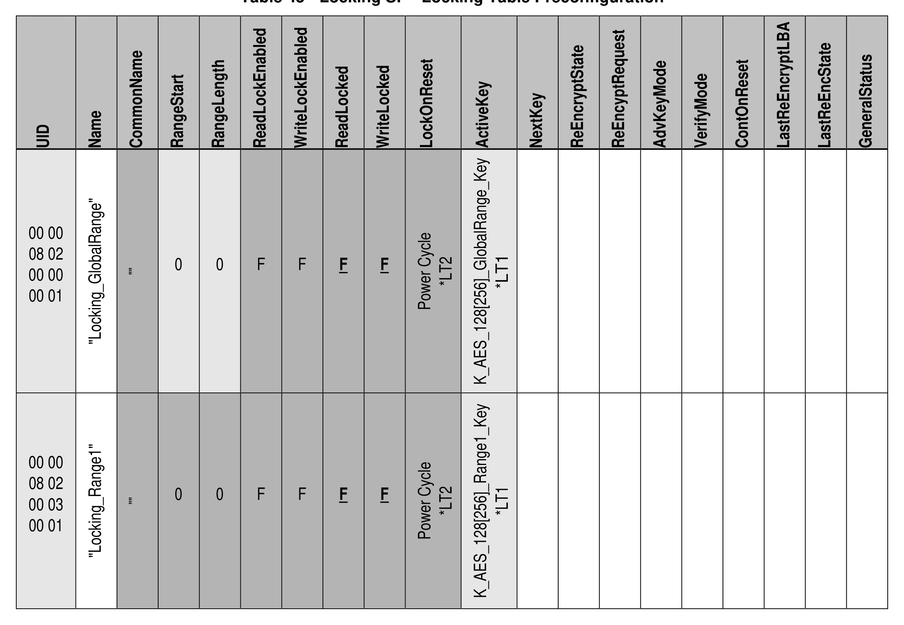

##### 4.3.5.2 Locking (M)

> **Section ID**: 4.3.5.2 | **Page**: 86-86

4.3.5.2 Locking (M)  
Table 45 contains Optional rows designated with (O). 
*LT1 means that the ActiveKey can be a K_AES_128 object reference (UID) or a K_AES_256 object reference (UID) 
*LT2 means that only a limited set of LockOnReset values is required to be supported by Opal SSC compliant Storage 
Devices. Refer to section 4.3.5.2.2 for details. 
Table 45 - Locking SP - Locking Table Preconfiguration 
TCG Storage Security Subsystem Class (SSC): Opal 
TCG Storage Security Subsystem Class (SSC): Opal  |  Version 2.30  |  1/30/2025  |  PUBLISHED 
Page 86 
© TCG 2025 

---
### 📊 Tables (2)

#### Table 1: Table 45 - Locking SP - Locking Table Preconfiguration

| UID | Name | CommonName | RangeStart | RangeLength | ReadLockEnabled | WriteLockEnabled | ReadLocked | WriteLocked | LockOnReset | ActiveKey | NextKey | ReEncryptState | ReEncryptRequest | AdvKeyMode | VerifyMode | ContOnReset | LastReEncryptLBA | LastReEncState | GeneralStatus |
|:---|:---|:---|:---|:---|:---|:---|:---|:---|:---|:---|:---|:---|:---|:---|:---|:---|:---|:---|:---|
| 00 00 | | "Locking_GlobalRange" | | | | | | | | | | | | | | | | | |
| 08 02 | | | 0 | 0 | F | F | | | Power Cycle | K_AES_128[256]_GlobalRange_Key | | | | | | | | | |
| 00 00 | | | | | | | | | | | | | | | | | | | |
| 00 01 | | | | | | | | | | | | | | | | | | | |
| 00 00 | | "Locking_Range1" | | | | | | | | | | | | | | | | | |
| 08 02 | | | 0 | 0 | F | F | | | Power Cycle | K_AES_128[256]_Range1_Key | | | | | | | | | |
| 00 03 | | | | | | | | | | | | | | | | | | | |
| 00 01 | | | | | | | | | | | | | | | | | | | |
| 00 00 | | "Locking_NNNN" | | | | | | | | | | | | | | | | | |
| 08 02 | | | 0 | 0 | F | F | | | Power Cycle | K_AES_128[256]_RangeNNNN_Key | | | | | | | | | |
| 00 03 | | | | | | | | | | | | | | | | | | | |
| NN | NN | | | | | | | | | | | | | | | | | | |

#### Table 2: Untitled Table

(Continuation of Table 45 - Locking SP - Locking Table Preconfiguration - see first part)

