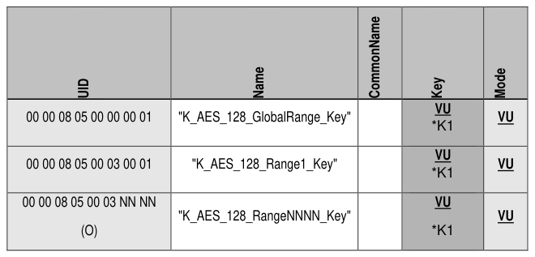
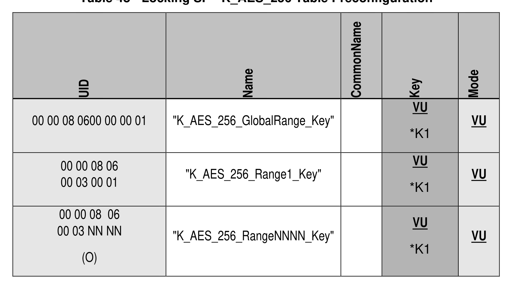

##### 4.3.5.5 K_AES_128 or K_AES_256 (M)

> **Section ID**: 4.3.5.5 | **Page**: 89-89

4.3.5.5 K_AES_128 or K_AES_256 (M) 
At least one of the following tables (Table 47 and Table 48) SHALL be supported. 
Table 47 contains Optional rows designated with (O). 
*K1 means that a field is indirectly writable using the GenKey method. 
Table 47 - Locking SP - K_AES_128 Table Preconfiguration 
Table 48 - Locking SP - K_AES_256 Table Preconfiguration 
TCG Storage Security Subsystem Class (SSC): Opal 
TCG Storage Security Subsystem Class (SSC): Opal  |  Version 2.30  |  1/30/2025  |  PUBLISHED 
Page 89 
© TCG 2025 

---
### 📊 Tables (2)

#### Table 1: Table 47 - Locking SP - K_AES_128 Table Preconfiguration

| UID | Name | CommonName | Key | Mode |
|:---|:---|:---|:---|:---|
| 00 00 08 05 00 00 00 01 | "K_AES_128_GlobalRange_Key" | | VU \*K1 | VU |
| 00 00 08 05 00 03 00 01 | "K_AES_128_Range1_Key" | | VU \*K1 | VU |
| 00 00 08 05 00 03 NN NN (O) | "K_AES_128_RangeNNNN_Key" | | VU \*K1 | VU |

#### Table 2: Table 48 - Locking SP - K_AES_256 Table Preconfiguration

| UID | Name | CommonName | Key | Mode |
|---|---|---|---|---|
| 00 00 08 0600 00 00 01 | "K_AES_256_GlobalRange_Key" | | VU *K1 | VU |
| 00 00 08 06 00 03 00 01 | "K_AES_256_Range1_Key" | | VU *K1 | VU |
| 00 00 08 06 00 03 NN NN (O) | "K_AES_256_RangeNNNN_Key" | | VU *K1 | VU |

