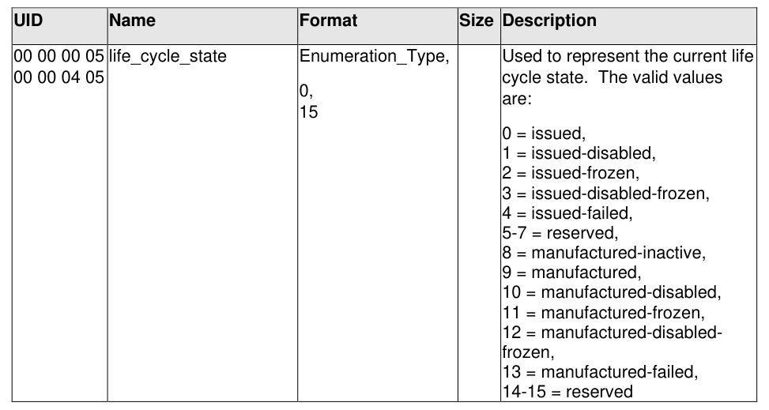

#### 5.2.3 Type Table Modification

> **Section ID**: 5.2.3 | **Page**: 98-98

5.2.3 Type Table Modification 
In order to accommodate the additional life cycle states defined in this specification, the definition of the 
life_cycle_state type is changed from [2] to that described in Table 49: 
Table 49 - Life Cycle State Type Table Modification 

---
### 📊 Tables (1)

#### Table 1: Table 49 - Life Cycle State Type Table Modification

| UID | Name | Format | Size | Description |
|:---|:---|:---|:---|:---|
| 00 00 00 05 00 00 04 05 | life_cycle_state | Enumeration_Type, 0, 15 | | Used to represent the current life cycle state. The valid values are:  0 = issued, 1 = issued-disabled, 2 = issued-frozen, 3 = issued-disabled-frozen, 4 = issued-failed, 5-7 = reserved, 8 = manufactured-inactive, 9 = manufactured, 10 = manufactured-disabled, 11 = manufactured-frozen, 12 = manufactured-disabled-frozen, 13 = manufactured-failed, 14-15 = reserved |

