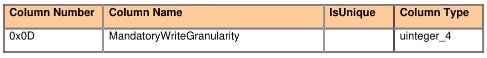
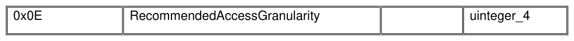

#### 5.3.1 Table Table Modification

> **Section ID**: 5.3.1 | **Page**: 98-98

5.3.1 Table Table Modification 
In order to allow a Storage Device to report its mandatory and recommended data alignment restrictions when 
accessing byte tables, the Table table SHALL contain the additional columns shown in Table 50. 
The mandatory and recommended data alignment restrictions do not apply to Object tables. 
Table 50 - Table Table Additional Columns 
TCG Storage Security Subsystem Class (SSC): Opal 
TCG Storage Security Subsystem Class (SSC): Opal  |  Version 2.30  |  1/30/2025  |  PUBLISHED 
Page 98 
© TCG 2025 

---
### 📊 Tables (2)

#### Table 1: Table 50 - Table Table Additional Columns

| Column Number | Column Name | IsUnique | Column Type |
|:---|:---|:---|:---|
| 0x0D | MandatoryWriteGranularity | | uinteger_4 |
| 0x0E | RecommendedAccessGranularity | | uinteger_4 |

#### Table 2: Untitled Table

(Continuation of Table 50 - Table Table Additional Columns - see first part)

