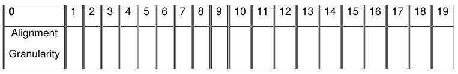
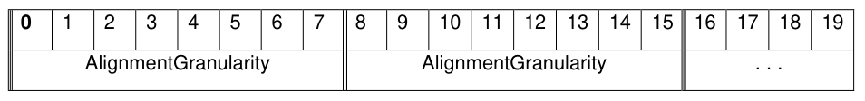
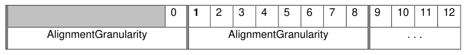
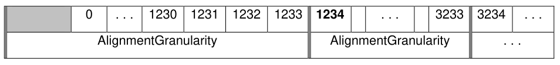

### 5.4 Examples of Alignment Geometry Reporting

> **Section ID**: 5.4 | **Page**: 100-101

5.4 Examples of Alignment Geometry Reporting 
Figure 7 illustrates reporting for a typical legacy Storage Device where there is one logical block per physical block 
on the media. 
TCG Storage Security Subsystem Class (SSC): Opal 
TCG Storage Security Subsystem Class (SSC): Opal  |  Version 2.30  |  1/30/2025  |  PUBLISHED 
Page 100 
© TCG 2025 
Figure 7 - Example: AlignmentGranularity=1, Lowest Aligned LBA=0 
Figure 8 illustrates geometry for a Storage Device where there are 8 logical blocks per physical block (e.g., a 4K 
physical block) and the first logical block is aligned at the beginning of the first physical block. 
Figure 8 - Example: AlignmentGranularity=8, Lowest Aligned LBA=0 
Figure 9 illustrates geometry for a Storage Device where there are 8 logical blocks per physical block (e.g., a 4K 
physical block) and LBA=1 is the first logical block that is aligned at the beginning of a physical block 
Figure 9 - Example: AlignmentGranularity=8, Lowest Aligned LBA=1 
Figure 10 illustrates geometry for a Storage Device where there are 2000 logical blocks per physical block and 
LBA=1234 is the first logical block that is aligned at the beginning of a physical block. 
Figure 10 - Example: AlignmentGranularity=2000, Lowest Aligned LBA=1234 

---
### 📊 Tables (4)

#### Table 1: Untitled Table

| 0 | 1 | 2 | 3 | 4 | 5 | 6 | 7 | 8 | 9 | 10 | 11 | 12 | 13 | 14 | 15 | 16 | 17 | 18 | 19 |
|---|---|---|---|---|---|---|---|---|---|---|---|---|---|---|---|---|---|---|---|
| Alignment | | | | | | | | | | | | | | | | | | | |
| Granularity | | | | | | | | | | | | | | | | | | | |
| 0 | 1 | 2 | 3 | 4 | 5 | 6 | 7 | 8 | 9 | 10 | 11 | 12 | 13 | 14 | 15 | 16 | 17 | 18 | 19 |
| AlignmentGranularity | | | | | | | | | | | | | | | | | | | |
| AlignmentGranularity | | | | | | | | | | | | | | | | | | | |
| ... | | | | | | | | | | | | | | | | | | | |
| 0 | 1 | 2 | 3 | 4 | 5 | 6 | 7 | 8 | 9 | 10 | 11 | 12 |
| AlignmentGranularity | | | | | | | | | | | | |
| AlignmentGranularity | | | | | | | | | | | | |
| ... | | | | | | | | | | | | |
| 0 | ... | 1230 | 1231 | 1232 | 1233 | 1234 | ... | 3233 | 3234 | ... |
| AlignmentGranularity | | | | | | | | | | | |
| AlignmentGranularity | | | | | | | | | | | |
| ... | | | | | | | | | | | |

#### Table 2: Untitled Table

(Continuation of Untitled Table - see first part)

#### Table 3: Untitled Table

(Continuation of Untitled Table - see first part)

#### Table 4: Untitled Table

(Continuation of Untitled Table - see first part)

