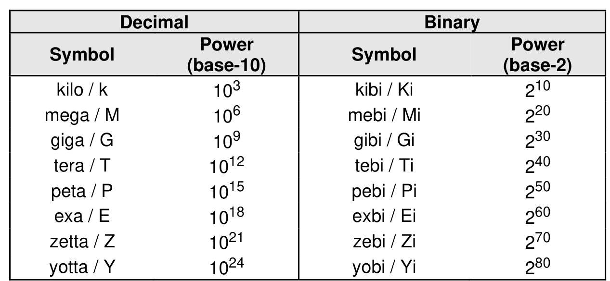

#### 1.4.2 Numerical Descriptions

> **Section ID**: 1.4.2 | **Page**: 27-28

A 0’s based value is a numbering scheme in which the number 0h represents a value of 1h, 1h represents
2h, 2h represents 3h, etc. In this numbering scheme, there is no method to represent the value of 0h.
Values in this specification are 1-based (i.e., the number 1h represents a value of 1h, 2h represents 2h,
etc.) unless otherwise specified.
Size values are shown in binary units or decimal units. The symbols used to represent these values are as
shown in Figure 2.
The ^ operator is used to denote the power to which that number, symbol, or expression is to be raised.
Some parameters are defined as an ASCII string. ASCII strings shall contain only code values (i.e., byte
values or octet values) 20h through 7Eh. For the string “Copyright”, the character “C” is the first byte, the
character “o” is the second byte, etc. ASCII strings are left justified. If padding is necessary, then the string
shall be padded with spaces (i.e., ASCII character 20h) to the right unless the string is specified as null-
terminated.
Some parameters are defined as a UTF-8 string. UTF-8 strings shall contain only byte values (i.e., octet
values) 20h through 7Eh, 80h through BFh, and C2h through F4h (refer to sections 1 to 3 of RFC 3629).
For the string “Copyright”, the character “C” is the first byte, the character “o” is the second byte, etc. UTF-8
strings are left justified. If padding is necessary, then the string shall be padded with spaces (i.e., ASCII
character 20h, Unicode character U+0020) to the right unless the string is specified as null-terminated.
If padding is necessary for a field that contains a null-terminated string then the field should be padded with
nulls (i.e., ASCII character 00h, Unicode character U+0000) to the right of the string.
A hexadecimal ASCII string is an ASCII string that uses a subset of the code values: “0” to “9”, “A” to “F”
uppercase, and “a” to “f” lowercase.
Hexadecimal (i.e., base 16) numbers are written with a lower case “h” suffix (e.g., 0FFFh, 80h).
Hexadecimal numbers larger than eight digits are represented with an underscore character dividing each
group of eight digits (e.g., 1E_DEADBEEFh).
Binary (i.e., base 2) numbers are written with a lower case “b” suffix (e.g., 1001b, 10b). Binary numbers
larger than four digits are written with an underscore character dividing each group of four digits (e.g.,
1000_0101_0010b).
All other numbers are decimal (i.e., base 10). A decimal number is represented in this specification by any
sequence of digits consisting of only the Western-Arabic numerals 0 to 9 not immediately followed by a
lower-case b or a lower-case h (e.g., 175). This specification uses the following conventions for representing
decimal numbers:
a) the decimal separator (i.e., separating the integer and fractional portions of the number) is a period;
b) the thousands separator (i.e., separating groups of three decimal digits in a portion of the number)
is a comma;
c) the thousands separator is used in only the integer portion of a number and not the fractional portion
of a number; and
d) the decimal representation for a year does not include a comma (e.g., 2019 instead of 2,019).

---
### 📊 Tables (1)

#### Table 1: Untitled Table

| 102 | yobl / Y1 | 28 |
|---|---|---|
| 3 |  |  |

