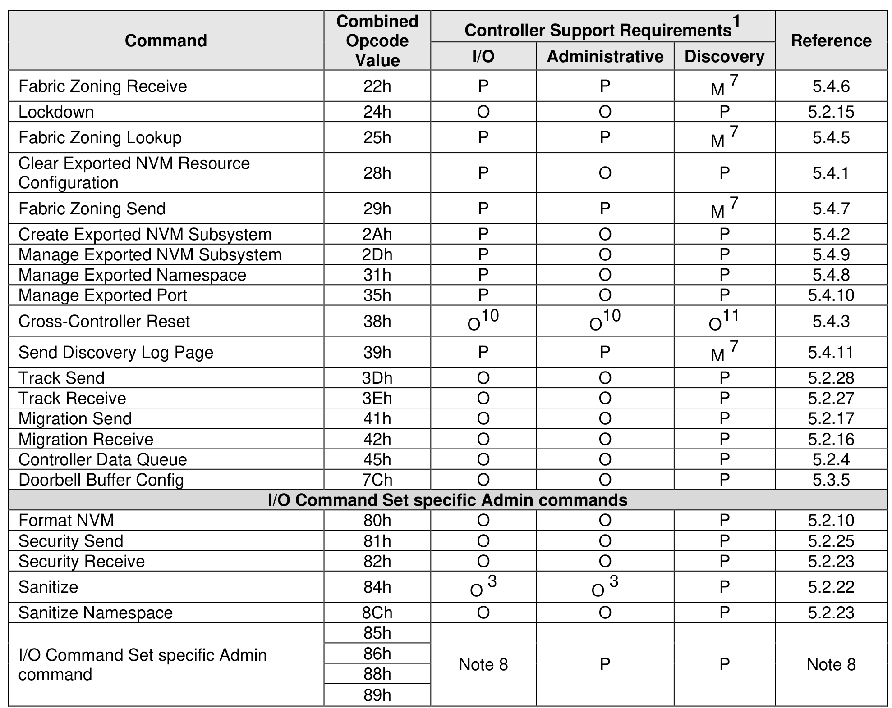
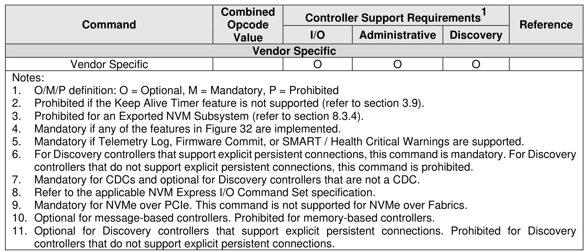
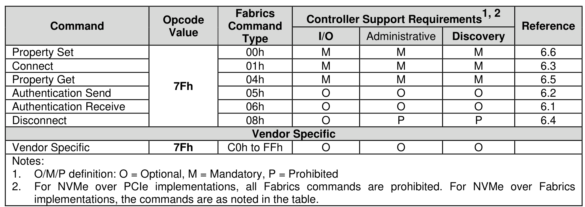
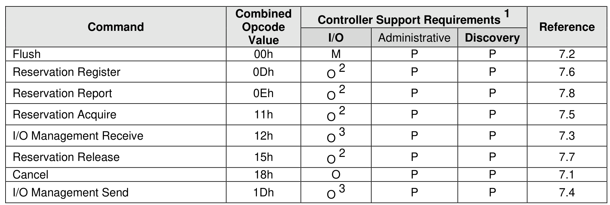
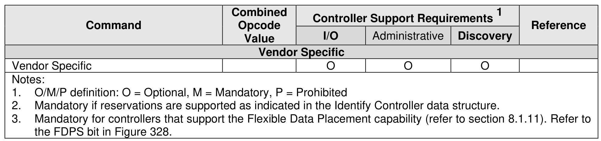

##### 3.1.3.4 Command Support Requirements

> **Section ID**: 3.1.3.4 | **Page**: 68-71

Figure 28, Figure 29, and Figure 30 define commands that are mandatory, optional, and prohibited for an
I/O controller, Administrative controller, and Discovery controller. I/O Command Set specific command
support requirements are described within NVM Express I/O Command Set specifications. Since an
Administrative controller does not support I/O queues, I/O Command Set specific commands that are not
Admin commands are not supported by an Administrative controller.
A host may utilize the Commands Supported and Effects log page to determine optional commands that
are supported by a controller.

---
### 📊 Tables (6)

#### Table 1: Untitled Table

| | | | | | |
| :--- | :--- | :--- | :--- | :--- | :--- |
| /O Completion Queue | 05h | M9 | P | P | 5.3.1 |
| | 06h | M | M | M | 5.2.13 |
| | 08h | M | O | O | 5.2.1 |
| | 09h | M | O4 | Note 6 | 5.2.26 |
| | 0Ah | M | O4 | Note 6 | 5.2.11 |
| | 0Ch | M | O5 | Note 6 | 5.2.2 |
| | 0Dh | O | O | P | 5.2.21 |
| | 10h | O | O | P | 5.2.8 |
| | 11h | O | O | P | 5.2.9 |
| | 14h | O | O | P | 5.2.5 |
| | 15h | O | O | P | 5.2.20 |
| | 18h | M2 | M2 | Note 6 | 5.2.14 |
| | 19h | O | O | P | 5.2.7 |
| | 1Ah | O | O | P | 5.2.6 |
| | 1Ch | O | O | P | 5.3.6 |
| | 1Dh | O | O | P | 5.2.19 |
| | 1Eh | O | O | P | 5.2.18 |
| | 20h | O | O | P | 5.2.3 |
| | 21h | P | P | M7 | 5.4.4 |
| | | | | | |
| | | | | | |
| | | | | | |
| | | | | | |
| |
| | Value | I/O | Administrative | Discovery |
|---|---|---|---|---|
| Vendor Specific | | O | O | O |
| | | | | |
| I/P definition: O = Optional, M = Mandatory, P = Prohibited | | | | |
| hibited if the Keep Alive Timer feature is not supported (refer to section 3.9). | | | | |
| hibited for an Exported NVM Subsystem (refer to section 8.3.4). | | | | |
| mandatory if any of the features in Figure 32 are implemented. | | | | |
| mandatory if Telemetry Log, Firmware Commit, or SMART / Health Critical Warnings are supported. | | | | |
| Discovery controllers that support explicit persistent connections, this command is mandatory. For Discovery | | | | |
| controllers that do not support explicit persistent connections, this command is prohibited. | | | | |
| mandatory for CDCs and optional for Discovery controllers that are not a CDC. | | | | |
| er to the applicable NVM Express I/O Command Set specification. | | | | |
| mandatory for NVMe over PCIe. This command is not supported for NVMe over Fabrics. | | | | |
| onal for message-based controllers. Prohibited for memory-based controllers. | | | | |
| onal for Discovery controllers that support explicit persistent connections. Prohibited for Discovery | | | | |
| controllers that do not support explicit persistent connections. | | | | |

Figure 29: Fabrics Command Support Requirements
| Command | Opcode Value | Fabrics Command Type | \multicolumn{3}{c|}{Controller Support Requirements $^{1,2}$} | Reference |
|---|---|---|---|---|---|---|
| | | | I/O | Administrative | Discovery | |
| | | | O | O | O | |
| | | | | | | |
| | | | | | | |
| | | | | | | |
| | | | |

#### Table 2: Untitled Table

(Continuation of Untitled Table - see first part)

#### Table 3: Untitled Table

(Continuation of Untitled Table - see first part)

#### Table 4: Untitled Table

(Continuation of Untitled Table - see first part)

#### Table 5: Untitled Table

(Continuation of Untitled Table - see first part)

#### Table 6: Untitled Table

(Continuation of Untitled Table - see first part)

