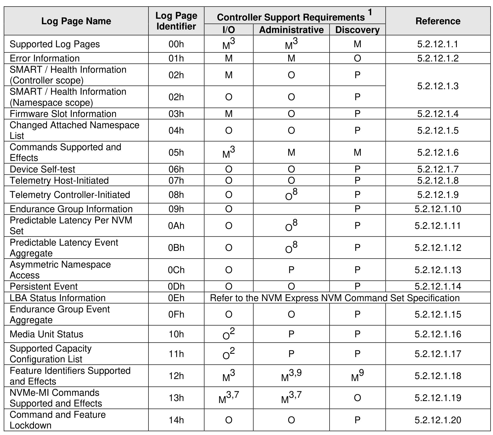
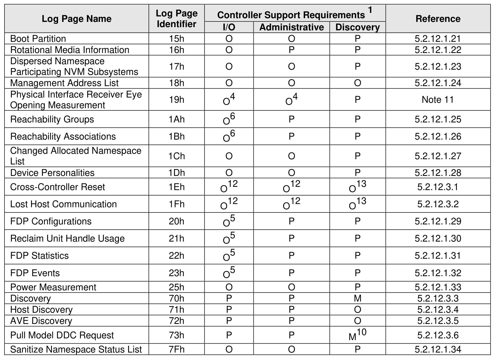
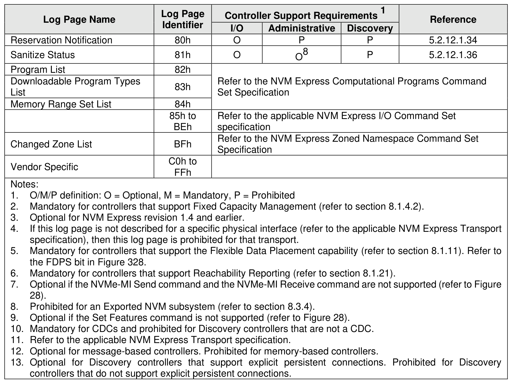

##### 3.1.3.5 Log Page Support Requirements

> **Section ID**: 3.1.3.5 | **Page**: 71-73

Figure 31 defines log pages that are mandatory, optional, and prohibited for an I/O controller, Administrative
controller, and Discovery controller. I/O Command Set specific log page support requirements are
described within NVM Express I/O Command Set specifications.

---
### 📊 Tables (3)

#### Table 1: Untitled Table

| | Identifier | I/O | Administrative | Discovery | |
| :--- | :--- | :--- | :--- | :--- | :--- |
| / Health Information | 02h | O | O | P | 5.2.12.1.3 |
| e Slot Information | 03h | M | O | P | 5.2.12.1.4 |
| d Attached Namespace | 04h | O | O | P | 5.2.12.1.5 |
| nds Supported and | 05h | M³ | M | M | 5.2.12.1.6 |
| Self-test | 06h | O | O | P | 5.2.12.1.7 |
| ry Host-Initiated | 07h | O | O | P | 5.2.12.1.8 |
| ry Controller-Initiated | 08h | O | O⁸ | P | 5.2.12.1.9 |
| nce Group Information | 09h | O | | P | 5.2.12.1.10 |
| ble Latency Per NVM | 0Ah | O | O⁸ | P | 5.2.12.1.11 |
| ble Latency Event | 0Bh | O | O⁸ | P | 5.2.12.1.12 |
| etric Namespace | 0Ch | O | P | P | 5.2.12.1.13 |
| nt Event | 0Dh | O | O | P | 5.2.12.1.14 |
| tus Information | 0Eh | Refer to the NVM Express NVM Command Set Specification | | | |
| nce Group Event | 0Fh | O | O | P | 5.2.12.1.15 |
| Init Status | 10h | O² | P | P | 5.2.12.1.16 |
| ed Capacity | 11h | O² | P | P | 5.2.12.1.17 |
| ration List | | | | | |
| Identifiers Supported | 12h | M³ | M³,⁹ | M⁹ | 5.2.12.1.18 |
| cts | | | | | |
| MI Commands | 13h | M³,⁷ | M³,⁷ | O | 5.2.12.1.19 |
| ed and Effects | | | | | |
| nd and Feature | 14h | O | O | P | 5.2.12.1.20 |
| wn | | | | | |
| | | | | | |
| | | | | | |
| | | | | | |
| | | |

#### Table 2: Untitled Table

(Continuation of Untitled Table - see first part)

#### Table 3: Untitled Table

(Continuation of Untitled Table - see first part)

