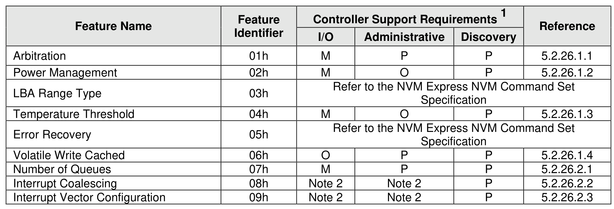
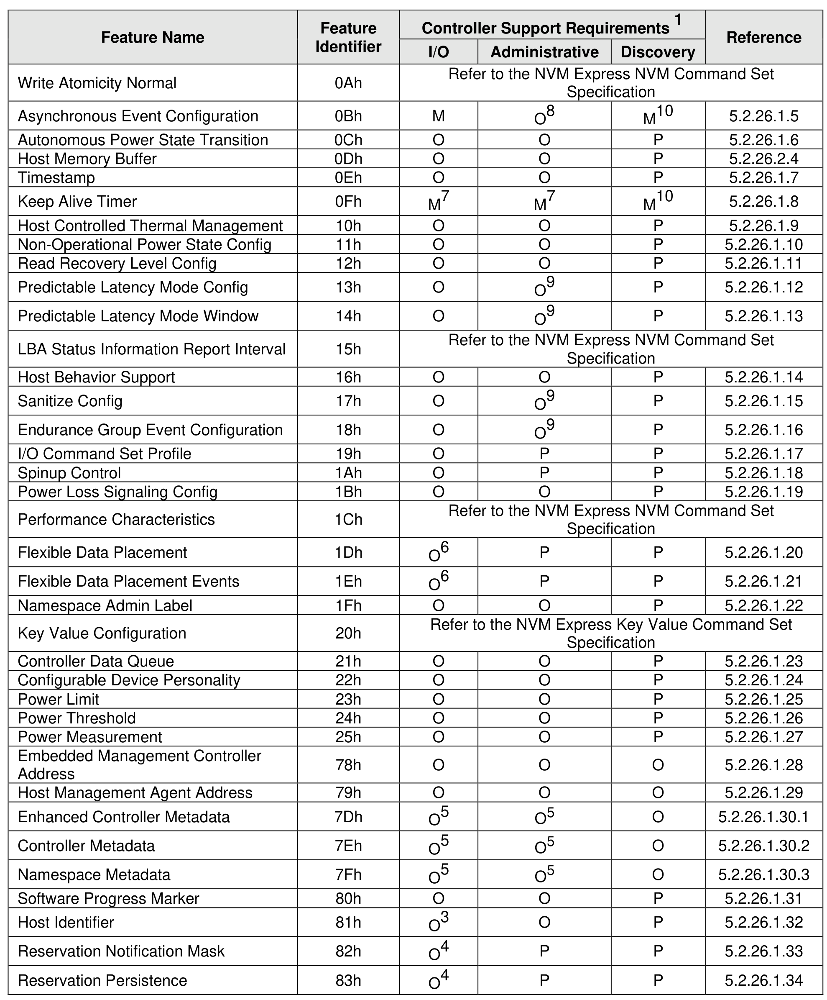
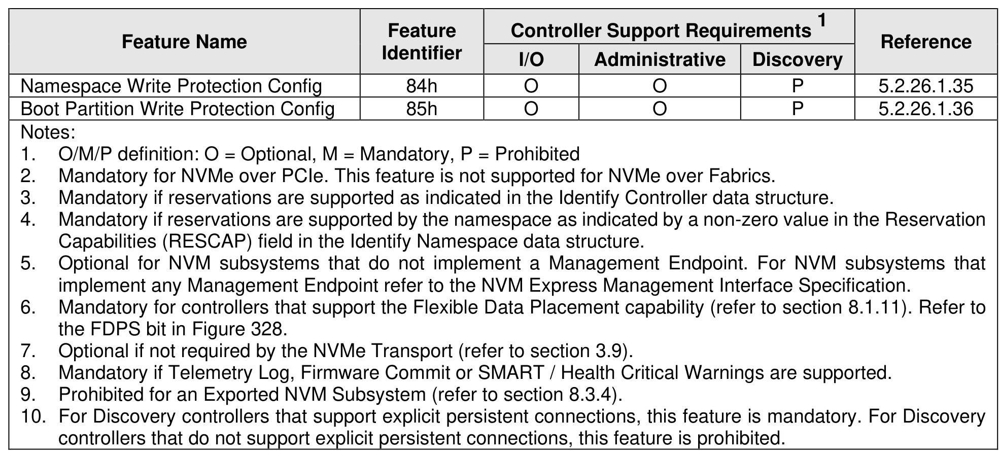

##### 3.1.3.6 Feature Support Requirements

> **Section ID**: 3.1.3.6 | **Page**: 73-75

Figure 32 defines features that are mandatory, optional, and prohibited for an I/O controller, Administrative
controller, and Discovery controller. If any feature is supported, then the Set Features command and the
Get Features command shall be supported. I/O Command Set specific feature support requirements are
described within NVM Express I/O Command Set specifications.

---
### 📊 Tables (3)

#### Table 1: Untitled Table

| Feature Name | Identifier | I/O | Administrative | Discovery | References |
| :--- | :--- | :--- | :--- | :--- | :--- |
| Atomicity Normal | 0Ah | | | | Refer to the NVM Express NVM Command Set Specification |
| Nonous Event Configuration | 0Bh | M | O8 | M10 | 5.2.26.1.5 |
| Nonous Power State Transition | 0Ch | O | O | P | 5.2.26.1.6 |
| Memory Buffer | 0Dh | O | O | P | 5.2.26.1.4 |
| Imp | 0Eh | O | O | P | 5.2.26.1.7 |
| Live Timer | 0Fh | M7 | M7 | M10 | 5.2.26.1.8 |
| Controlled Thermal Management | 10h | O | O | P | 5.2.26.1.9 |
| Operational Power State Config | 11h | O | O | P | 5.2.26.1.10 |
| Recovery Level Config | 12h | O | O | P | 5.2.26.1.11 |
| Enable Latency Mode Config | 13h | O | O9 | P | 5.2.26.1.12 |
| Enable Latency Mode Window | 14h | O | O9 | P | 5.2.26.1.13 |
| Status Information Report Interval | 15h | | | | Refer to the NVM Express NVM Command Set Specification |
| Behavior Support | 16h | O | O | P | 5.2.26.1.14 |
| Config | 17h | O | O9 | P | 5.2.26.1.15 |
| nce Group Event Configuration | 18h | O | O9 | P | 5.2.26.1.16 |
| Command Set Profile | 19h | O | P | P | 5.2.26.1.17 |
| Control | 1Ah | O | P | P | 5.2.26.1.18 |
| Loss Signaling Config | 1Bh | O | O | P | 5.2.26.1.19 |
| erformance Characteristics | 1Ch | | | | Refer to the NVM Express NVM Command Set Specification |
| Data Placement | 1Dh | O6 | P | P | 5.2.26.1.20 |
| Data Placement Events | 1Eh | O6 | P | P | 5.2.26.1.21 |
| Space Admin Label | 1Fh | O | O | P | 5.2.26.1.22 |
| Value Configuration | 20h | | | | Refer to the NVM Express Key Value Command Set Specification |
| er Data Queue | 21h | O | O | P | 5.2.26.1.23 |
| erable Device Personality | 22h | O | O | P | 5.2.26.1.24 |
| Limit | 23h | O | O | P | 5.2.26.1.25 |
| Threshold | 24h | O | O | P | 5.2.26.1.26 |
| Measurement | 25h | O | O | P | 5.2.26.1.27 |
| ed Management Controller | 25h | O | O | P | 5.2.26.1.27 |
| Management Agent Address | 79h | O | O | O | 5.2.26.1.29 |
| ed Controller Metadata | 7Dh | O5 | O5 | O | 5.2.26.1.30.1 |
| er Metadata | 7Eh | O5 | O5 | O | 5.2.26.1.30.2 |
| ace Metadata | 7Fh | O5 | O5 | O | 5.2.26.1.30.3 |
| e Progress Marker | 80h | O | O | P | 5.2.26.1.31 |
| Identifier | 81h | O3 | O | P | 5.2.26.1.32 |
| ation Notification Mask | 82h | O4 | P | P | 5.2.26.1.33 |
| ation Persistence | 83h | O4 | P | P | 5.2.26.1.34 |
| ace Write Protection Config | 84h | O | O | P | 5.2.26.1.35 |
| rtition Write Protection Config | 85h | O | O | P | 5.2.26.1.36 |
| | | | | | |
| | | | | | M/P definition: O = Optional, M = Mandatory, P = Prohibited |
| | | | | | Mandatory for NVMe over PCIe. This feature is not supported for NVMe over Fabrics. |
| | | | | | Mandatory if reservations are supported as indicated in the Identify Controller data structure. |
| | | | | | Mandatory if reservations are supported by the namespace as indicated by a non-zero value in the Reservation Capabilities (RESCAP) field in the Identify Namespace data structure. |
| | | | | | Optional for NVM subsystems that do not implement a Management Endpoint. For NVM subsystems that implement any Management Endpoint refer to the NVM Express Management Interface Specification. |
| | | | | | Mandatory for controllers that support the Flexible Data Placement capability (refer to section 8.1.11). Refer to FDPs bit in Figure 328. |
| | | | | | Optional if not required by the NVMe Transport (refer to section 3.9). |
| | | | | | Mandatory if Telemetry Log, Firmware Commit or SMART / Health Critical Warnings are supported. |
| | | | | | Inhibited for an Exported NVM Subsystem (refer to section 8.3.4). |
| | | | | | Discovery controllers that support explicit persistent connections, this feature is mandatory. For Discovery controllers that do not support explicit persistent connections, this feature is prohibited. |
| | | | | | |
| | | | | | |
| | | | | | |
| | | | | | |
| |

#### Table 2: Untitled Table

(Continuation of Untitled Table - see first part)

#### Table 3: Untitled Table

(Continuation of Untitled Table - see first part)

