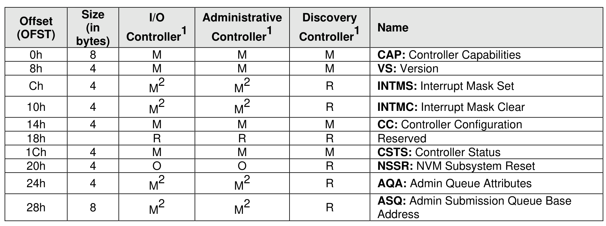
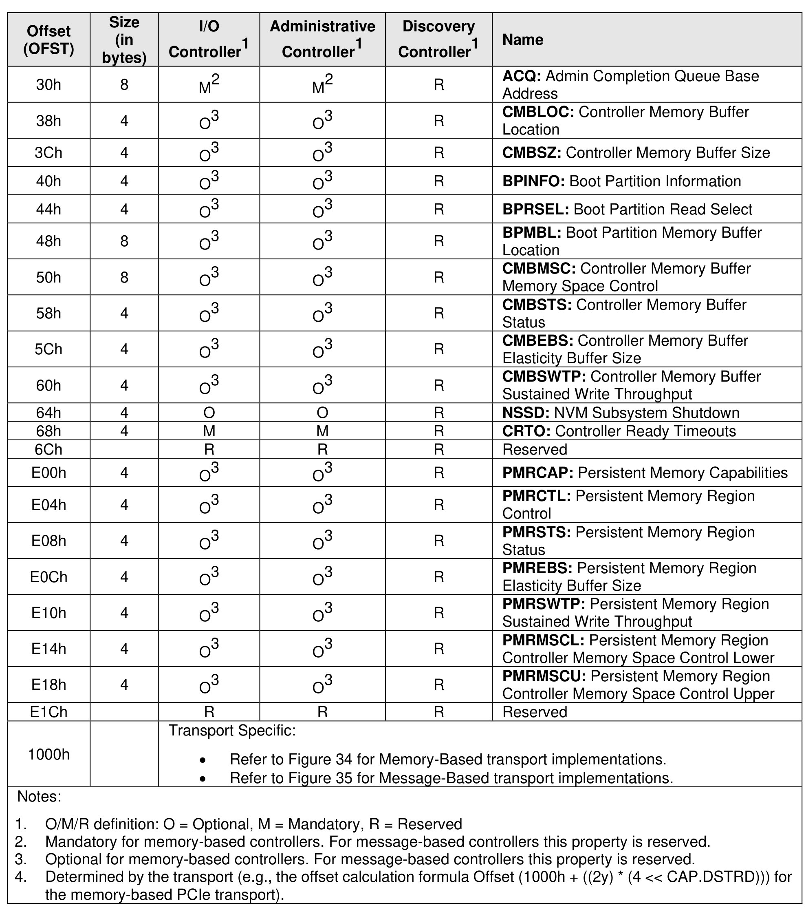
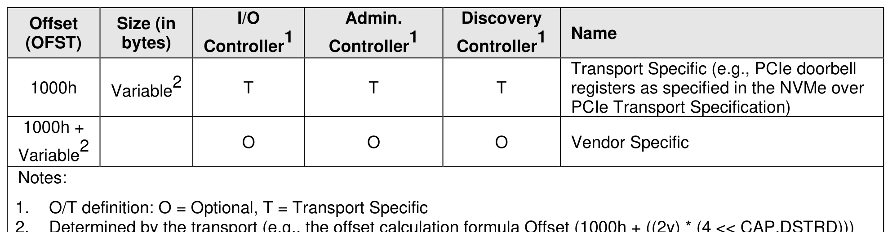
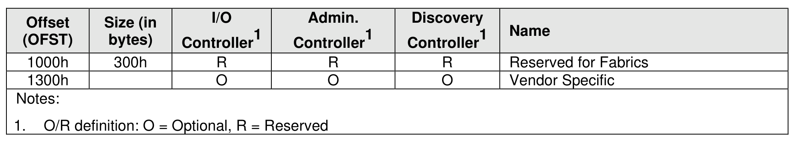

#### 3.1.4 Controller Properties

> **Section ID**: 3.1.4 | **Page**: 75-77

A property is a dword, or qword attribute of a controller. The attribute may have read, write, or read/write
access. The host shall access a property using the width specified for that property with an offset that is at
the beginning of the property unless otherwise noted in a transport specific specification. All reserved
properties and all reserved bits within properties are read-only and return 0h when read.
For message-based controllers, properties may be read with the Property Get command and may be written
with the Property Set command.
For memory-based controllers, refer to the applicable NVMe Transport binding specification for access
methods and rules (e.g., NVMe over PCIe Transport Specification).
Figure 33 and Figure 34 describe the property map for a memory-based controller. Figure 33 and Figure
35 describe the property map for a message-based controller.
Accesses that target any portion of two or more properties are not supported.
Software should not rely on 0h being returned.
The following conventions are used to describe controller properties for all transport models. Hardware
shall return ‘0’ for all bits that are marked as reserved, and a host shall write all reserved bits and properties
with the value of 0h.
The following terms and abbreviations are used:
RO
Read Only
RW
Read Write
RWC
Read/Write ‘1’ to clear
RWS
Read/Write ‘1’ to set
Impl Spec
Implementation Specific – the controller has the freedom to choose
its implementation.
HwInit
The default state is dependent on NVM Express controller and
system configuration.
Reset
This column indicates the value of the field after a Controller Level
Reset as defined in section 3.7.2.
For some fields, it is implementation specific as to whether the field is RW, RWC, or RO; this is typically
shown as RW/RO or RWC/RO to indicate that if the functionality is not supported that the field is read only.
When a field is referred to in the document, the convention used is “Property Symbol.Field Symbol”. For
example, the PCI command register Parity Error Response Enable bit is referred to by the name CMD.PEE.
If the field is an array of bits, the field is referred to as “Property Symbol.Field Symbol (array offset to
element)”. When a sub-field is referred to in the document, the convention used is “Property Symbol.Field
Symbol.Sub Field Symbol”. For example, when the Controller Ready With Media Support sub-field of the
Controller Ready Modes Supported field within the Controller Capability property, the sub-field is referred
to by the name CAP.CRMS.CRWMS.

---
### 📊 Tables (4)

#### Table 1: Untitled Table

| ("" bytes) | Controller¹ | Controller¹ | Controller¹ | Name |
| :--- | :--- | :--- | :--- | :--- |
| | | | | **ACQ: Admin Completion Queue Base** Address |
| 8 | M² | M² | R | |
| 4 | O³ | O³ | R | **CMBLOC: Controller Memory Buffer** Location |
| 4 | O³ | O³ | R | **CMBSZ: Controller Memory Buffer Size** |
| 4 | O³ | O³ | R | **BPINFO: Boot Partition Information** |
| 4 | O³ | O³ | R | **BPRSEL: Boot Partition Read Select** |
| 8 | O³ | O³ | R | **BPMBL: Boot Partition Memory Buffer** Location |
| 8 | O³ | O³ | R | **CMBMSC: Controller Memory Buffer** Memory Space Control |
| 4 | O³ | O³ | R | **CMBSTS: Controller Memory Buffer** Status |
| 4 | O³ | O³ | R | **CMBEBS: Controller Memory Buffer** Elasticity Buffer Size |
| 4 | O³ | O³ | R | **CMBSWTP: Controller Memory Buffer** Sustained Write Throughput |
| 4 | O | O | R | **NSSD: NVM Subsystem Shutdown** |
| 4 | M | M | R | **CRTO: Controller Ready Timeouts** |
| | R | R | R | **Reserved** |
| 4 | O³ | O³ | R | **PMRCAP: Persistent Memory Capabilities** |
| 4 | O³ | O³ | R | **PMRCTL: Persistent Memory Region** Control |
| 4 | O³ | O³ | R | **PMRSTS: Persistent Memory Region** Status |
| 4 | O³ | O³ | R | **PMREBS: Persistent Memory Region** Elasticity Buffer Size |
| 4 | O³ | O³ | R | **PMRSWTP: Persistent Memory Region** Sustained Write Throughput |
| 4 | O³ | O³ | R | **PMRMSCl: Persistent Memory Region** Controller Memory Space Control Lower |
| 4 | O³ | O³ | R | **PMRMSCU: Persistent Memory Region** Controller Memory Space Control Upper |
| | R | R | R | **Reserved** |
| | | | | Transport Specific: |
| | | | | • Refer to Figure 34 for Memory-Based transport implementations. |
| | | | | • Refer to Figure 35 for Message-Based transport implementations. |
| | | | | ¹/R definition: O = Optional, M = Mandatory, R = Reserved |
| | | | | Mandatory for memory-based controllers. For message-based controllers this property is reserved. |
| | | | | Optional for memory-based controllers. For message-based controllers this property is reserved. |
| | | | | Determined by the transport (e.g., the offset calculation formula Offset (1000h + ((2y) * (4 << CAP.DSTRD))) for memory-based PCIe transport). |
| | | | | |
| | | | | |
| | | | | |
| | | | | |
| | | | | |

#### Table 2: Untitled Table

(Continuation of Untitled Table - see first part)

#### Table 3: Untitled Table

(Continuation of Untitled Table - see first part)

#### Table 4: Untitled Table

(Continuation of Untitled Table - see first part)

