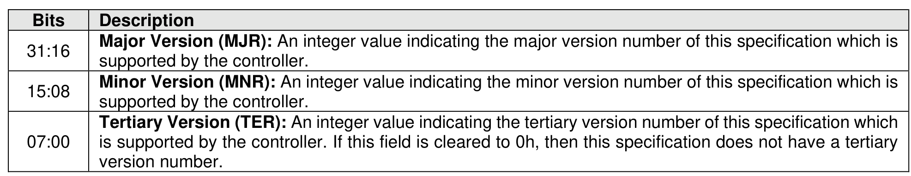
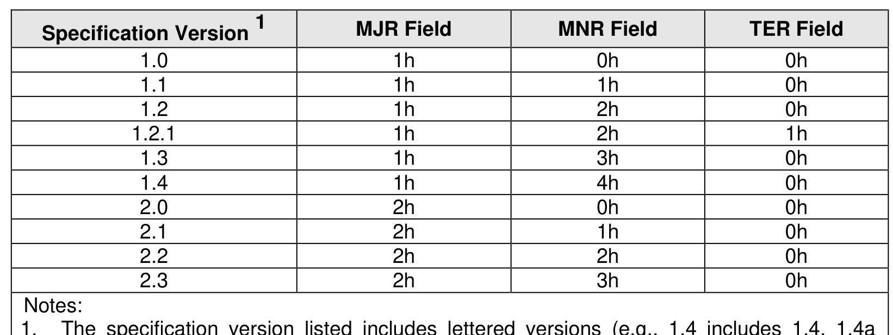

##### 3.1.4.2 Offset 8h: VS – Version

> **Section ID**: 3.1.4.2 | **Page**: 81-81

This property is Read Only (RO) and indicates the version of this specification that the controller supports,
as defined in Figure 37.
The reset value for each field is described in Figure 38:

---
### 📊 Tables (2)

#### Table 1: Untitled Table

| Specification Version¹ | MJR Field | MNR Field | TER Field |
| :--- | :--- | :--- | :--- |
| 1.0 | 1h | 0h | 0h |
| 1.1 | 1h | 1h | 0h |
| 1.2 | 1h | 2h | 0h |
| 1.2.1 | 1h | 2h | 1h |

#### Table 2: Untitled Table

(Continuation of Untitled Table - see first part)

