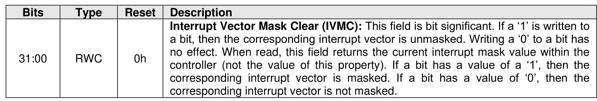

##### 3.1.4.4 Offset 10h: INTMC – Interrupt Mask Clear

> **Section ID**: 3.1.4.4 | **Page**: 82-82

This property is used to unmask interrupts when using pin-based interrupts, single message MSI, or multiple
message MSI. When using MSI-X, the interrupt mask table defined as part of MSI-X should be used to
unmask interrupts. A host shall not access this property when configured for MSI-X; any accesses when
configured for MSI-X is undefined. For interrupt behavior requirements, refer to the Interrupts section of the
NVMe over PCIe Transport Specification.

---
### 📊 Tables (1)

#### Table 1: Untitled Table

| Offset 14h: CC – Controller Configuration |  |
| :--- | :--- |
| Property modifies settings for the controller. A host shall set the Arbitration Mechanism Selected (CC.AMS), the Memory Page Size (CC.MPS), and the I/O Command Set Selected (CC.CSS) to valid values enabling the controller by setting CC.EN to '1'. Attempting to create an I/O queue before initializing Completion Queue Entry Size (CC.IOCQES) and the I/O Submission Queue Entry Size (CC.IOSQES) shall cause a controller to abort a Create I/O Completion Queue command or a Create I/O Submission Queue command with a status code of Invalid Queue Size. |  |
| Figure 41: Offset 14h: CC – Controller Configuration |  |

