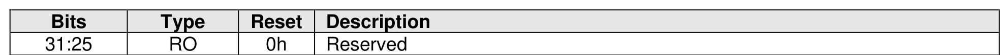
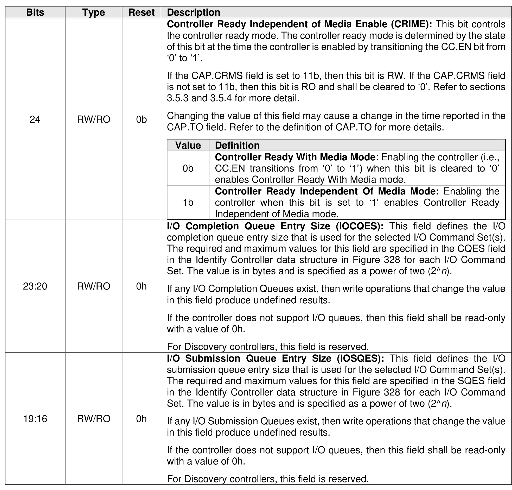
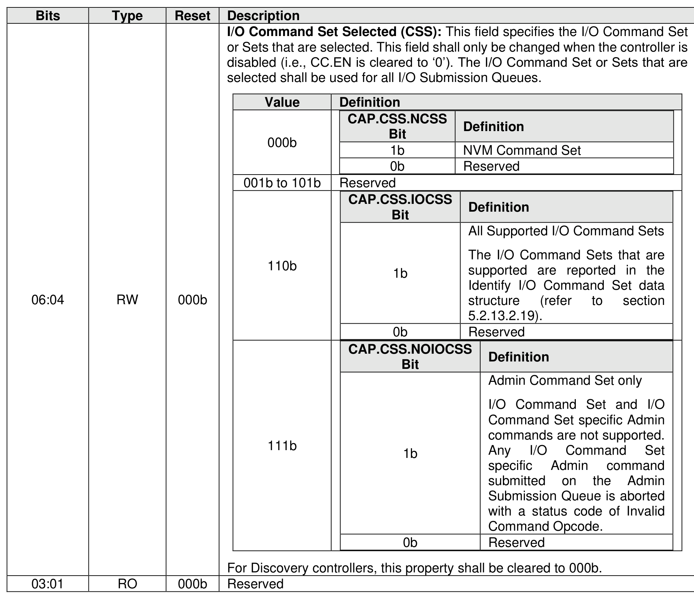
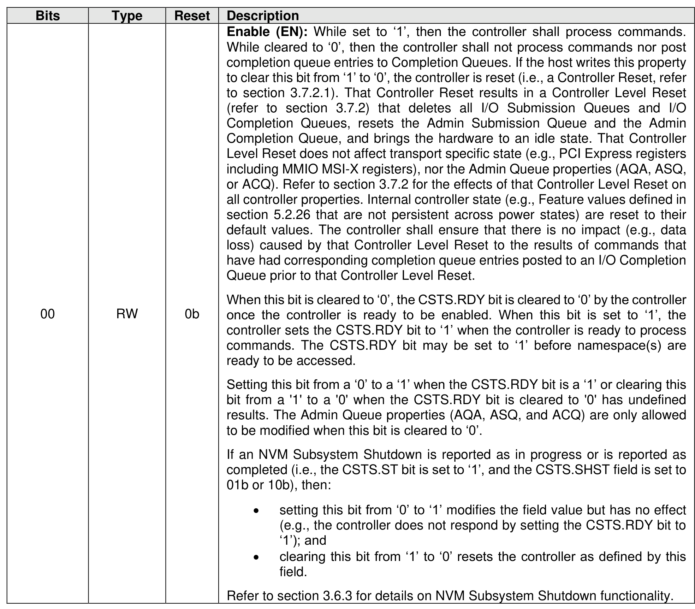

##### 3.1.4.5 Offset 14h: CC – Controller Configuration

> **Section ID**: 3.1.4.5 | **Page**: 82-86

This property modifies settings for the controller. A host shall set the Arbitration Mechanism Selected
(CC.AMS), the Memory Page Size (CC.MPS), and the I/O Command Set Selected (CC.CSS) to valid values
prior to enabling the controller by setting CC.EN to ‘1’. Attempting to create an I/O queue before initializing
the I/O Completion Queue Entry Size (CC.IOCQES) and the I/O Submission Queue Entry Size
(CC.IOSQES) shall cause a controller to abort a Create I/O Completion Queue command or a Create I/O
Submission Queue command with a status code of Invalid Queue Size.

---
### 📊 Tables (5)

#### Table 1: Untitled Table

| | | | |
| :--- | :--- | :--- | :--- |
| | RW/RO | 0b | Controller Ready Independent Of Media Enable (CRIME): This bit controls the controller ready mode. The controller ready mode is determined by the state of this bit at the time the controller is enabled by transitioning the CC.EN bit from '0' to '1'.  If the CAP.CRMS field is set to 11b, then this bit is RW. If the CAP.CRMS field is not set to 11b, then this bit is RO and shall be cleared to '0'. Refer to sections 3.5.3 and 3.5.4 for more detail.  Changing the value of this field may cause a change in the time reported in the CAP.TO field. Refer to the definition of CAP.TO for more details.  **Value** | **Definition** 0b | Controller Ready With Media Mode: Enabling the controller (i.e., CC.EN transitions from '0' to '1') when this bit is cleared to '0' enables Controller Ready With Media mode. 1b | Controller Ready Independent Of Media Mode: Enabling the controller when this bit is set to '1' enables Controller Ready Independent of Media mode. |
| | RW/RO | 0h | I/O Completion Queue Entry Size (IOCQES): This field defines the I/O completion queue entry size that is used for the selected I/O Command Set(s). The required and maximum values for this field are specified in the CQES field in the Identify Controller data structure in Figure 328 for each I/O Command Set. The value is in bytes and is specified as a power of two (2^n).  If any I/O Completion Queues exist, then write operations that change the value in this field produce undefined results.  If the controller does not support I/O queues, then this field shall be read-only with a value of 0h.  For Discovery controllers, this field is reserved. |
| | RW/RO | 0h | I/O Submission Queue Entry Size (IOSQES): This field defines the I/O submission queue entry size that is used for the selected I/O Command Set(s). The required and maximum values for this field are specified in the SQES field in the Identify Controller data structure in Figure 328 for each I/O Command Set. The value is in bytes and is specified as a power of two (2^n).  If any I/O Submission Queues exist, then write operations that change the value in this field produce undefined results.  If the controller does not support I/O queues, then this field shall be read-only with a value of 0h.  For Discovery controllers, this field is reserved. |
| | | | |
| :--- | :--- | :--- | :--- |
| | | | |
| | | | |
| | | | |
| | | | |
| | | | |
| | | | |
| | | | | |
|---|---|---|---|---|
| | | | **Value** | **Definition** |
| | | | | **CAP.CSS.NCSS Bit** | **Definition** |
| | | | 000b | 1b | NVM Command Set |
| | | | | 0b | Reserved |
| | | | 001b to 101b | Reserved |
| | | | | **CAP.CSS.IOCSS Bit** | **Definition** |
| | | | 110b | 1b | All Supported I/O Command Sets   The I/O Command Sets that are supported are reported in the Identify I/O Command Set data structure (refer to section 5.2.13.2.19). |
| | | | | 0b | Reserved |
| | | | | **CAP.CSS.NOIOCSS Bit** | **Definition** |
| | | | 111b | 1b | Admin Command Set only   I/O Command Set and I/O Command Set specific Admin commands are not supported. Any I/O Command Set specific Admin command submitted on the Admin Submission Queue is aborted with a status code of Invalid Command Opcode. |
| | | | | 0b | Reserved |
| | | | | For Discovery controllers, this property shall be cleared to 000b. |
| | | | | Reserved |
| | | | | |
| | | | |
| :--- | :--- | :--- | :--- |
| | | | |
| | | | |
| | | | |
| | | | |
| | | | |
| | | | |

#### Table 2: Untitled Table

(Continuation of Untitled Table - see first part)

#### Table 3: Untitled Table

(Continuation of Untitled Table - see first part)

#### Table 4: Untitled Table

(Continuation of Untitled Table - see first part)

#### Table 5: Untitled Table

(Continuation of Untitled Table - see first part)

