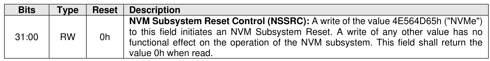

##### 3.1.4.7 Offset 20h: NSSR – NVM Subsystem Reset

> **Section ID**: 3.1.4.7 | **Page**: 88-89

This optional property provides a host with the capability to initiate an NVM Subsystem Reset. Support for
this property is indicated by the state of the NVM Subsystem Reset Supported (CAP.NSSRS) field. If this
property is not supported, then the address range occupied by this property is reserved. Refer to section
3.7.1.

---
### 📊 Tables (1)

#### Table 1: Untitled Table

| RW | 0h | to this field initiates an NVM Subsystem Reset. A write of any other value has no functional effect on the operation of the NVM subsystem. This field shall return the value 0h when read. |

