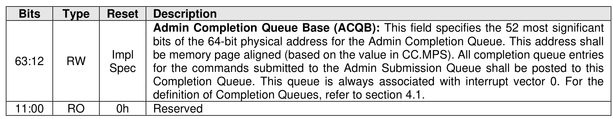

##### 3.1.4.10 Offset 30h: ACQ – Admin Completion Queue Base Address

> **Section ID**: 3.1.4.10 | **Page**: 89-90

This property defines the base memory address of the Admin Completion Queue.
This property shall not be reset by a Controller Level Reset initiated by a Controller Reset.

---
### 📊 Tables (1)

#### Table 1: Untitled Table

| | | |
| :--- | :--- | :--- |
| RW | Impl Spec | Admin Completion Queue Base (ACQB). This field specifies the 32 most significant bits of the 64-bit physical address for the Admin Completion Queue. This address shall be memory page aligned (based on the value in CC.MPS). All completion queue entries for the commands submitted to the Admin Submission Queue shall be posted to this Completion Queue. This queue is always associated with interrupt vector 0. For the definition of Completion Queues, refer to section 4.1. |
| RO | 0h | Reserved |

