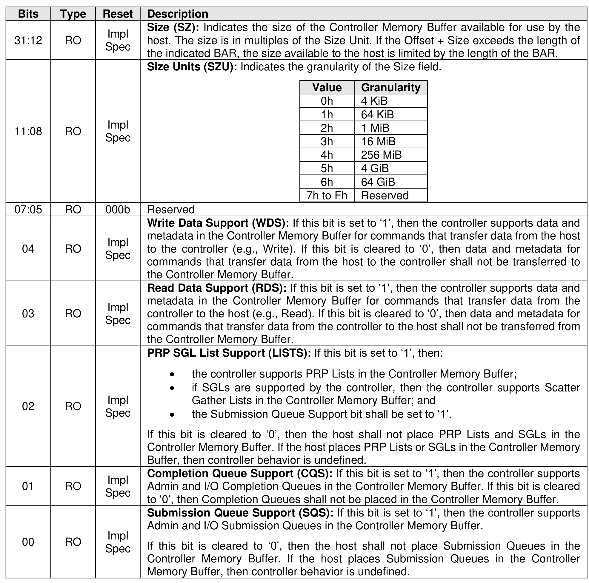

##### 3.1.4.12 Offset 3Ch: CMBSZ – Controller Memory Buffer Size

> **Section ID**: 3.1.4.12 | **Page**: 91-91

This optional property defines the size of the Controller Memory Buffer (refer to section 8.2.1). If the
controller does not support the Controller Memory Buffer feature or if the controller supports the Controller
Memory Buffer (CAP.CMBS) and CMBMSC.CRE is cleared to ‘0’, then this property shall be cleared to 0h.

---
### 📊 Tables (1)

#### Table 1: Untitled Table

| | | | |
| :--- | :--- | :--- | :--- |
| RO | Impl Spec | Size Units (SZU): Indicates the granularity of the Size field. | <table><tbody><tr><th>Value</th><th>Granularity</th></tr><tr><td>0h</td><td>4 KiB</td></tr><tr><td>1h</td><td>64 KiB</td></tr><tr><td>2h</td><td>1 MiB</td></tr><tr><td>3h</td><td>16 MiB</td></tr><tr><td>4h</td><td>256 MiB</td></tr><tr><td>5h</td><td>4 GiB</td></tr><tr><td>6h</td><td>64 GiB</td></tr><tr><td>7h to Fh</td><td>Reserved</td></tr></tbody></table> |
| RO | 000b | Reserved | |
| RO | Impl Spec | Write Data Support (WDS): If this bit is set to '1', then the controller supports data and metadata in the Controller Memory Buffer for commands that transfer data from the host to the controller (e.g., Write). If this bit is cleared to '0', then data and metadata for commands that transfer data from the host to the controller shall not be transferred to the Controller Memory Buffer. | |
| RO | Impl Spec | Read Data Support (RDS): If this bit is set to '1', then the controller supports data and metadata in the Controller Memory Buffer for commands that transfer data from the controller to the host (e.g., Read). If this bit is cleared to '0', then data and metadata for commands that transfer data from the controller to the host shall not be transferred from the Controller Memory Buffer. | |
| RO | Impl Spec | PRP SGL List Support (LISTS): If this bit is set to '1', then: • the controller supports PRP Lists in the Controller Memory Buffer; • if SGLs are supported by the controller, then the controller supports Scatter Gather Lists in the Controller Memory Buffer; and • the Submission Queue Support bit shall be set to '1'.  If this bit is cleared to '0', then the host shall not place PRP Lists and SGLs in the Controller Memory Buffer. If the host places PRP Lists or SGLs in the Controller Memory Buffer, then controller behavior is undefined. | |
| RO | Impl Spec | Completion Queue Support (CQS): If this bit is set to '1', then the controller supports Admin and I/O Completion Queues in the Controller Memory Buffer. If this bit is cleared to '0', then Completion Queues shall not be placed in the Controller Memory Buffer. | |
| RO | Impl Spec | Submission Queue Support (SQS): If this bit is set to '1', then the controller supports Admin and I/O Submission Queues in the Controller Memory Buffer.  If this bit is cleared to '0', then the host shall not place Submission Queues in the Controller Memory Buffer. If the host places Submission Queues in the Controller Memory Buffer, then controller behavior is undefined. | |
| | | | |
| | | | |
| | | | |
| | | | |
| | | | |
| | | |

