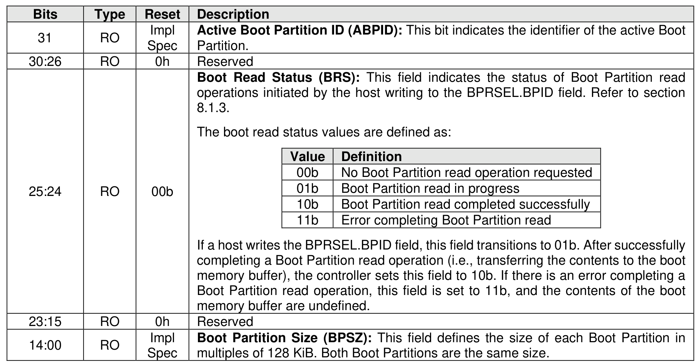

##### 3.1.4.13 Offset 40h: BPINFO – Boot Partition Information

> **Section ID**: 3.1.4.13 | **Page**: 91-92

This optional property defines the characteristics of Boot Partitions (refer to section 8.1.3). If the controller
does not support the Boot Partitions feature, then this property shall be cleared to 0h.

---
### 📊 Tables (1)

#### Table 1: Untitled Table

| | | | |
| :--- | :--- | :--- | :--- |
| | RO | 0h | Reserved |
| | RO | 00b | **Boot Read Status (BRS)**: This field indicates the status of Boot Partition read operations initiated by the host writing to the BPRSEL.BPID field. Refer to section 8.1.3.  The boot read status values are defined as:   | |
| | | | <table><tbody><tr><th>Value</th><th>Definition</th></tr><tr><td>00b</td><td>No Boot Partition read operation requested</td></tr><tr><td>01b</td><td>Boot Partition read in progress</td></tr><tr><td>10b</td><td>Boot Partition read completed successfully</td></tr><tr><td>11b</td><td>Error completing Boot Partition read</td></tr></tbody></table> |
| | | | If a host writes the BPRSEL.BPID field, this field transitions to 01b. After successfully completing a Boot Partition read operation (i.e., transferring the contents to the boot memory buffer), the controller sets this field to 10b. If there is an error completing a Boot Partition read operation, this field is set to 11b, and the contents of the boot memory buffer are undefined. |
| | RO | 0h | Reserved |
| | RO | Impl Spec | **Boot Partition Size (BPSZ)**: This field defines the size of each Boot Partition in multiples of 128 KiB. Both Boot Partitions are the same size. |
| | | | |
| | | | |
| | | | |
| | | | |
| | | | |
| | | | |

