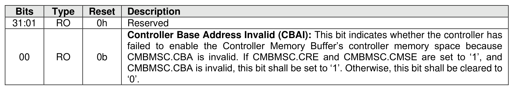

##### 3.1.4.17 Offset 58h: CMBSTS – Controller Memory Buffer Status

> **Section ID**: 3.1.4.17 | **Page**: 93-93

This optional property indicates the status of the Controller Memory Buffer. If the controller supports the
Controller Memory Buffer (CAP.CMBS), this property is mandatory. Otherwise, this property is reserved.

---
### 📊 Tables (1)

#### Table 1: Untitled Table

| | 2023 | 2022 | 2021 |
| :--- | :--- | :--- | :--- |
| **Total assets** | $1,000,000 | $950,000 | $900,000 |
| **Total liabilities** | $600,000 | $550,000 | $500,000 |
| **Equity** | $400,000 | $400,000 | $400,000 |
| **Revenue** | $800,000 | $750,000 | $700,000 |
| **Net income** | $100,000 | $90,000 | $80,000 |

