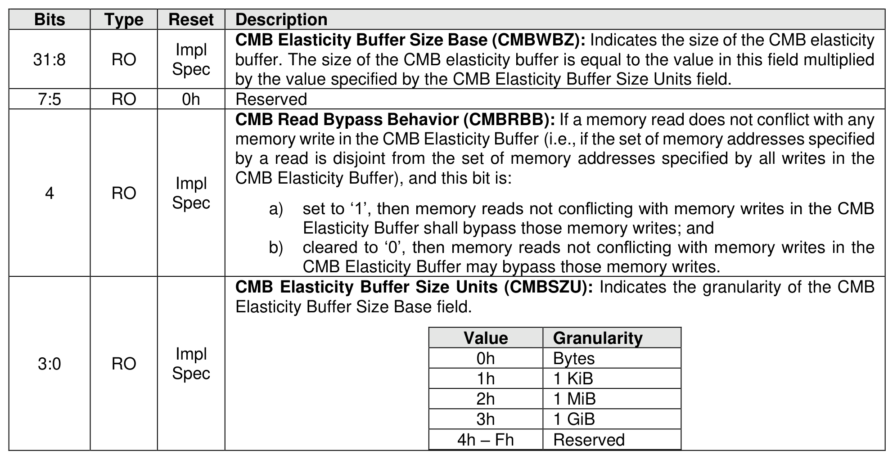

##### 3.1.4.18 Offset 5Ch: CMBEBS – Controller Memory Buffer Elasticity Buffer Size

> **Section ID**: 3.1.4.18 | **Page**: 94-94

This optional property identifies to the host the size of the CMB elasticity buffer. A value of 0h in this property
indicates to the host that no information regarding the presence or size of a CMB elasticity buffer is
available.

---
### 📊 Tables (1)

#### Table 1: Untitled Table

| | | | |
| :--- | :--- | :--- | :--- |
| | | | |
| RO | 0h | Reserved | |
| RO | Impl Spec | **CMB Read Bypass Behavior (CMBRBB):** If a memory read does not conflict with any memory write in the CMB Elasticity Buffer (i.e., if the set of memory addresses specified by a read is disjoint from the set of memory addresses specified by all writes in the CMB Elasticity Buffer), and this bit is: a) set to '1', then memory reads not conflicting with memory writes in the CMB Elasticity Buffer shall bypass those memory writes; and b) cleared to '0', then memory reads not conflicting with memory writes in the CMB Elasticity Buffer may bypass those memory writes. | |
| RO | Impl Spec | **CMB Elasticity Buffer Size Units (CMBSZU):** Indicates the granularity of the CMB Elasticity Buffer Size Base field. <table><tr><th>Value</th><th>Granularity</th></tr><tr><td>0h</td><td>Bytes</td></tr><tr><td>1h</td><td>1 KiB</td></tr><tr><td>2h</td><td>1 MiB</td></tr><tr><td>3h</td><td>1 GiB</td></tr><tr><td>4h – Fh</td><td>Reserved</td></tr></table> | |

