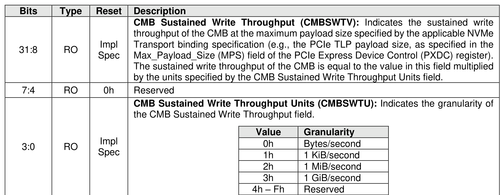

##### 3.1.4.19 Offset 60h: CMBSWTP – Controller Memory Buffer Sustained Write Throughput

> **Section ID**: 3.1.4.19 | **Page**: 94-94

This optional property identifies to the host the maximum CMB sustained write throughput. A value of 0h in
this property indicates to the host that no information regarding the CMB sustained write throughput is
available.

---
### 📊 Tables (1)

#### Table 1: Untitled Table

| RO | Impl Spec | Value | Granularity |
|:---|:---|:---|:---|
| | | 0h | Bytes/second |
| | | 1h | 1 KiB/second |
| | | 2h | 1 MiB/second |
| | | 3h | 1 GiB/second |
| | | 4h – Fh | Reserved |

