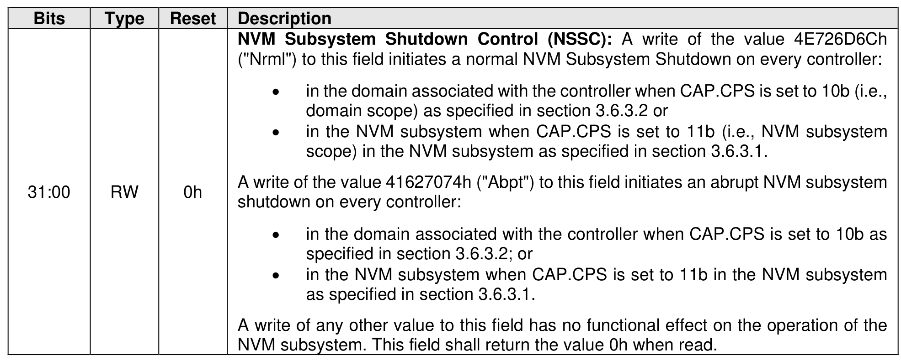

##### 3.1.4.20 Offset 64h: NSSD – NVM Subsystem Shutdown

> **Section ID**: 3.1.4.20 | **Page**: 95-95

This optional property provides a host with the capability to initiate a normal or an abrupt NVM Subsystem
Shutdown.
Support for this property is indicated by the state of the NVM Subsystem Shutdown Supported (CAP.NSSS)
field. If this property is not supported, then the address range occupied by this property is reserved.
The NVM Subsystem Shutdown Enhancements Supported (CAP.NSSES) bit affects the functionality
invoked by host modification of this property (refer to section 3.6.3).

---
### 📊 Tables (1)

#### Table 1: Untitled Table

| | | | |
| :--- | :--- | :--- | :--- |
| | | | |
| | | | |
| | | | |
| | | | |
| | | | |
| | | | |

