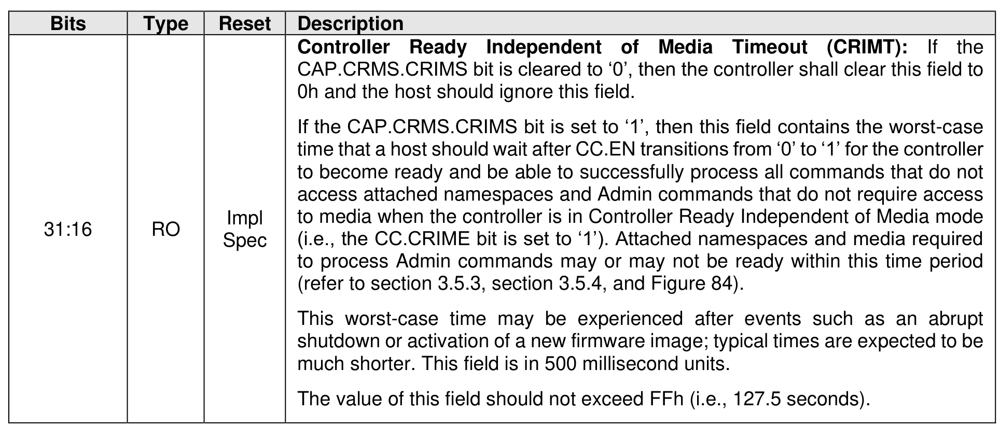
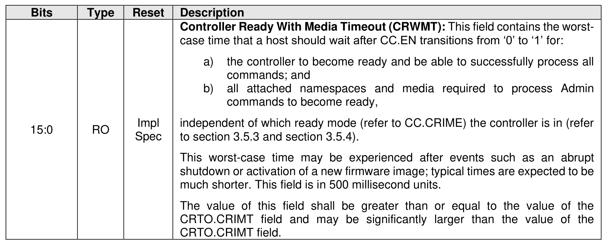

##### 3.1.4.21 Offset 68h: CRTO – Controller Ready Timeouts

> **Section ID**: 3.1.4.21 | **Page**: 95-96

This property indicates the controller ready timeout values. This property is mandatory for controllers
compliant with NVM Express Base Specification revision 2.0 and later.

---
### 📊 Tables (2)

#### Table 1: Untitled Table

| | | | |
| :--- | :--- | :--- | :--- |
| | | | case time that a host should wait after CC.EN transitions from '0' to '1' for: |
| | | | a) the controller to become ready and be able to successfully process all commands; and |
| | | | b) all attached namespaces and media required to process Admin commands to become ready, |
| RO | Impl Spec | | independent of which ready mode (refer to CC.CRIME) the controller is in (refer to section 3.5.3 and section 3.5.4). |
| | | | This worst-case time may be experienced after events such as an abrupt shutdown or activation of a new firmware image; typical times are expected to be much shorter. This field is in 500 millisecond units. |
| | | | The value of this field shall be greater than or equal to the value of the CRTO.CRIMT field and may be significantly larger than the value of the CRTO.CRIMT field. |
| | | | to process Admin commands may or may not be ready within this time period (refer to section 3.5.3, section 3.5.4, and Figure 84). |
| | | | This worst-case time may be experienced after events such as an abrupt shutdown or activation of a new firmware image; typical times are expected to be much shorter. This field is in 500 millisecond units. |
| | | | The value of this field should not exceed FFh (i.e., 127.5 seconds). |

#### Table 2: Untitled Table

(Continuation of Untitled Table - see first part)

