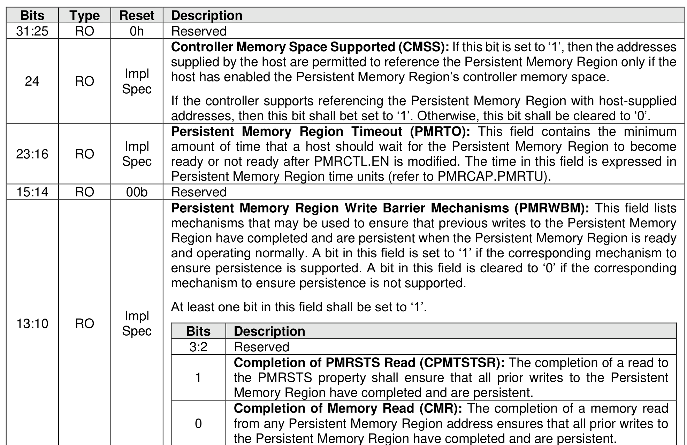
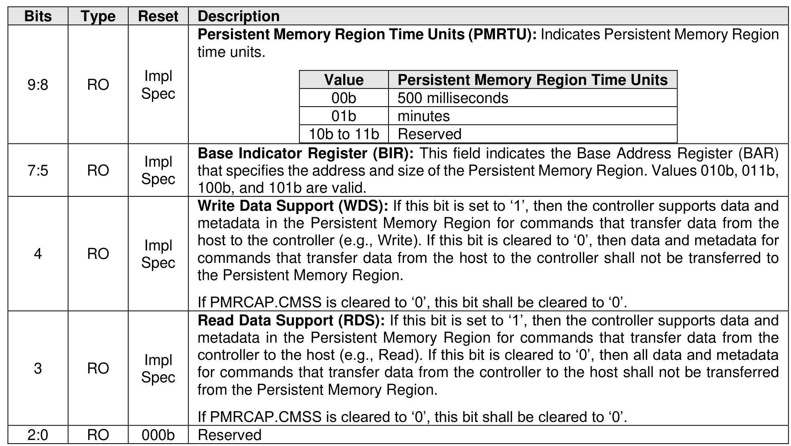

##### 3.1.4.22 Offset E00h: PMRCAP – Persistent Memory Region Capabilities

> **Section ID**: 3.1.4.22 | **Page**: 96-97

This property indicates capabilities of the Persistent Memory Region. If the controller does not support the
Persistent Memory Region feature, then this property shall be cleared to 0h.
This property shall not be reset by a Controller Level Reset initiated by a Controller Reset.

---
### 📊 Tables (2)

#### Table 1: Untitled Table

| RO | Impl Spec | |
| :--- | :--- | :--- |
| | | amount of time that a host should wait for the Persistent Memory Region to become ready or not ready after PMRCTL.EN is modified. The time in this field is expressed in Persistent Memory Region time units (refer to PMRCAP.PMRTU). |
| RO | 00b | Reserved |
| RO | Impl Spec | **Persistent Memory Region Write Barrier Mechanisms (PMRWBМ):** This field lists mechanisms that may be used to ensure that previous writes to the Persistent Memory Region have completed and are persistent when the Persistent Memory Region is ready and operating normally. A bit in this field is set to '1' if the corresponding mechanism to ensure persistence is supported. A bit in this field is cleared to '0' if the corresponding mechanism to ensure persistence is not supported.   At least one bit in this field shall be set to '1'.   |
| | | <table> <tr> <th>Bits</th> <th>Description</th> </tr> <tr> <td>3:2</td> <td>Reserved</td> </tr> <tr> <td>1</td> <td><b>Completion of PMRSTS Read (CPMTSTSR):</b> The completion of a read to the PMRSTS property shall ensure that all prior writes to the Persistent Memory Region have completed and are persistent.</td> </tr> <tr> <td>0</td> <td><b>Completion of Memory Read (CMR):</b> The completion of a memory read from any Persistent Memory Region address ensures that all prior writes to the Persistent Memory Region have completed and are persistent.</td> </tr> </table> |
| | | |
| | | 72 |
| RO | Impl Spec | time units. |
| | | <table> <tr> <th>Value</th> <th>Persistent Memory Region Time Units</th> </tr> <tr> <td>00b</td> <td>500 milliseconds</td> </tr> <tr> <td>01b</td> <td>minutes</td> </tr> <tr> <td>10b to 11b</td> <td>Reserved</td> </tr> </table> |
| RO | Impl Spec | **Base Indicator Register (BIR):** This field indicates the Base Address Register (BAR) that specifies the address and size of the Persistent Memory Region. Values 010b, 011b, 100b, and 101b are valid. |
| RO | Impl Spec | **Write Data Support (WDS):** If this bit is set to '1', then the controller supports data and metadata in the Persistent Memory Region for commands that transfer data from the host to the controller (e.g., Write). If this bit is cleared to '0', then data and metadata for commands that transfer data from the host to the controller shall not be transferred to the Persistent Memory Region.   If PMRCAP.CMSS is cleared to '0', this bit shall be cleared to '0'. |
| RO | Impl Spec | **Read Data Support (RDS):** If this bit is set to '1', then the controller supports data and metadata in the Persistent Memory Region for commands that transfer data from the controller to the host (e.g., Read). If this bit is cleared to '0', then all data and metadata for commands that transfer data from the controller to the host shall not be transferred from the Persistent Memory Region.   If PMRCAP.CMSS is cleared to '0', this bit shall be cleared to '0'. |
| RO | 000b | Reserved |
| | | **Offset E04h: PMRCTL – Persistent Memory Region Control** |
| | | This optional property controls the operation of the Persistent Memory Region. If the controller does not support the Persistent Memory Region feature, then this property shall be cleared to 0h.   This property shall not be reset by a Controller Level Reset initiated by a Controller Reset. |
| | | **Figure 59: Offset E04h: PMRCTL – Persistent Memory Region Control** |

#### Table 2: Untitled Table

(Continuation of Untitled Table - see first part)

